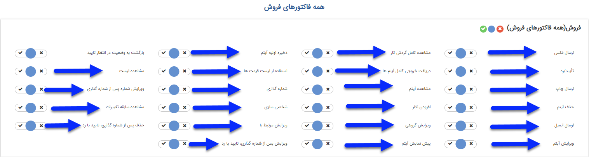
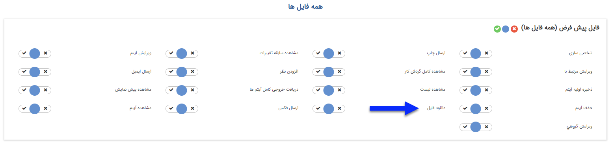
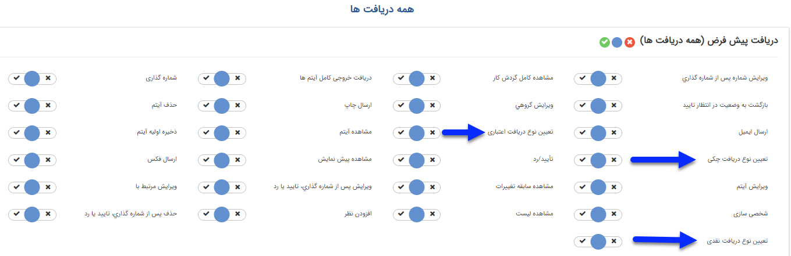
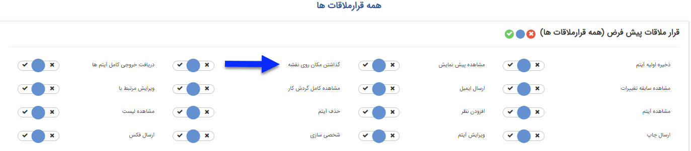
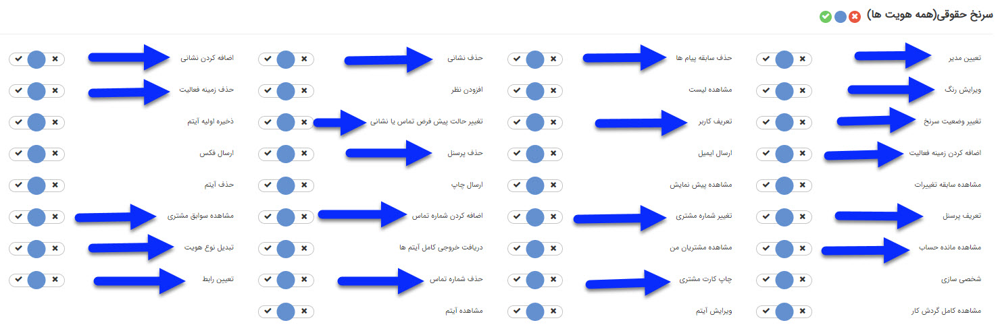
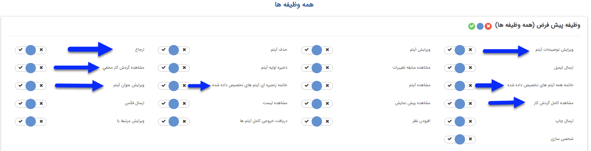
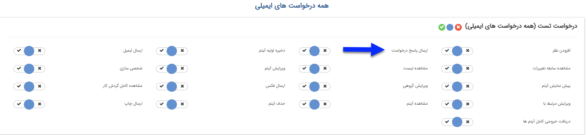
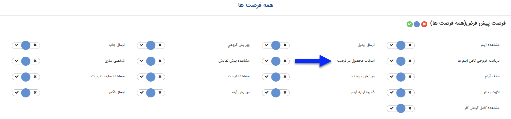

# دسترسی های موجودیت ها    

دسترسی های موجودیت ها

دسترسی به هر یک از آیتم های نرم افزار (فاکتورها، فرم ها و ...) در این قسمت تعیین می شود. برخی از این مجوزها بین همه آیتم ها مشترک هستند، اما علاوه بر آن ها هر آیتم مجوزهای مخصوص به خود را نیز ممکن است داشته باشد، در زیر آیتم فاکتور فروش به عنوان مرجع برای توضیح مجوزهای مشترک و مجوزهای آیتم های دارای قابلیت تایید و شماره گذاری در نظر گرفته شده است و پس از آن به مجوزهای اختصاصی مربوط به سایر آیتم ها اشاره شده است.

 

نکته: توجه داشته باشید که مجوز مشاهده یک آیتم پیش نیاز برخی از مجوز ها مانند ارسال ایمیل یا افزودن نظر است. 

نکته: توجه داشته باشید که اغلب این مجوزها به صورت دکمه هایی بالای آن آیتم نمایش داده می شوند و یا اجازه دسترسی به یک فیلد در آن آیتم را می دهند. (برای مثال اگر یک کاربر مجوز پیش نمایش را نداشته باشد، دکمه پیش نمایش را در آن آیتم نخواهد دید.)

مجوزهای مشترک بین تمام آیتم ها و مجوزهای ایتم های فاکتور و پیش فاکتور به شرح ذیل است: 

دریافت خروجی کامل آیتم ها: اجازه گرفتن خروجی اکسل از این آیتم را به کاربر می دهد.

ارسال ایمیل: اجازه ارسال قالب نمایش این آیتم از طریق ایمیل را به کاربر می دهد. (برای مثال قالب چاپی فاکتور را برای مخاطب ارسال می کند.)

ارسال چاپ:  اجازه ارسال قالب نمایش این آیتم از طریق چاپ را به کاربر می دهد. (برای مثال قالب چاپی پیش فاکتور را با مشخصات مخاطبی که به آن مرتبط است چاپ می کند.)

ارسال فکس: اجازه ارسال قالب نمایش این آیتم از طریق فکس را به کاربر می دهد. (برای مثال قالب چاپ فرم را برای مخاطبی که برای او فرم را ذخیره کرده ایم ارسال می کند.)

استفاده از لیست قیمت: اجازه تغییر لیست قیمت را به کاربر می دهد. (مخصوص آیتم های از نوع فاکتور، پیش فاکتور است.)

افزودن نظر: اجازه اضافه کردن نظر روی این آیتم را به کاربر می دهد.

پیش نمایش آیتم : اجازه پیش نمایش گرفتن از قالب چاپ این آیتم را به کاربر می دهد.)

تایید/ رد: این آیتم را برای تایید در کارتابل این کاربر نمایش می دهد. (مخصوص آیتم های مالی - فاکتور، دریافت و ... - و آیتم های انبار - حواله و رسیدها- است.)

حذف آیتم: اجازه حذف این آیتم را به کاربر می دهد. (در آیتم های دارای قابلیت تایید/رد کاربر با داشتن این مجوز تنها قبل از تایید/رد آیتم می تواند آن را حذف کند)

حذف پس از تایید/رد:  اجازه حذف این آیتم پس از تایید شدن را به کاربر می دهد. (مخصوص آیتم های مالی - فاکتور، دریافت و ... - و آیتم های انبار - حواله و رسیدها- است.)

ذخیره اولیه آیتم: اجازه ساختن این آیتم را به کاربر می دهد. (برای مثال صدور اولیه پیش فاکتور را به کارشناس فروش می دهد.)

شخصی سازی: اجازه شخصی سازی (ویرایش تنظیمات این آیتم، تغییر چرخه، اضافه کردن فیلد و ...) این آیتم را به کاربر می دهد.

شماره گذاری: این آیتم را برای شماره گذاری در کارتابل کاربر نمایش می دهد، علاوه بر این کاربر اجازه تعیین شماره دستی برای آیتم را خواهد داشت.

مشاهده آیتم: اجازه مشاهده کردن این آیتم را به کاربر می دهد.

مشاهده سابقه تغییرات: اجازه مشاهده تغییراتی که از ابتدای ایجاد این آیتم بر روی آن اتفاق افتاده است را به کاربر می دهد.

مشاهده کامل گردش کار: در صورتی که آیتم چرخه کاری فعال داشته باشد، کاربر با داشتن این مجوز می تواند چگونگی گردش آیتم در کارتابل کاربران را مشاهده نماید. 

مشاهده لیست: به صورت پیش فرض هر کاربر در لیست های سوابق و آیتم ها (مانند [فرصت ها](../../../CRM/Apportunity.md) - [CRM تاریخچه](../../../CRM/CRMHistory.md) و ...) تنها آیتم هایی که خود ذخیره کرده است را مشاهده خواهد کرد. این مجوز دسترسی مشاهده آیتم هایی که کاربران دیگر ذخیره کرده اند را به کاربر می دهد. (برای مثال کاربر تنها فاکتورهایی که خود ذخیره کرده است را مشاهده می کند اما با داشتن این مجوز می تواند فاکتورهایی که دیگر کاربران ذخیره کرده اند را در لیست مشاهده کند.) 

ویرایش آیتم: اجازه ویرایش این آیتم پس از ذخیره اولیه را به کاربر می دهد. (برای آیتم های دارای قابلیت تایید/رد، کاربر با داشتن این مجوز تنها می تواند قبل از تایید، آیتم را ویرایش کند.

ویرایش پس از تایید: اجازه ویرایش پس از تایید آیتم را به کاربر میدهد. (مخصوص آیتم های مالی - فاکتور، دریافت و ... - و آیتم های انبار - حواله و رسیدها- است.)

ویرایش شماره پس از شماره گذاری: اجازه تغییر شماره آیتم پس از تایید را به کاربر تخصیص می دهد. (مخصوص آیتم های مالی - فاکتور، دریافت و ... - و آیتم های انبار - حواله و رسیدها- است.)

ویرایش گروهی: اجازه تغییر دسته جمعی آیتم مورد نظر را به کاربر می دهد.

ویرایش مرتبط با: دسترسی تغییر هویتی که این آیتم به او مرتبط شده است را به کاربر می دهد. (کاربر می تواند فرم را از سوابق یک مخاطب به سوابق مخاطب دیگری منتقل کند.)

مجوزهای اختصاصی مربوط به سایر آیتم ها به شرح زیر می باشد:

**آیتم فایل**

 

دانلود فایل: اجازه دانلود فایل ذخیره شده را به کاربر می دهد.

** آیتم دریافت/پرداخت**

 

تعیین نوع دریافت/پرداخت: با استفاده از این مجوزها می توانید تعیین کنید که کاربر مجوز ثبت چه نوع دریافت/پرداخت هایی (نقدی،چکی و اعتباری) داشته باشد. (به طور مثال در صورتی که کاربر مجوز تعیین نوع دریافت اعتباری را نداشته باشد، در هنگام ثبت دریافت، در فیلد نوع دریافت گزینه های نقدی و چکی را مشاهده خواهد کرد.)

**آیتم قرار ملاقات**

 

گذاشتن مکان روی نقشه: کاربر با داشتن این مجوز می تواند محل قرار ملاقات را روی نقشه نمایش داده شده در فرم قرار ملاقات مشخص کند.

**آیتم هویت (سرنخ یا مخاظب حقوقی/حقیقی)**

 

اضافه کردن زمینه فعالیت: از آنجایی که هر هویت امکان عضویت در بیش از یک دسته بندی بانک اطلاعاتی را دارد، کاربر در صورت داشتن این مجوز می تواند زمینه فعالیت جدیدی در قسمت "دسته بندی بانک اطلاعاتی" به هویت اضافه کند.

اضافه کردن شماره تماس: امکان تعریف شماره تماس جدید (از نوع تلفن، موبایل، فکس و تلفکس) برای هویت را به کاربر می دهد.

اضافه کردن نشانی: امکان تعریف کردن آدرس جدید برای هویت را به کاربر می دهد.

تبدیل نوع هویت: امکان تبدیل مخاطب/سرنخ حقیقی به حقوقی یا بالعکس را به کاربر می دهد.(با نداشتن این مجوز دکمه تبدیل هویت در نوار ابزار مشخصات نمایش داده نخواهد شد)

تعریف پرسنل: امکان تعریف پرسنل جدید را برای هویت های حقوقی به کاربر می دهد.

تعریف کاربر: کاربر با داشتن این مجوز می تواند برای هویت، کاربری باشگاه مشتریان ایجاد کند. (با نداشتن این مجوز دکمه تعریف کاربر در نوار ابزار مشخصات نمایش داده نخواهد شد)

تعیین رابط: کاربر با داشتن این مجوز می تواند یکی از پرسنل تعریف شده برای هویت های حقوقی را به عنوان رابط تعیین کند (با نداشتن این مجوز دکمه "تعیین به عنوان رابط" در تب پرسنل هویت های حقوقی نمایش داده نخواهد شد)

تعیین مدیر: کاربر با داشتن این مجوز می تواند یکی از پرسنل تعریف شده برای هویت های حقوقی را به عنوان مدیر تعیین کند (با نداشتن این مجوز دکمه "تعیین به عنوان مدیر" در تب پرسنل هویت های حقوقی نمایش داده نخواهد شد)

تغییر حالت پیش فرض یا نشانی:  از آن جایی که می توان به تعداد نامحدود شماره تماس یا نشانی برای هویت ها تعریف کرد، باید یکی از آن ها به عنوان پیشفرض تعیین گردد. کاربر با داشتن این مجوز می تواند شماره تماس یا آدرس پیشفرض را تغییر دهد. (در صورت نداشتن مجوز اولین شماره تماس/آدرس تعریف شده به عنوان پیشفرض تعیین می گردد)

تغییر شماره مشتری: کاربر در صورت داشتن این مجوز امکان تخصیص یا تغییر شماره مشتری برای هویت را خواهد داشت.

تغییر وضعیت سرنخ: امکان تبدیل سرنخ به مخاطب یا تغییر وضعیت سرنخ های نامعلوم به عدم کفایت یا بالعکس را به کاربر می دهد. (مخصوص هویت از نوع سرنخ می باشد)

چاپ کارت مشتری: با داشتن این مجوز دکمه "صدور کارت" در نوار ابزار مشخصات هویت نمایش داده خواهد شد و کاربر می تواند برای مشتری کارت صادر کند. (برای تغییر قالب چاپی کارت مشتری به [تنظیمات کلی](../../TotalSetting/CustomerCard.md) مراجعه کنید)

حذف آدرس: امکان حذف آدرس های تعریف شده برای هویت را به کاربر می دهد.

حذف پرسنل: امکان حذف پرسنل تعریف شده برای هویت های حقوقی را به کاربر خواهد داد. (توجه کنید هویت حقیقی مرتبط با پرسنل حذف نخواهد شد و تنها ارتباط آن هویت با شرکت حذف خواهد شد)

حذف زمینه فعالیت: از آنجایی که هر هویت امکان عضویت در بیش از یک دسته بندی بانک اطلاعاتی را دارد، کاربر در صورت داشتن این مجوز می تواند در قسمت "دسته بندی بانک اطلاعاتی" زمینه های فعالیت تعریف شده برای هویت را حذف نماید.

حذف سابقه پیام ها: از آنجایی که پیام های ارسالی برای هویت ها (پیام کوتاه، ایمیل، فکس) در سربرگ سوابق نمایش داده می شود، کاربر با داشتن این مجوز می تواند سابقه پیام ها را حذف نماید.

حذف شماره تماس: کاربر یا داشتن این مجوز می تواند شماره تماس های تعریف شده برای هویت (تلفن، موبایل، فکس و تلفکس) را حذف نماید.

مشاهده سوابق مشتری: در صورتی که کاربر این مجوز را نداشته باشد در سربرگ سوابق هویت، تنها لیست سوابق ایجاد شده توسط خودش را مشاهده خواهد کرد و سوابق ایجاد شده توسط سایر کاربران برای او قایل مشاهده نیست.

**نکته:** توجه داشته باشید کاربر حتی در صورت داشتن مجوز مشاهده سوابق مشتری، فقط می تواند لیست سوابق ایجاد شده را در سربرگ سوابق مشاهده نماید و برای باز کردن و مشاهده جزئیات هریک از سوابق باید مجوز مشاهده آیتم مربوطه را داشته باشد. 

مشاهده مانده حساب: کاربر در صورت داشتن این مجوز در صفحه مشخصات هویت، فیلد مانده حساب را مشاهده خواهد کرد. همچنین می تواند در سربرگ مالی، لیست سوابق مالی تایید شده را مشاهده نماید.

ویرایش رنگ: امکان تخصیص رنگ به هویت یا تغییر آن را به کاربر می دهد.

** آیتم وظیفه**

 

ارجاع: قابلیت ارجاع وظیفه به کاربران دیگر را به کاربر می دهد. یعنی در صورت این نداشتن این مجوز کاربر تنها می تواند وظایف را برای خود ذخیره نماید و نمی تواند آن را به کاربران دیگر ارجاع دهد. علاوه بر این وظایف ارجاع شده توسط سایر کاربران نیز برای او قابلیت ارجاع مجدد نخواهند داشت. (توجه داشته باشید برای ارجاع مجدد وظایف ارجاع شده باید نحوه ارجاع وظیفه "اصل" باشد و ارجاعات از نوع رونوشت قابلیت ارجاع مجدد ندارند)

خاتمه زنجیره ای آیتم های تخصیص داده شده: کاربر در صورت داشتن این مجوز می تواند با زدن دکمه خاتمه زنجیره ای، زنجیره ارجاعات بعد از خود را خاتمه دهد. (با نداشتن این مجوز دکمه "خاتمه زنجیره ای" در نوار ابزار مشخصات وظیفه نمایش داده نخواهد شد)

خاتمه همه آیتم های تخصیص داده شده: کاربر در صورت داشتن این مجوز می تواند با زدن دکمه خاتمه همه، تمامی نسخه های وظیفه که در کارتابل کاربران موجود است را خاتمه دهد.  (با نداشتن این مجوز دکمه "خاتمه همه" در نوار ابزار مشخصات وظیفه نمایش داده نخواهد شد)

مشاهده کامل گردش کار وظیفه: از آنجایی که آیتم وظیفه قابلیت ارجاع دارد، گردش کار این آیتم با گردش کار سایر آیتم ها (که روال فرایند طی شده را نمایش می دهد) متفاوت است، به صورت پیشفرض در قسمت "مشاهده گردش کار" وظیفه، تمامی ارجاعات مرتبط با کاربر (ارجاعات قبل و بعد) که در قسمت پاراف نیز نمایش داده می شوند، قابل مشاهده است، اما کاربر با داشتن این مجوز می تواند تمامی ارجاعات وظیفه (حتی ارجاعات از نوع رونوشت مخفی) را مشاهده نماید.

**نکته:** توجه داشته باشید حتی با داشتن این مجوز، در قسمت پاراف باز هم ارجاعات مرتبط با کاربر نمایش داده می شود و در قسمت مشاهده گردش کار، می توان گردش کار کامل را مشاهده نمود.

مشاهده گردش کار مخفی: کاربر در صورت داشتن این مجوز می تواند ارجاعات از نوع "رونوشت مخفی" را نیز در قسمت پاراف و مشاهده گردش کار، مشاهده نماید.

ویرایش توضیحات آیتم: در صورتی که کاربر این مجوز را نداشته باشد، قسمت توضیحات وظیفه برای او قایل ویرایش نیست و تنها می تواند توضیحات درج شده توسط سایر کاربران را مشاهده نماید.

ویرایش عنوان آیتم: در صورت نداشتن این مجوز، عنوان وظیفه برای کاربر به صورت غیرفعال نمایش داده می شود و نمی تواند آن را ویرایش کند.

**نکته:** در صورتی که کاربر مجوز های ویرایش توضیحات آیتم/ویرایش عنوان آیتم را نداشته باشد، در هنگام ذخیره وظیفه می تواند عنوان/توضیحات دلخواه خود را وارد نماید، اما پس از ذخیره امکان ویرایش آن نیست.

**آیتم درخواست پشتیبانی**

 

ارسال پاسخ درخواست: کاربر در صورت نداشتن این مجوز، امکان ارسال پاسخ به مشتری از طریق ایمیل برای درخواست ثبت شده وجود نخواهد داشت و دکمه "ارسال پاسخ" نمایش داده نخواهد شد.

**آیتم فرصت**

 

انتخاب محصول در فرصت: امکان اضافه کردن محصول در قسمت "محصولات فرصت" را به کاربر می دهد.