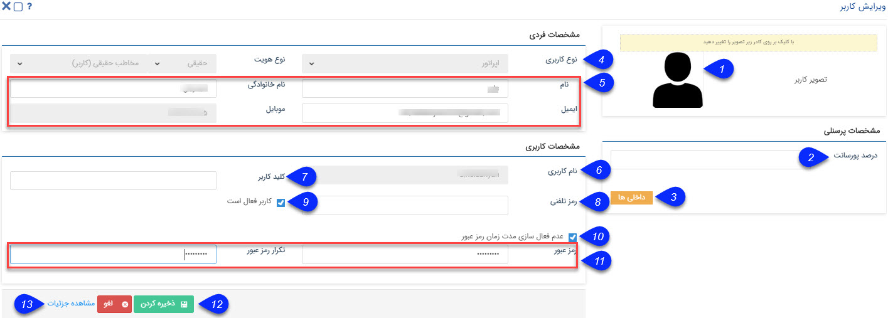

# ساخت کاربر جدید    

ساخت کاربر جدید 

شیوه ساخت یک کاربر جدید به شرح زیر است:

 

1\. **تصویر کاربری:** تصویر کاربر را با کلیک بر روی تصویر عوض کنید. (هر کاربر نیز می تواند در قسمت [پروفایل من](../../../Home/MyProfile.md) تصویر کاربری خود را عوض کند.)

2\. **درصد پورسانت:** اگر کاربر پورسانتی از فروش هایی که انجام می دهد (فاکتورها و قراردادهایی که در پیام گستر با نام او ثبت می شود) را دریافت می کند، درصد آن را در این فیلد وارد کنید.

3\. **داخلی ها:** داخلی های کاربر مورد نظر را تعریف کنید. توجه داشته باشید که این داخلی ها بر اساس قسمت [مدیریت سیستم های تلفنی](../../../BaseInformatio/Phonesystems/Phonesystemsmanagement.md) تعیین می شوند.

4\. **نوع هویت:** نوع هویت کاربر (مخاطب حقیقی یا حقوقی، سرنخ حقیقی یا حقوقی) را تعیین کنید.

5. **اطلاعات کاربر:** نام و نام خانوادگی و اطلاعات تماسی کاربر را در این قسمت وارد کنید. توجه داشته باشید از آن جا که نرم افزار برای ارسال پیام های مختلف (از جمله پیام های داخل فرآیند، یا زمانی که یک وظیفه یا درخواست تایید) نیاز به اطلاعات تماسی کاربر دارد، نیاز است که این اطلاعات با دقت و صحیح لحاظ شوند.

6. **نوع کاربر:** کاربر می تواند چهار نوع باشد:

*   کاربر:  کاربر عادی نرم افزار محسوب می شود.
    
*   نماینده: مانند کاربر عمل می کند.
    
*   مشتری: فقط دسترسی به پنل [باشگاه مشتریان](../../../MajolhayeTakmili/BashgaheMoshtarian.md) دارد. (توجه کنید که این نوع از کاربران جزء کاربران فعال شما محسوب نمی شوند.)
    

7\. **نام کاربری** : نام کاربری را وارد کنید. این نام باید به زبان انگلیسی و حداقل 5 کاراکتر باشد. توجه داشته باشید پس از ایجاد کاربر، نام کاربری او قابل ویرایش نیست.

8\. **کلید کاربر:** برای مباحث ارتباط از طریق وب سرویس برنامه نویسان از این فیلد استفاده می کنند و کاربردی برای کاربران ندارد.

9\. **کاربر فعال است:** اگر کاربر را غیر فعال کنید. یکی از سقف کاربران مجاز شما آزاد می شود و می توانید کاربر دیگری را به نرم افزار اضافه کنید. (به جای حذف کاربرانی که از مجموعه شما رفته اند یا دیگر نیازی به استفاده از پیام گستر ندارند - مانند جابه جایی عنوان شغلی و ...- از غیر فعال کردن این گزینه استفاده کنید.)

10\. **عدم فعال سازی مدت زمان عبور** : با فعال کردن این گزینه رمز عبور این کاربر در نرم افزار، هیچ زمانی منقضی نمی شود.

برای تنظیم مقدار پیشفرض زمان خارج شدن کاربر در صورت عدم استفاده از نرم افزار به قسمت [امنیتی](../../TotalSetting/Safetly.md) مراجعه کنید.

11. **رمز عبور:** رمز عبور کاربر را تعیین کنید. (تعداد حروف رمز عبور، امکان منقضی شدن رمز عبور و الزام رمز پیچیده بودن آن را در قسمت [امنیتی](../../TotalSetting/Safetly.md) میتوانید تنظیم کنید.)

12\. **مشاهده جزییات:** لینک هویتی که در بانک اطلاعاتی به نام این کاربر ایجاد شده است در این قسمت نمایش داده می شود.