# افزودن مشخصه    

**افزودن مشخصه (اضافه کردن فیلد)**

با استفاده از افزودن مشخصه می توانید به هر آیتم (مانند فرم، فاکتور، هویت و ...) فیلدهای اطلاعاتی دلخواه را اضافه کنید. تسلط بر این انواع فیلدی برای ساخت بهتر فرآیند و بهینه سازی نرم افزار ضروری است.

نکته: نام پارامترهای ساخته شده نباید دقیقا با پارامترهایی که به صورت پیشفرض در صفحه هویت ها (مانند: وب سایت، ایمیل، نام خانوادگی و ...) وجود دارد، همنام باشد.

نکته: فیلدهایی که به هویت های اضافه می شوند در قسمت جستجوی پیشرفته می توانند مورد استفاده قرار بگیرند. (برای مثال اگر یک فیلد برای کد/شناسه ملی اضافه کنید، در جستجوی پیشرفته می توانید بر اساس آن بین مخاطبان و سرنخ های خود جستجو انجام دهید.)

**1.** **اضافه کردن گروه:** می توانید گروه فیلدی جدید اضافه کنید.

**2.** **کلید بالا و پایین:** با استفاده از این دو کلید میتوانید ترتیب چینش فیلدها را تغییر دهید.

**3\. فیلتر:** می توانید برای یافتن فیلد/فیلدهای مورد نظر خود از بین فیلدهای ساخته شده، نام آن را فیلتر کنید.

**4\. افزودن عبارت:** می توانید عبارت مورد نظر خود را به آیتم اضافه کنید. این عبارت به عنوان یکی از فیلدهای آیتم نمایش داده نخواهد شد و تنها می توانید از پارامتر هوشمند آن برای تنظیم قالب چاپی (پیش نمایش) آیتم ها استفاده کنید.

5\. **افزودن مشخصه:** می توانید یک مشخصه دلخواه را به آیتم اضافه کنید، نوع  نمایشآن را بسته به کاربردپارامتر می توانید متن، تاریخ، لیست،چک باکس یا سایر موارد موجودمشخص کنید.همچنین می توان مشخص کرد این پارامتر اضافه شده، در صفحه مشخصات آیتم، در چهگروهینمایش داده شود. به طور مثال با انتخاب گروه مالی، این پارامتر در پروفایل ها در گروه مالی قابل مشاهده خواهد بود.

6. **استفاده ازمشخصه موجود:** برای کپی کردن فیلدهایی که در قبلا در آیتم دیگه ای ساخته شده اند می توانید از این ویژگی استفاده کنید.

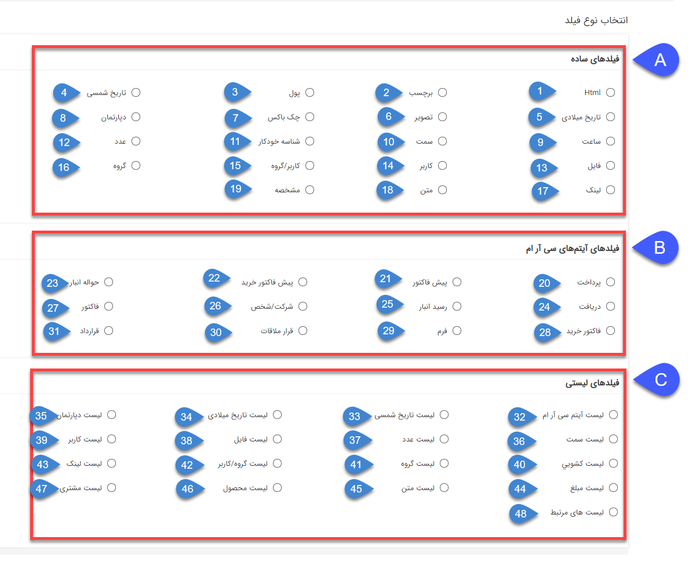 

برای هر پارامتری که میخواهید اضافه کنید باید یک عنوان در نظر بگیرید و گروهی که در آن باید جای بگیرد را نیز مشخص کنید. تقریبا برای تمامی فیلدها می توانید یک مقدار پیشفرض در نظر بگیرید. در هنگام ایجاد این آیتم، مقدار پیش فرض به صورت از پیش تعیین شده در آن فیلد نمایش داده خواهد شد. کلید کاربر برای برنامه نویسان مورد استفاده قرار می گیرد. (برای ارتباط نرم افزار پیام گستر با وب سرویس ها و برنامه های دیگری مانند نرم افزار های حسابداری و وب سایت ها...)

انواع فیلدها به 3 دسته تقسیم می شوند:

A.فیلدهای ساده: این امکان را به شما می دهند که بر اساس نوع فیلد، مقادیری به آن ها اختصاص دهید ( متن و عدد و چک باکس و فایل و ...) و یا اینکه از بین مقادیری که برای آن ها از قبل داده شده است انتخاب کنید (لیست و دپارتمان و سمت و مشخصه و ...)

B. فیلدهای سی آر ام: این امکان را به شما می دهند که بر اساس نوع فیلد، آیتمی از همان نوع انتخاب کرده و یا اینکه آیتم جدید ایجاد کرده و به فیلد متصل کنید.

C. فیلدهای لیستی:  این امکان را به شما می دهند که بر اساس نوع فیلد، بیش از یک مقدار به فیلد مورد نظرتان اختصاص دهید. در واقع لیستی از مقادیر مرتبط با فیلد در آیتم ذخیره می شود.

در زیر هر 3 دسته از انواع فیلد با ذکر چندین نمونه توضیح داده شده است:

**A. انواع فیلدهای ساده**

1. Html: یک فیلد متنی با قابلیت استفاده از ابزارهای HTML می توانید بیافزایید. 

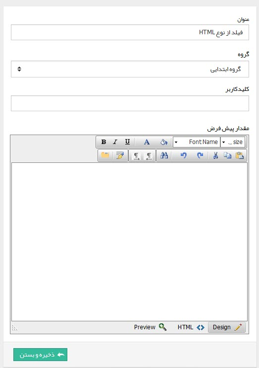 

نمونه:

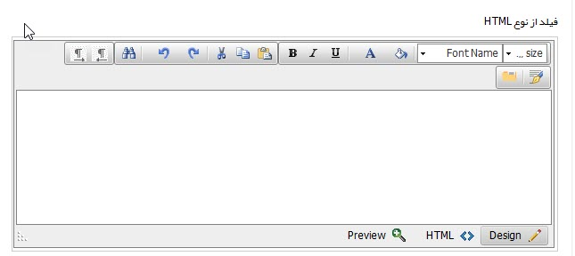

2. برچسب: می توانید یک متن رنگی یا یک آیکون را برای نمایش در آیتم اضافه کنید. (مانند توضیح نحوه پر کردن فرم، یا نکات مهمی که کاربر باید همیشه مد نظر داشته باشد.)

نمونه:

3. پول: یک فیلد برای وارد کردن مقادیر مثبت پولی را می توانید اضافه کنید.

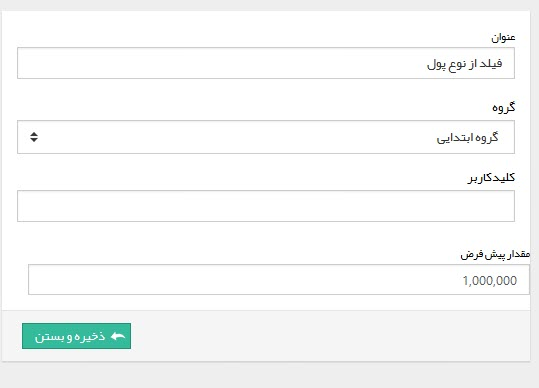

نمونه:

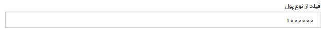

4\. تاریخ شمسی: یک فیلد از نوع تاریخ شمسی می توانید اضافه کنید.

5\. تاریخ میلادی: تاریخی از نوع میلادی را میتوانید اضافه کنید.

6\. تصویر: یک فیلد برای تصویر اضافه می کند. میتوانید اندازه، پسوندهای مجاز و اندازه نمایش تصویر در صفحه را مشخص کنید.

نمونه:

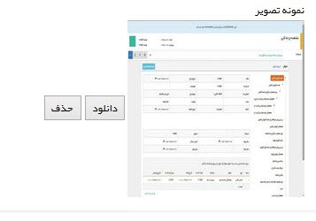

7\. چک باکس: یک چک باکس می توانید اضافه کنید.

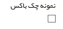

8\. دپارتمان: این فیلد لیست دپارتمان ها را شامل می شود که کاربر می تواند یکی از دپارتمان ها را از لیست انتخاب کند.

9\. ساعت: فیلدی با قابلیت انتخاب ساعت را می توانید بیافزایید.

10\. سمت: این فیلد لیست سمت ها را شامل می شود که کاربر می تواند یکی از سمت ها را از لیست انتخاب کند.

11\. شناسه خودکار: با استفاده ميتوانيد يک شناسه خودکار (Indicator) به يکي از آيتم ها اضافه کنيد، ميتوانيد پيشوند و پسوند اين شمارنده و تعداد رقم آن را مشخص کنيد.

12\. عدد: یک فیلد عددی را می توانید اضافه کنید. مقدار پیشفرض، تعداد رقم اعشار و بازه تعداد رقم صحیح عدد وارد شده (عدد چند رقمی باید باشد) را می توانید تعیین کنید.

نمونه:

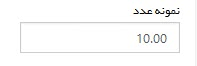

13\. فایل: یک فایل را از این طریق می توانید به صفحه مشخصات اضافه کنید. پسوندهای مجاز و حداکثر حجم فایل را نیز می توانید تعیین کنید.

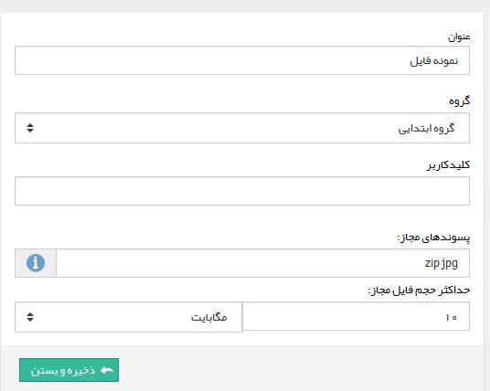

14.  يک لينک براي انتخاب يکي از کاربرهاي سيستم را مي توانيد اضافه کنيد.

15.  کاربر/گروه: یک لینک برای انتخاب یکی از کاربر/گروه را می توانید اضافه کنید.

16\. گروه: يک لينک براي انتخاب يکي از گروه هاي کاربري سيستم را مي توانيد اضافه کنيد.

17\. لینک: یک فیلد برای گنجاندن یک لینک را می توانید اضافه کنید.

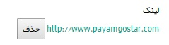

18\. متن: یک فیلدی از نوع متن (تک یا چند خطی) می توانید اضافه کنید. این فیلد میتواند تک خطی یا چند خطی باشد. فیلد چند خطی برای مواردی که نیاز به وارد کردن چندین خط توضیحات است، مناسب است.

19\. مشخصه: یکی از مشخصات تعریف شده در [آیتم های سیستم](../BaseInformatio/SystemsItemsManagement.md) (مانند نوع برخورد، رفتار فرد و ... ) را می توانید اضافه کنید.

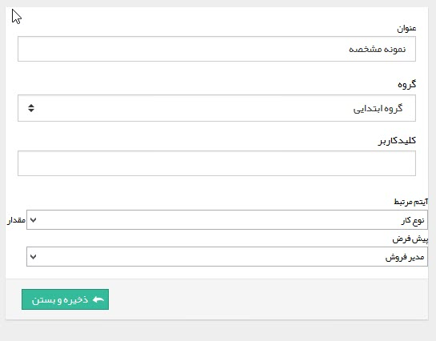

**B. انواع فیلدهای سی آر ام **

20.پرداخت: یک لینک برای انتخاب یکی از پرداخت های انجام شده به مخاطب می توانید اضافه کنید.

نمونه:

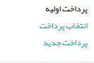

21\. پیش فاکتور: یک لینک برای انتخاب یکی از پیش فاکتورهای فروش سیستم را می توانید اضافه کنید.

22\. پیش فاکتور خرید: یک لینک برای انتخاب یکی از پیش فاکتورهای خرید سیستم را  می توانید اضافه کنید.

23\. حواله انبار:  یک لینک برای انتخاب یکی از حواله های انبار می توانید اضافه کنید. (اگر در آیتم نیاز دارید که یک فیلد از نوع حواله داشته باشید.)

24\. دریافت: یک لینک برای انتخاب یکی از دریافت های سیستم را می توانید اضافه کنید.

25\. رسید انبار: یک لینک برای انتخاب یکی از رسیدهای انبار میتوانید اضافه کنید.

26\. شرکت/شخص: یک لینک برای مراجعه به پروفایل یک مخاطب یا سرنخ را می توانید از این طریق اضافه کنید.

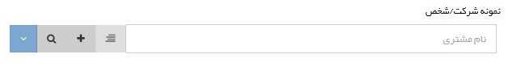 

27. فاکتور: یک لینک برای انتخاب یکی از فاکتورهای فروش سیستم را می توانید اضافه کنید.

28\. فاکتور خرید: یک لینک برای انتخاب یکی از فاکتورهای خرید سیستم را  می توانید اضافه کنید.

29\. فرم: یک لینک برای انتخاب یکی از فرم های سیستم را می توانید اضافه کنید. 

30\. قرار ملاقات: اجازه ثبت یک فیلد از نوع قرار ملاقات را می دهد.

31\. قرارداد: یک لینک برای انتخاب یکی از قراردادهای سیستم را می توانید اضافه کنید.

**C. انواع فیلدهای لیستی**

32: لیست آیتم سی آر ام: با استفاده از این فیلد می توانید جدولی داشته باشید که محتوای آن لیستی از یک نوع آیتم باشد که هنگام تعریف فیلد مشخص کرده اید.

طراحی فیلد از نوع لیست سی آر ام به صورت زیر است:

1\. ابتدا یک نام به فیلد اختصاص دهید.

2. در این قسمت آیتمی که می خواهید لیستی از آن نوع داشته باشید را انتخاب کنید (فاکتور فروش، فرم، قرارداد، فرصت و ....)

3. در این قسمت زیرنوع آیتمی که در بالا انتخاب کرده اید را انتخاب کنید.

4\. هر یک از فیلدهایی که در این قسمت فعال باشند، در جدول به عنوان یک ستون نمایش داده می شوند. فیلدهای نمایش داده شده در این قسمت به نوع آیتم بستگی دارد.

5\. گروه فیلد مرتبط با فیلد را انتخاب کنید

نمونه:

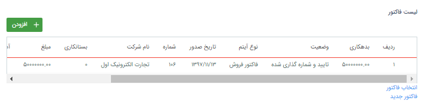

33: لیست تاریخ شمسی: هنگام استفاده از این فیلد لیستی از تاریخ های شمسی را با این فیلد می توانید مقدار دهی کنید

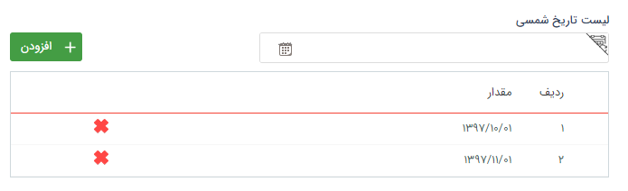

34: لیست تاریخ میلادی: هنگام استفاده از این فیلد  لیستی از تاریخ های میلادی را با این فیلد می توانید مقدار دهی کنید

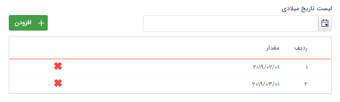

35\. لیست دپارتمان: هنگام استفاده از این فیلد  لیستی از دپارتمان هایی که در قسمت [مدیریت شعب، دپارتمان، سمت](../BaseInformatio/BranchManagement.md) تعریف شده اند را با این فیلد می توانید مقدار دهی کنید.

36. لیست سمت: هنگام استفاده از این فیلد لیستی از سمت هایی که در قسمت [مدیریت شعب، دپارتمان، سمت](../BaseInformatio/BranchManagement.md) تعریف شده اند را با این فیلد می توانید مقداردهی کنید.

37\. لیست عدد: هنگام استفاده از این فیلد  لیستی از اعداد را با در نظر گرفتن بازه مشخص شدهدر زمان طراحی ارقامی که هنگام تعریف فیلد مشخص کرده اید می توانید مقدار دهی کنید.

38\. لیست فایل: هنگام استفاده از این فیلد  لیستی از فایل ها را با در نظر گرفتن حجمی که هنگام طراحی فیلد مشخص کرده اید می توانید پیوست کنید.

در نظر داشته باشید که حجم تعریف شده برای فیلد، برای کلیه فایل ها در نظر گرفته می شوند. برای مثال اگر حجم مجاز 10 مگابایت تعریف شود، مجموع حجم کلی فایل های پیوست شده نمیتواند بیش از 10 مگابایت باشد.

نکته: امکان استفاده از لیست های فایل در قالب پیش نمایش وجود ندارد.

39\. لیست کاربر: هنگام استفاده از این فیلد  امکان ایجاد لیستی با مقادیر نام کاربران سیستم را در اختیار شما قرار می دهد. (فقط امکان انتخاب کاربران فعال وجود دارد.)

40\. لیست کشویی: در زمان طراحی فیلد ها  می توانید لیستی با مقادیر دلخواه خودتان را اضافه کنید. برای اضافه کردن مقادیر لیست باید ابتدا آن را ذخیره کنید.

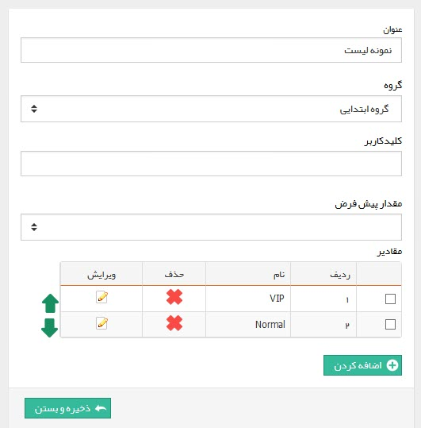

41\. لیست گروه: هنگام استفاده از این فیلد  امکان ایجاد لیستی با مقادیر نام گروه های کاربری را در اختیار شما قرار می دهد. (فقط امکان انتخاب گروه های فعال وجود دارد.)

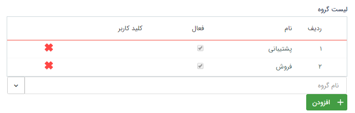

42\. لیست گروه ها و کاربران: هنگام استفاده از این فیلد  امکان ایجاد لیستی با مقادیر نام گروه ها و کاربران را در اختیار شما قرار می دهد. ( فقط امکان انتخاب گروه ها و کاربران فعال وجود دارد.)

43\. لیست لینک: هنگام استفاده از این فیلد امکان ایجاد لیستی از نوع لینک وجود دارد. (لینک ها باید با یک پروتکل شروع شوند برای مثال: //:http یا //:https  یا //:ftp و...)

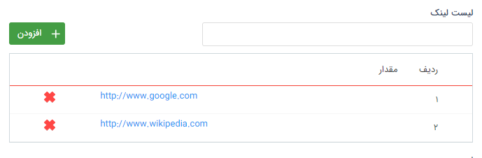

44\. لیست مبلغ: هنگام استفاده از این فیلد  امکان ایجاد لیستی از اعداد که ماهیت مبلغ دارند را در اختیار شما قرار می دهد.

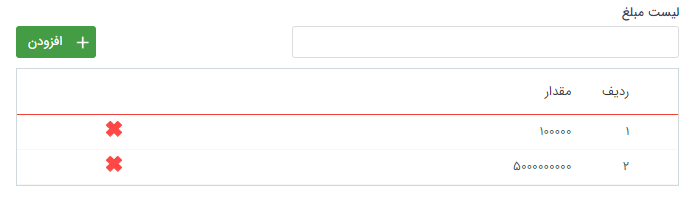

45:  لیست متن: هنگام استفاده از این فیلد  امکان درج لیستی با ماهیت متن را در اختیار شما قرار می دهد.

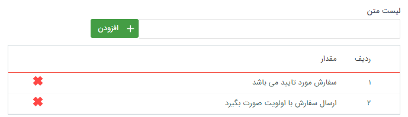

46\. لیست محصول: در زمان طراحی فیلد ها، با استفاده از این فیلد می توانید یک جدول محصول به آیتم اضافه کنید. می توانید مشخص کنید که برای هریک از ردیف های این جدول محصول چه اطلاعاتی (مقدار، تخفیف، قیمت واحد و قیمت نهایی) نمایش داده شود. توجه کنید که محصولات تعریف شده در [مدیریت محصولات](../BaseInformatio/ProduceManagement.md) می توانند در این لیست انتخاب شوند.

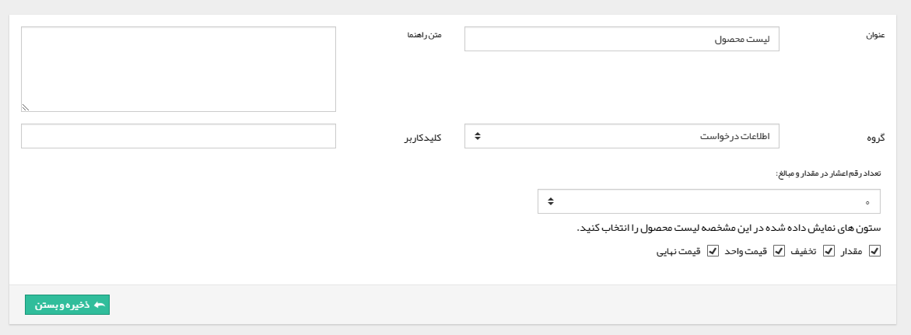

نمونه فیلد لیست محصول:

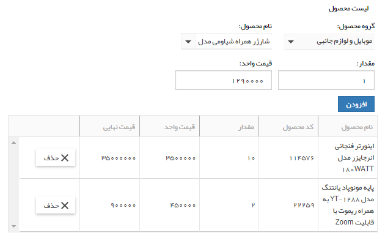

47: لیست مشتری: امکان جستجو و انتخاب هویت هایی که قبلا در بانک اطلاعاتی ایجاد شده اند و یا ایجاد هویت و سپس انتخاب آن ها در لیست وجود دارد.

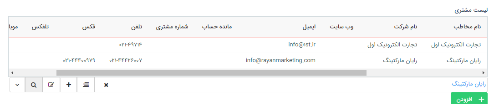

48\. لیست های مرتبط: در زمان طراحی فیلد ها، می توانید یک لیست به هم پیوسته در آیتم ایجاد کنید. ابتدا بر روی دکمه "تعریف لیست مرتبط کلیک کنید".

سپس طبق مراحل زیر اقدام کنید:

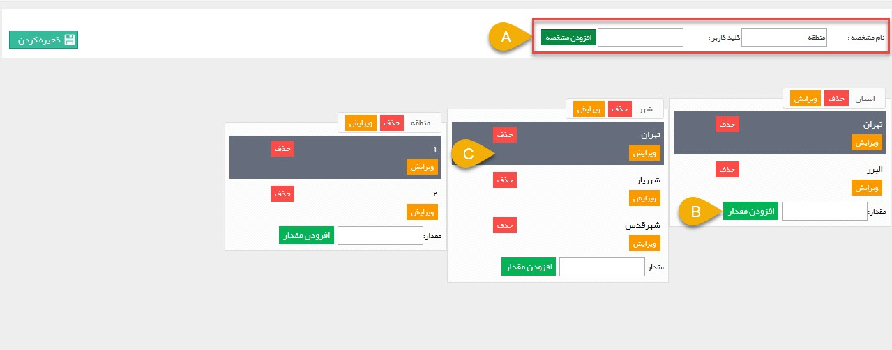

A. نام مشخصه: ستون های مختلف را از این قسمت اضافه کنید. (برای مثال طبق تصویر ما سه مشخصه استان، شهر و منطقه را اضافه کرده ایم.)

B. افزودن مقدار: نام مقدار را اضافه کنید. (برای مثال ما در ستون اول -استان- دو مقدار "تهران" و "البرز" را وارد کرده ایم.)

C. با کلیک بر روی هر مقدار می توانید، مقادیر ستون بعد را در آن وارد کنید. (برای مثال طبق تصویر ما برای تهران که در ستون اول وارد شده است، در ستون دوم سه مقدار تهران، شهریار و شهرقدس را وارد کرده ایم.)

نمونه:

نکته: امکان استفاده از لیست های مرتبط در قالب پیش نمایش وجود ندارد.