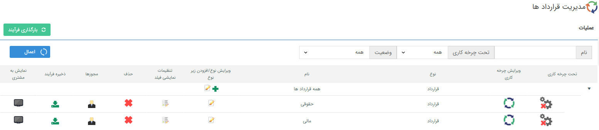
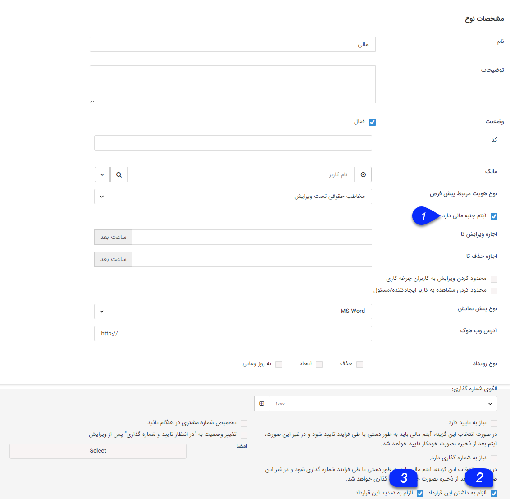
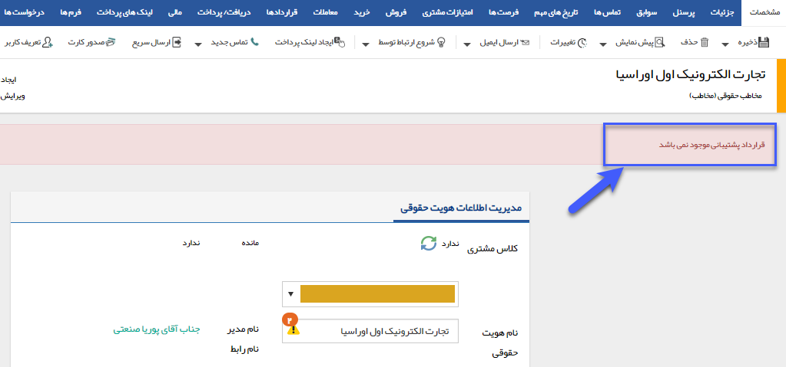

# مدیریت قراردادها    

مدیریت قراردادها

از این صفحه می توانید قرارداد جدیدی را تنظیم و قراردادهای قبلی را ویرایش و یا حذف نمایید. با کلیک بر روی دکمهاضافه کردنمی توانید قرارداد جدیدی را تنظیم نمایید.

قرارداد ها می توانند شامل قراداد پشتیبانی، تعمیر و نگهداری، خدمات پس از فروش، ضمانت تعویض و ... باشند. 

لطفا ابتدا  [اطلاعات کلی](Totalview/BasicInformation.md) را در این خصوص مطالعه فرمایید.

**قرارداد جدید:**

علاوه بر تنظیمات [آیتم های حقوقی/مالی](Totalview/FinancialItemscommonsetting.md)  و تنظیمات عمومی که در قسمت [تنظیمات مشترک آیتم های سیستم](Totalview/Itemscommonsetting.md)  توضیح داده شد، تنظیمات اختصاصی قرار دادها به شرح زیر می باشد.

**** 

1\. آیتم جنبه مالی دارد: در صورتی که این گزینه را فعال کنید مبلغ قرارداد در محاسبات مالی مربوط به پروفایل لحاظ می شود و قرارداد ماهیت مالی پیدا می کند و در صورتی که تیک را انتخاب نکنید، قرارداد تنها جنبه حقوقی خواهد داشت.

2\. الزام به داشتن این قرارداد: در صورتی که این گزینه فعال شده باشد، اگر مخاطبی در سوابقش این نوع قرارداد را نداشته باشد،نوار قرمز رنگی در صفحه پروفایل آن مخاطب دیده می شود.

 

3\. الزام به تمدید این قرارداد: در صورتی که این گزینه فعال شده باشد، اگر مخاطبی که این نوع قرارداد برای او ثبت شده است، تاریخ اتمام قراردادش فرا رسیده باشد، نوار قرمز رنگی در صفحه پروفایل آن  مخاطب دیده می شود.

