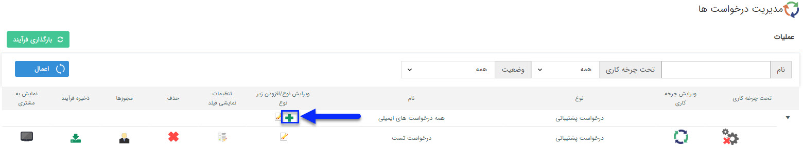
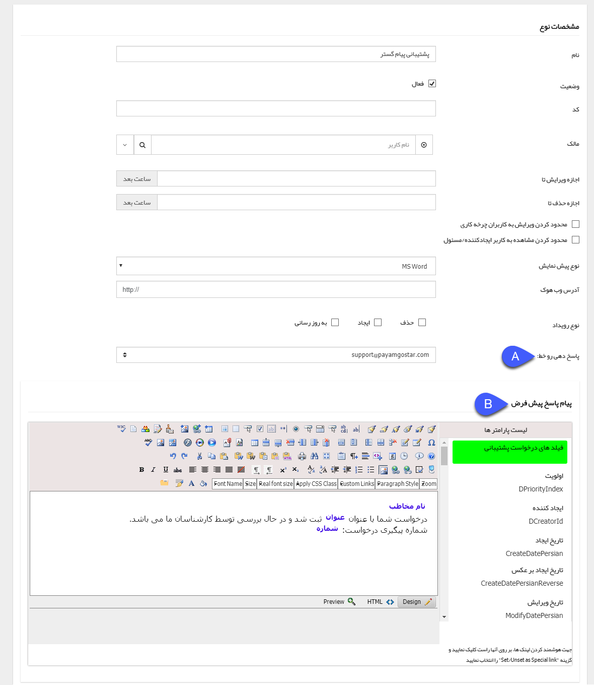

# مدیریت درخواست ها    

مدیریت درخواست ها

از این صفحه می توانیدسیستم درخواست (Ticketing)جدیدی را تنظیم ودرخواست های ساخته شده را ویرایش و یا حذف نمایید.

لطفا ابتدا [اطلاعات کلی](Totalview/BasicInformation.md) را در این خصوص مطالعه فرمایید.

درخواست در واقع پاسخ دهی به ایمیل ها بر روی یک خط خاص و مدیریت ایمیل های آن خط محسوب می شود، به طوری که که هر ایمیل ارسال شده بر روی آن خط شماره ای به صورت خودکار دریافت می کند و ارسال کننده ایمیل می توانند ایمیل را از طریق شماره آن پیگیری نماید.

 با کلیک بر روی آیکون + می توانید یک نوع درخواست پشتیبانی جدید را ایجاد نمایید.

برای تنظیمات عمومی درخواست پشتیبانی به [تنظیمات مشترک آیتم های سیستم](Totalview/Itemscommonsetting.md) مراجعه کنید.

A. پاسخ دهی روی خط: در واقع مشخص می کند این درخواست بر روی کدام خطایمیل فعال می شود. (در واقع ایمیل های دریافتی روی کدام خط به صورت خودکار پاسخ داده شود و شماره پیگیری دریافت نمایند.)

B. پیام پاسخ پیش فرض: در صورت دریافت هر ایمیل بر روی خط مشخص شده، این پیام تنظیم شده به صورت خودکار برای فرستنده ایمیل ارسال می شود.