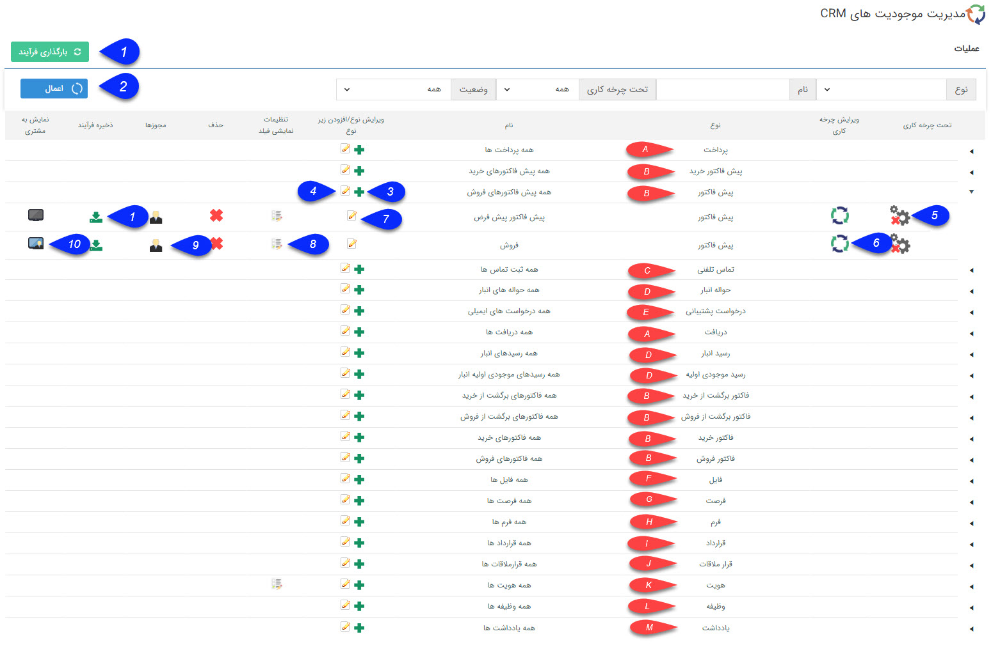

# اطلاعات کلی        

**شخصی سازی**  **CRM**

از این صفحه می توانید تمام موجودیت ها و آیتم های CRM  پیام گستر را شخصی سازی کنید.

 

1\. **ذخیره و بارگذاری فرآیند** **:** اجازه وارد کردن یک آیتم همراه با فرآیند آن را در نرم افزار می دهد. برای اطلاعات بیشتر، قسمت [ذخیره و بارگذاری فرآیند](ProcessDesignCycle/ImportExport.md) را مطالعه کنید.

2. اعمال**فیلتر:** می توانید انواع آیتم ها را فیلتر کنید. این فیلترها شامل نوع آیتم، نام آن ها، وضعیت فعال/غیرفعال بودن آیتم و اینکه چرخه فعال کاری دارند یا خیر، می شود.

3. **اضافه کردن:** با انتخاب آیکون + می توانید زیرنوع جدیدی را اضافه نماید. به طور مثال برای فاکتور امکان ساختن زیر نوع های مختلف فراهم شده است. زیر نوع هایی با مشخصات کاملاً متفاوت در درصد مالیات، شماره شروع فاکتور، مجوز تأیید و حتی قالب پیش نمایش آنها.

4\. **ویرایش سوپر فیلد:** امکان تعریف سوپر فیلدها را در اختیار شما قرار می دهد. هر فیلدی که در این قسمت اضافه شود. در تمامی زیرنوع های آن آیتم اضافه خواهد شد. (برای مثال اگر شما یک فیلد به نام "محل تحویل" از نوع لیست در آیتم فاکتورها اضافه کنید، در تمامی انواع فاکتورهایی که دارید، این فیلد نمایش داده می شود.)

این امکان برای تعریف کردن فیلدهای مشترک بین آیتم های مختلف بسیار مفید است.

5\. **فعال/غیرفعال کردن چرخه:** با کلیک بر روی آیکون تحت چرخه کاری، فرآیند طراحی شده بر روی آیتم انتخاب شده فعال می گردد. تیک سبز رنگ در کنار آیکون چرخه به معنی فعال بودن چرخه کاری بر روی آیتم است و ضربدر قرمز رنگ به معنی غیر فعال بودن چرخه کاری برروی آیتم است.  

6\. **ویرایش چرخه کاری:** با کلیک بر روی آیکون ویرایش چرخه کاری پنجره ای باز می شود و امکان طراحی فرآیند بر روی آیتم انتخاب شده فراهم می گردد.

(برای اطلاعات بیشتر به لینک[طراحی چرخه کاری](ProcessDesignCycle.md) مراجعه نمایید.)

7\. **ویرایش یک آیتم:** با کلیک بر روی این آیکون میتوانید آیتم مورد نظر را ویرایش کنید.

8\. **تنظیمات نمایش فیلد:** برای هر آیتم می توانید مشخص کنید که کدامیک از فیلدها جهت نمایش در لیست انتخاب شوند و یا اینکه در خلاصه نمایش داده شوند.

9\. **مجوزها:** مجوزهای هر آیتم را میتوانید تعیین کنید. برای اطلاعات بیشتر در این خصوص قسمت های [دسترسی های موجودیت ها](../../GroupsManagementAndUsers/Privileges/Itemprivileges.md) و [تعریف مجوزهای آیتم](ObjectTypePermission.md)  را مطالعه کنید.

10**.** **نمایش به مشتری:** در صورتی فعال یودن[ماژول باشگاه مشتریان](../../../MajolhayeTakmili/BashgaheMoshtarian.md) و انتخابآیکون نمایش به مشتری، مشتریان شما با مراجعه به داشبورد خود، در صورت داشتن این نوع آیتم می توانند آن را در پروفایل خود مشاهده نمایند.

برای اطلاع از نحوه ویرایش هر کدام از آیتم ها:

**A**. دریافت و پرداخت:

به قسمت [تنظیمات مشترک آیتم های سیستم](Itemscommonsetting.md) مراجعه کنید.

**B. پیش فاکتور و فاکتور و فاکتور برگشت:**

به قسمت [مدیریت فاکتورها](../FactorsManagement.md) مراجعه نمایید**.**

**C. تماس تلفنی:**

به قسمت [تنظیمات مشترک آیتم های سیستم](Itemscommonsetting.md) مراجعه کنید.

**D**. رسید ها و حواله های انبار:

لطفا به لینک [مدیریت تراکنش های انبار](../Warehousedraftmanagement.md) در بخش تنظیمات مراجعه نمایید**.**

**

E.  درخواست پشتیبانی:

**

لطفا به لینک [مدیریت درخواست ها](RequestsManagement.md) در بخش تنظیمات مراجعه نمایید.

**F**. فایل:

به قسمت [تنظیمات مشترک آیتم های سیستم](Itemscommonsetting.md) مراجعه کنید.

**G**. فرصت:

به قسمت [تنظیمات مشترک آیتم های سیستم](Itemscommonsetting.md) مراجعه کنید.

**H**.  فرم:

لطفا به لینک [مدیریت فرم ها](../FormsManagement.md) در بخش تنظیمات مراجعه نمایید.

### I.  قرارداد:

لطفا به لینک [مدیریت قراردادها](ContractManagement.md)  در بخش تنظیمات مراجعه نمایید.

**J**. قرار ملاقات:

به قسمت [تنظیمات مشترک آیتم های سیستم](Itemscommonsetting.md) مراجعه کنید.

**K**. هویت:

به قسمت [تنظیمات مشترک آیتم های سیستم](Itemscommonsetting.md) مراجعه کنید.

**L**. وظیفه:

به قسمت [تنظیمات مشترک آیتم های سیستم](Itemscommonsetting.md) مراجعه کنید.

**M**. یادداشت:

به قسمت [تنظیمات مشترک آیتم های سیستم](Itemscommonsetting.md) مراجعه کنید.