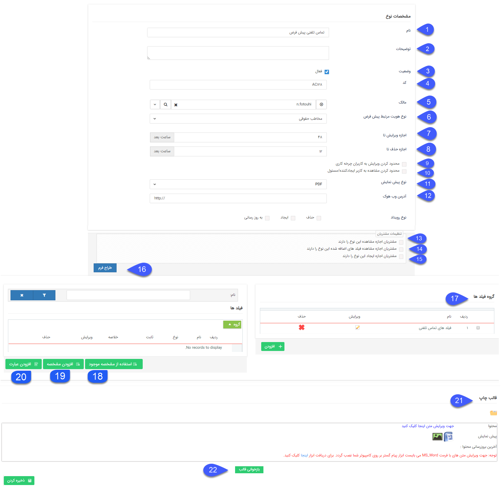
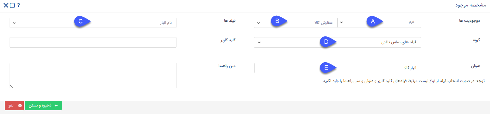
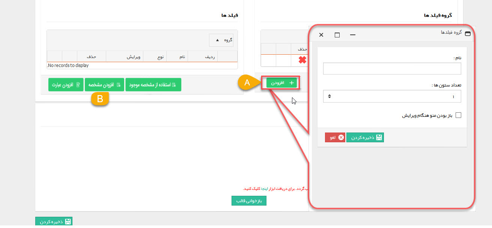

# تنظیمات مشترک آیتم های سیستم    

### تنظیمات مشترک آیتم های سیستم

در این قسمت تنظیماتی که در ویرایش تمامی آیتم های نرم افزار پیام گستر مشترک است را مشاهده می کنید، توجه داشته باشید که علاوه بر این قسمت باید  [آیتم های حقوقی/مالی/حواله انبار](FinancialItemscommonsetting.md) را نیز مطالعه کنید، یادگیری این قسمت در طراحی چرخه حائز اهمیت است.

**موارد زیر در تمامی آیتم های سیستم به صورت مشترک وجود دارد:** 

1. **نام:** می توانید نام آیتم را به دلخواه خود تعیین کنید.

2\. **توضیحات**: می توانید توضیحات مرتبط با آیتم را بنویسید.

3\. **فعال:** با غیر فعال کردن هر آیتم، اجازه ذخیره آن را از کاربران خواهید گرفت. به این معنی که کاربران دیگر نمیتوانند مورد جدیدی از آن آیتم را ذخیره کنند. (برای مثال اکر یک فرم را غیرفعال کنید، کاربران نمیتوانند از آن فرم مورد جدیدی را ذخیره کنند.)

در نظر داشته باشید که اگر آیتم مورد نظر دارای فرآیند باشد، فرآیند همچنان به کار خود ادامه خواهد داد. (برای غیر فعال کردن فرآیند آن به مورد 6 در قسمت  [اطلاعات کلی](BasicInformation.md) مراجعه کنید.)

4 **کد:** می توانید کد دلخواه (برای مثال کد ایزو (ISO) سازمانی را) در این قسمت وارد کنید. این کد فقط شامل اعداد و حروف می تواند باشد.

5 **مالک:** به قسمت [مالک آیتم](itemowner.md)  مراجعه کنید.

6\. **نوع هویت مرتبط پیش فرض:** در این قسمت می توانید هویت چابک مرتبط با آیتم را مشخص کنید. 

7\. **اجازه ویرایش تا:** در صورتی که فیلد "اجازه ویرایش تا"را با یک مقدار عددی به ساعت پر نمایید. تنها تا مدت زمان عددیقبل از این مقدار اجازه ویرایش به ایجاد کننده آیتم داده خواهد شد (این محدودیت برای کاربرانی که اجازه ویرایش آن آیتم را دارند صدق نمی کند). در صورت خالی بودن فیلد، اجازه ویرایش برای کاربر ایجادکننده آیتم آزاد است.

8\. **اجازه حذف تا:** در صورتی که فیلد " اجازه حذف تا"را با یک مقدار عددی به ساعت پر نمایید. تنها تا مدت زمان عددیقبل از این مقدار اجازه حذف به ایجادکننده آیتم داده خواهد شد (این محدودیت برای کاربرانی که اجازه حذف آن آیتم را دارند صدق نمی کند). در صورت خالی بودن فیلد، اجازه حذف برای کاربر ایجادکننده آیتم آزاد است.

9. **محدود کردن ویرایش به کاربران چرخه کاری:** زمانی معنی پیدا می کند که بر روی این فرم، فرآیند تعریف و فعال شده باشد و در غیر این صورت تاثیری نخواهد داشت. در صورت فعال شدن گزینه، تنها کاربرانی می توانند این فرم را ویرایش کنند که در فرآیند یا چرخه کاری نقش داشته باشند.

10. **محدود کردن مشاهده به کاربر ایجاد کننده/ مسئول:** با فعال کردن این گزینه تنها کاربر ایجاد کننده و یا مسئول آیتم (مثلا در فرصت کاربری که در فیلد "تخصیص داده شده یه" وارد می شود به عنوان مسئول فرصت شناخته می شود) می توانند آیتم را مشاهده کنند.

11\. **نوع پیش نمایش:** می توان فرمت پیش نمایش مرتبط با این آیتم را به صورت وورد (قابل ویرایش پس از پیش نمایش گرفتن) یا عکس یا pdf تنظیم کرد.

12\. **وب هوک:** به عنوان یکی از امکانات منحصر به فرد نرم افزار، شما از این قسمت می توانید تعیین کنید که پس از هر بار ایجاد، به روز رسانی و ویرایش این آیتم یک آی دی مبنی بر تغییر آیتم به آدرسی که در این قسمت تعیین می کنید فرستاده شود. این امکان برای ارتباط این آیتم با یک وب سرویس بیرونی در نظر گرفته شده و قابل استفاده توسط برنامه نویسان است. (برای مثال ارتباط با نرم افزار حسابداری یا یک وب سایت و ...)

13\. **مشتریان اجازه مشاهده این نوع را دارند:** با فعال کردن این گزینه مشتریان با ورود به صفحه تاریخچه من  [باشگاه مشتریان](../../../MajolhayeTakmili/BashgaheMoshtarian.md) خود می توانند آیتم هایی از این نوع را که در سوابق خود دارند مشاهده کنند. (برای مثال بتوانند پرداخت های خود را مشاهده کنند.)

14\. **مشتریان اجازه مشاهده فیلدهای اضافه شده به این نوع را دارند:** با فعال بودن این گزینه مشتریان با باز کردن آیتم مربوطه در صفحه تاریخچه من باشگاه مشتریان خود می توانند فیلد های اضافه شده(جهت مشاهده تنظیمات اضافه کردن فیلد مورد 14 را مشاهده نمایید) در آیتم مربوطه را مشاهده کنند.  (برای مثال فیلد های اضافه شده به پیش فاکتور خود را مشاهده کنند.)

15\. **مشتریان اجازه ایجاد این نوع را دارند:** با فعال بودن این گزینه مشتریان با ورود به صفحه   [باشگاه مشتریان](../../../MajolhayeTakmili/BashgaheMoshtarian.md) خود می توانند این نوع آیتم را ایجاد کنند. (برای مثال می توان اجازه ایجاد فرم نظر سنجی را به مشتریان عضو باشگاه مشتریان تخصیص داد.) 

نکته: برای اطلاعات بیشتر در این خصوص، قسمت [داشبورد مشتریان](../../../MajolhayeTakmili/BashgaheMoshtarian/DashboardeMoshtarian.md)  را مطالعه کنید.

16\. **طراح فرم:** اجازه اضافه کردن فیلدها با استفاده از یک ویرایشگر شماتیک (تصویری) را فراهم می کند. برای اطلاع از جزییات بیشتر قسمت  [طراح فرم](Formdesigner.md) را مطالعه کنید.

17.**گروه فیلد ها:** برای فیلدهایی که قصد ساخت آن را دارید نام و تعداد ستون های گروهی آن را تعیین کنید(قسمت A). این کار به منظور دسته بندی فیلدهای ساخته شده صورت می پذیرد که سهولت استفاده از آن آیتم را در برخواهد داشت.

18\. **استفاده از مشخصه موجود:** برای کپی کردن فیلدهایی که در قبلا در آیتم دیگه ای ساخته شده اند می توانید از این ویژگی استفاده کنید.

 

روال کار به این صورت می باشد:

A. آیتمی که فیلد مورد نظرتان در آن قرار دارد را  انتخاب کنید.

B. زیرنوع آیتم را انتخاب کنید.

C. فیلد مد نظر خود را انتخاب کنید.

D. گروه فیلد مورد نظر خود را انتخاب کنید.

E. عنوانی به فیلد اختصاص دهید.

توجه کنید که پس از کپی شدن هیچ وابستگی ای بین فیلد اصلی و فیلد کپی شده وجود ندارد. به این معنی که ویرایش روی هر فیلد، به فیلد دیگر اعمال نمی شود.

19. **فیلدها:** فیلدهای خاص مربوط به آیتم خود را می توانید از قسمت فیلدها و دکمه افزودن مشخصه بسازید. همچنین فیلد اضافه شده در قسمت پارامترهای هوشمند، فیلدهای فرم نمایش داده می شود. **.**برای ساخت فیلدها فقط کافیست نام فیلد، نوع فیلد( یکی از انواع متن، لیست، چک باکس و ...) و گروه فیلدی مربوطه را انتخاب نمایید.(برای اطلاعات تکمیلی در خصوص انواع فیلدها به [افزودن مشخصه](../../ParametersAndPersonalInformationManagement.md)  مراجعه کنید.)

  

**A. افزودن گروه فیلد: برای فیلدهایی که قصد ساخت آن را دارید نام و تعداد ستون های گروهی آن را تعیین کنید. همچنین مشخص کنید که این گروه فیلدی زمانی که آیتم را کاربر باز می کند به صورت پیشفرض باز (Expand) نمایش داده شود و یا جمع شده (Collapse).**

**B. افزودن فیلد: با استفاده از گزینه اضافه کردن می توانید انواع فیلدهای دلخواه خود را اضافه کنید. (برای اطلاعات تکمیلی در خصوص انواع فیلدها به  [افزودن مشخصه](../../ParametersAndPersonalInformationManagement.md)  مراجعه کنید.)**

**20\. **افزودن عبارت:** در این قسمت می توانید یک عبارت ثابت وارد کرده و از آن در تنظیم قالب چاپی استفاده نمایید. این عبارت به عنوان یکی از فیلدهای آیتم نمایش داده نخواهد شد و تنها می توانید از پارامتر هوشمند آن برای تنظیم قالب چاپی (پیش نمایش) آیتم ها استفاده کنید. (به طور مثال اگر در پیش نمایش تعداد زیادی از فرم ها و سوابق دیگر، آدرس شرکت را درج میکنید، می توانید آدرس را به عنوان یک عبارت در قسمت سوپرفیلدهای هویت تعریف نموده و از آن در تنظیم قالب چاپی تمامی آیتم ها استفاده کنید)**

21.**  قالب چاپ:** در این قسمت می توانید قالب چاپ (پیش نمایش) آیتم را تنظیم کنید. برای اطلاع از چگونگی انجام این کار به قسمت  [تنظیم قالب چاپ](printpreviewdesign.md) مراجعه کنید.

22\. **بازخوانی از قالب:** برای برخی از آیتم های (مانند پیش فاکتور یا فاکتور فروش) یک قالب چاپی پیشفرض در نرم افزار پیام گستر طراحی شده است، با استفاده از این دکمه می توان قالب پیشفرض نرم افزار را جایگزین قالب چاپ فعلی کرد.