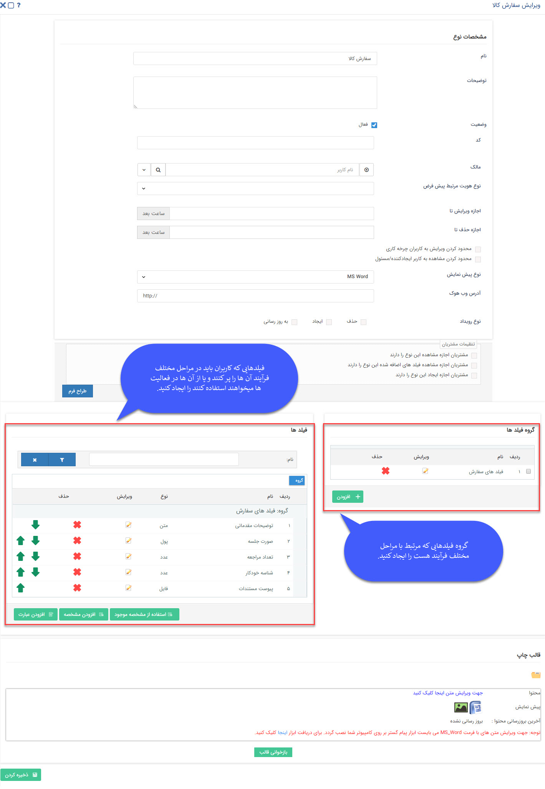

# طراحی فرآیند - چرخه کاری    

طراحی فرآیند (چرخه کاری)

برای طراحی چرخه کاری بر روی هر یک از آیتم ها به طور مثال فاکتور، فرم و فرصت و ...، لطفا مراحل زیر را طی نمایید**.**

نکته: لطفا ابتدا [اطلاعات کلی](BasicInformation.md) را مطالعه فرمایید.

در اولین مرحله، فرآیند یا چرخه کاری خود را طراحی نمایید. هر چرخه و فرآیند کاری متشکل از یک سری کارتابل و فعالیت و اقدامات بین آنهاست.

مراحل چرخه و مسئول هر مرحله را مشخص نمایید. همچنین ارتباط بین مراحل را مشخص نمایید. برای این کار می توانید از ابزارهای موجود (مانند MS-VISIO) برای طراحی فرآیند خود بهره ببرید. هر چرخه یک حالت آغاز و حالت انتهایی دارد ، بنابراین آغاز و پایان فرایند خود را نیز مشخص کنید.

دقت داشته باشید هر چرخه روی یکی از آیتم های نرم افزار (فرم یا فرصت یا فاکتور یا ...) اجرا می شود، بنابراین بعد از طراحی فرایند خود و انتخاب آیتم مورد نظر جهت پیاده سازی فرآیند کاری خود روی آن ، باید فیلدهایی که در طول چرخه نیاز به پردازش روی آنها دارید یا نیاز به گزارش گیری از آنها دارید را در قسمت ویرایش نوع در آیتم مورد نظر ایجاد کنید.

چرخه کاری می تواند بر روی هر کدام از موجودیت ها و آیتم های CRM فعالسازی شود. برای درک بهتر چرخه کاری به مثال فاکتور توجه نمایید. میتوانید چرخه کاری را بر روی آیتم فاکتور فعال نمایید. پس از شروع ارتباط با یک مشتری، فاکتور توسط کارشناسان فروش ثبت می شود و به کارتابل مدیر فروش جهت تایید ارسال می شود. بعد از این مرحله به کارتابل مالی برای دریافت هزینه فاکتور و ثبت و تایید آن ارسال می شود و سپس فاکتور تایید شده و پرداخت شده به بخش انبارداری برای ارسال محصول به مشتری ارجاع داده می شود**.** برای راه اندازی این چرخه فاکتور در نرم افزار پیام گستر می توانید از توضیحات زیر بهره ببرید.

**فیلدهای مورد نیاز:**

فیلدهای مورد نیازی که باید طی مراحل فرآیند توسط کاربران تکمیل شود و پردازشی روی آن صورت گیرد و یا نیاز باشد گزارشی از آن تهیه شود باید در این قسمت ساخته شود**.**

برای اطلاع از شیوه اضافه کردن فیلدها به بند 14 [تنظیمات مشترک آیتم های سیستم](Itemscommonsetting.md) مراجعه کنید.

