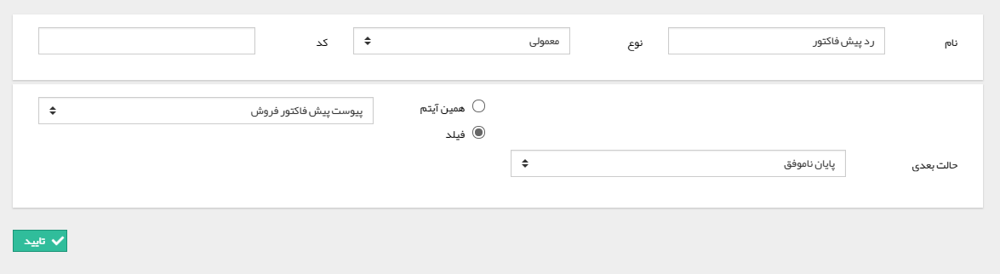

# تایید/رد آیتم مالی        

**مالی تایید آیتم - مالی رد آیتم**

  
با استفاده از این فعالیت می توانید یک آیتم crm که نیاز به تایید یا شماره گذاری دارد را به صورت خودکار در فرآیند، توسط سیستم تایید/شماره گذاری و یا رد کنید(این آیتم ها شامل پیش فاکتور/فاکتور، دریافت/پرداخت یا قرارداد مالی/حقوقی می باشند).

به طور مثال فرض کنید میخواهید در فرایند طراحی شده روی آیتم فرصت، پیش فاکتور متصل شده به فیلد پیش فاکتور فروش، پس از رویت و تایید مدیر فروش به صورت خودکار توسط سیستم تایید و شماره گذاری شود، و مدیر فروش برای تایید آن به کارتابل خود رجوع نکند ،برای انجام این کار می توانید با استفاده از این فعالیت پس از کارتابل مدیر فروش و استفاده از اقدام تایید فاکتور چرخه را به این فعالیت هدایت کنید تا فاکتور تایید شود.

 

1\. با فعال بودن این گزینه، پس از اجرای این فعالیت، آیتم مربوطه تایید خواهد شد.

2\. با فعال بودن این گزینه، پس از اجرای این فعالیت، آیتم مربوطه شماره گذاری خواهد شد.

برای تایید و شماره گذاری همزمان آیتم، باید موارد 1 و 2 را فعال کنید.

3. همین آیتم: در صورتی که می خواهید همین آیتم (آیتمی که چرخه کاری بر روی آن اجرا شده است) تایید/شماره گذاری یا رد شود ( مانند فاکتور، پرداخت، قرارداد و ...).

4\. فیلد: یک فیلد وابسته به این آیتم را میتوانید برای تایید و یا رد شدن انتخاب کنید. فیلدهایی از نوع پیش فاکتور، فاکتور، فاکتور برگشت، دریافت، پرداخت، قرارداد را می توان در این حالت انتخاب کرد.

در فعالیت رد آیتم مالی، صرفاً باید آیتم مربوطه را مشخص کرده و حالت بعدی فرآیند را مشخص کنید.

 

**نکته مهم:** در صورتی که چرخه کاری فعال روی آیتم های دارای قابلیت تایید و شماره گذاری (فاکتور، قرارداد، دریافت/پرداخت) داشته باشید، این آیتم ها پس از صدور برای تایید در کارتابل های مربوطه نمایش داده نخواهند شد و باید با استفاده از فرآیند و فعالیت های تایید/رد آیتم مالی نحوه تایید/رد آن ها را تعیین کنید.