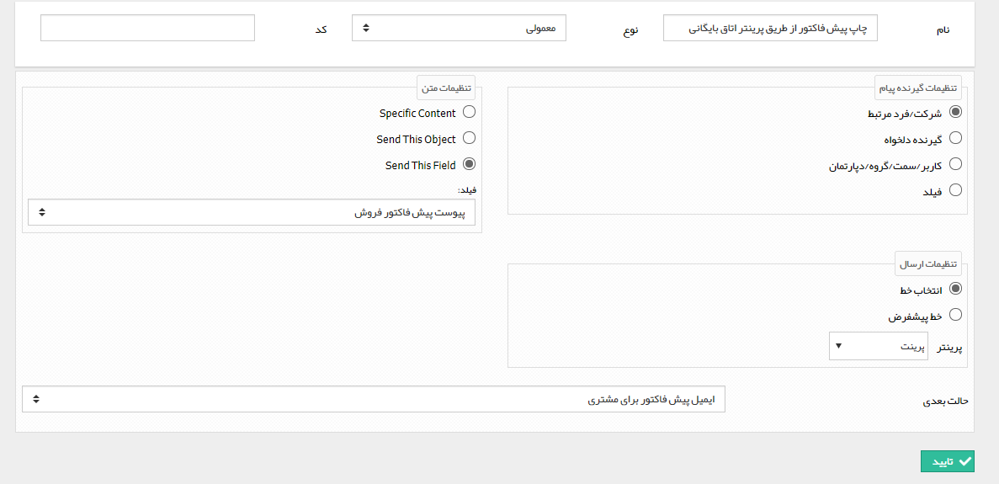
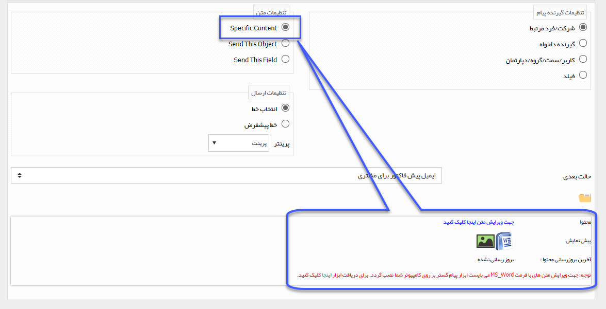

# چاپ    

**چاپ**

لطفا ابتدا قسمت  [ارسال پیامک-ایمیل-فکس-چاپ و پیام شبکه اجتماعی](../CommunicationActivity.md) را مطالعه کنید.

با انتخاب این فعالیت، یک چاپ به صورت خودکار به چاپگر تعریف شده در نرم افزار ارسال می شود و سپس گردش کار به مرحله بعد می رود.

نکته مهم: در صورت انتخاب قالب چاپ این آیتم (Send This Object) و یا قالب چاپ یک فیلد وابسته (Send This Field) به عنوان محتوا، قالب چاپی آیتم انتخاب شده به دستگاه چاپگر ارسال می شود.

به طور مثال فرض کنید، می خواهید در فرآیند فرصت پس از صدور پیش فاکتور فروش توسط کارشناس و تایید آن، پیش نمایش پیش فاکتور توسط دستگاه چاپگر مسئول بایگانی پرینت شود تا آن را در پرونده مشتری بایگانی کند.کافی است در قسمت تنظیمات متن، گزینه Send this  Field را انتخاب کرده و پس از آن فیلد پیش فاکتور را انتخاب کنید.

نکته: در صورتی که گزینه SpecificContent را انتخاب کنید، باید متن ارسالی را از طریق ابزار WebClientTool تنظیم کنید. برای اطلاع در خصوص تنظیم محتوای یک چاپ به قسمت [تنظیم متن](../../../../../../AdvertisedTools/Fax/GroupSendingList/Step2.md) مراجعه کنید.

