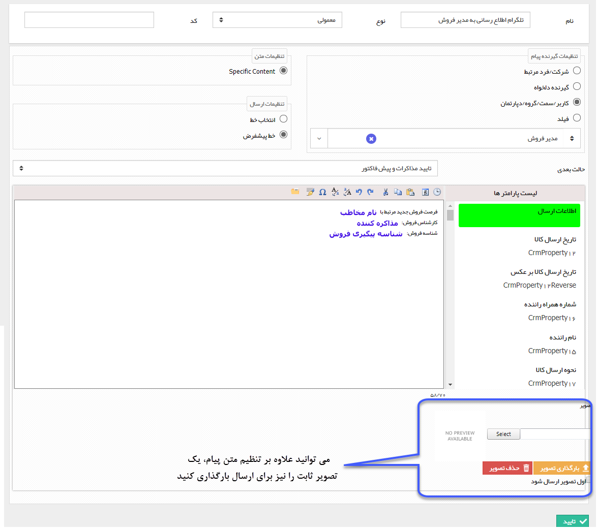

# ارسال پیام شبکه اجتماعی

ارسال پیام شبکه اجتماعی

لطفا ابتدا قسمت [ارسال پیامک-ایمیل-فکس-چاپ و پیام شبکه اجتماعی](../CommunicationActivity.md) را مطالعه کنید.

با استفاده از این فعالیت می توانید یک متن را برای ارسال از طریق پیام شبکه اجتماعی تنظیم کنید.

نکته مهم: در ارسال پیام شبکه اجتماعی امکان فرستادن قالب چاپ این آیتم (Send This Object) و فرستادن قالب چاپ یک فیلد وابسته (Send This Field) موجود نیست.

به طور مثال فرض کنید در فرآیند فرصت فروش، می خواهید قبل از ورود آیتم به کارتابل مدیر فروش برای تایید مذاکرات اولیه، یک پیام تلگرامی جهت اطلاع رسانی به او ارسال گردد.

