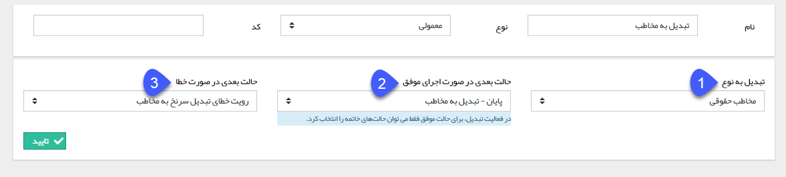

# تبدیل نوع

تبدیل نوع

با استفاده از این فعالیت می توانید زیرنوع یک آیتم تحت چرخه را تغییر دهید، به طور مثال در فرآیند طراحی شده برای سرنخ، پس از تایید کفایت سرنخ، آن را تبدیل به مخاطب کنید یا فرصت فروش کالا را تبدیل به فرصت پروژه (فروش کالا+خدمات) کنید. توجه داشته باشید این فعالیت، تنها قابلیت تبدیل یک زیرنوع از موجودیت های crm را به سایر زیرنوع های همان موجودیت دارد (یعنی فرم به فرم، رسید انبار به رسید انبار، هویت به هویت و ...).

**نکته:** با تبدیل یک آیتم به زیرنوع دیگر با استفاده از این فعالیت، مقادیر وارد شده در فیلدهای همنام به آیتم مقصد انتقال پیدا می کند و مقادیر وارد شده در فیلدهایی که فیلد همنامی در آیتم مقصد ندارند را از دست خواهید داد.

برای ایجاد این فعالیت، پس از تعیین نام و نوع فعالیت، سایر تنظیمات را مطابق با توضیحات زیر انجام دهید.

  

1\. در این قسمت لیست زیرنوع های ایجاد شده برای آیتم تحت چرخه نمایش داده می شود و باید مشخص کنید که این آیتم به کدام زیرنوع تبدیل شود.

**نکته:** توجه داشته باشید در صورتی که تبدیل نوع را برای هویت انجام می دهید، قابلیت تبدیل هویت های حقوقی به حقیقی و بالعکس با استفاده از این فعالیت وجود ندارد .

2\. حالت بعدی در صورت اجرای موفق تبدیل نوع را مشخص کنید، توجه داشته باشید با توجه به اینکه پس از اجرای این فعالیت، این آیتم به زیرنوع دیگری تغییر می کند، در این قسمت تنها میتوانید یکی از حالت های نهایی فرآیند را انتخاب کنید.

3\. حالت بعدی فرآیند در صورت بروز خطا در تبدیل نوع را مشخص کنید.