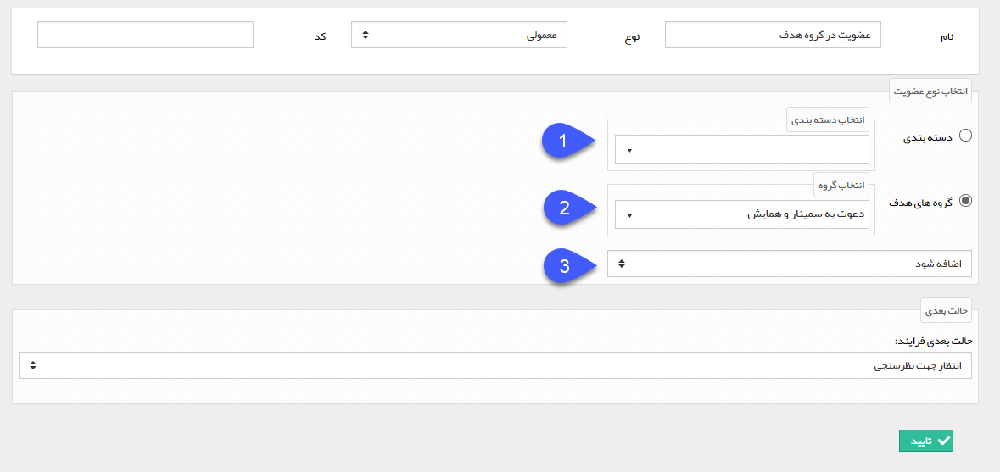

# عضویت

عضویت

با استفاده از این فعالیت می توانید هویت مرتبط با این آیتم را به یک دسته بندی بانک اطلاعاتی/گروه هدف اضافه کنید و یا از آن دسته بندی/گروه هدف، هویت را حذف کنید. برای مثال فرض کنید یک فرایند برای فرم شرکت در سمینار طراحی کرده اید، می توانید در این فرایند با استفاده از یک فعالیت عضویت تمامی هویت هایی که این فرم برایشان ثبت می شود را به گروه هدف "دعوت به سمینار و همایش" اضافه کنید. و از این گروه برای اهداف تبلیغاتی استفاده کنید.

برای ایجاد این فعالیت، پس از تعیین نام، نوع و حالت بعدی فرآیند، سایر تنظیمات را مطابق توضیحات زیر انجام دهید: 

1\. در صورتی که میخواهید هویت مرتبط به یک دسته بندی بانک اطلاعاتی اضافه شود یا از آن حذف گردد، این گزینه را انتخاب کرده و پس از آن دسته بندی مورد نظر خود را انتخاب کنید.

2\. در صورتی که میخواهید هویت مرتبط به یک گروه هدف اضافه شود یا از آن حذف گردد، این گزینه را انتخاب کرده و پس از آن گروه هدف مورد را انتخاب کنید.

3\. در این قسمت مشخص کنید که هویت مرتبط به دسته بندی/گروه هدف مشخص شده اضافه شود یا از آن حذف گردد.