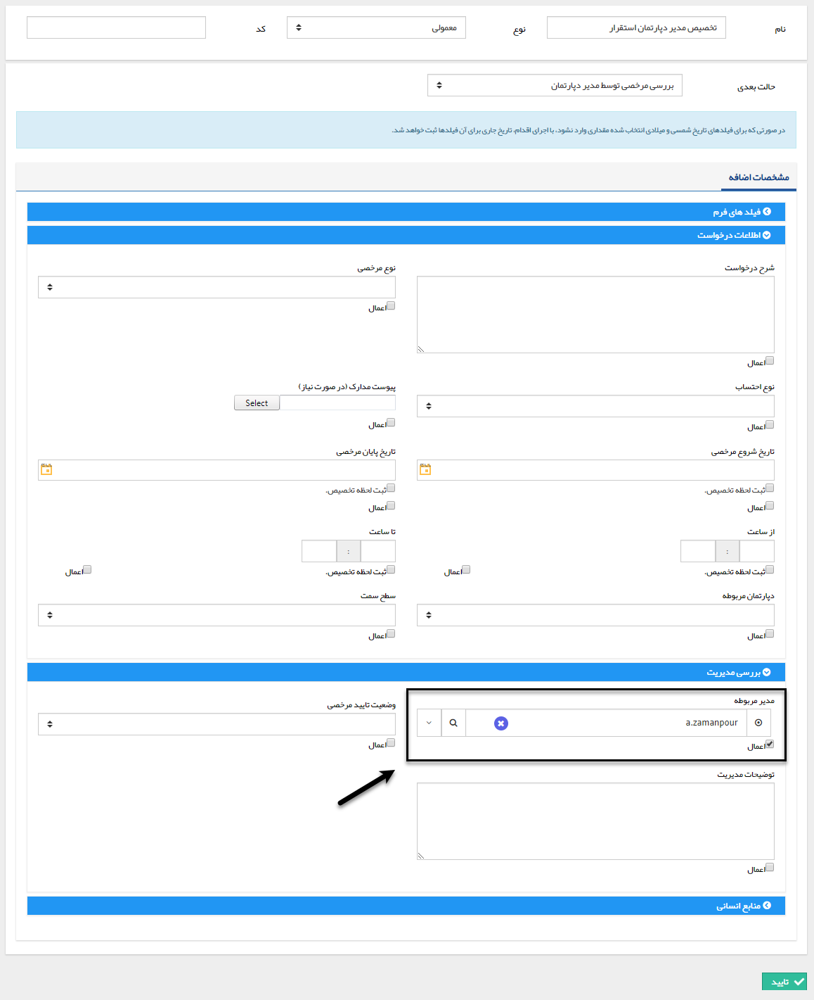
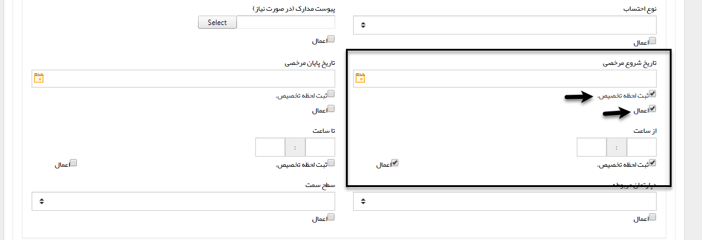

# تخصیص مقدار    

** تخصیص مقدار**

با استفاده از این فعالیت می توانید یک مقدار دلخواه را به یکی از فیلدهای آیتم تحت چرخه اختصاص دهید ( این فیلدها میتوانند فیلدهای پیشفرض و یا فیلدهای اضافه شده از قسمت شخصی سازی باشند)

 به طور مثال فرض کنید یک چرخه کاری روی آیتم فرم درخواست مرخصی طراحی کرده اید و می خواهید پس از ثبت درخواست، فرم به کارتابل مدیر دپارتمان مربوط به شخص درخواست دهنده برای رویت و بررسی ارجاع شود. میتوانید با ساختن یک فیلد از نوع لیست برای انتخاب دپارتمان مربوطه، یک فیلد از نوع لیست کاربر برای مدیر مربوطه و فعالیت های تصمیم و تخصیص مقدار این کار را انجام دهید، نحوه عملکرد به این صورت است که شخص درخواست دهنده دپارتمان خود را مشخص میکند و با استفاده از فعالیت های تصمیم و قرار دادن یک فعالیت تخصیص مقدار پس از هرکدام از تصمیم ها، فیلد مدیر مربوطه را به مدیر دپارتمان مربوط به شخص درخواست دهنده اختصاص می دهد. (فلوچارت این قسمت از فرآیند در صورتی که سه دپارتمان استقرار، پشتیبانی و فروش داشته باشیم به صورت زیر خواهد بود)

  

نحوه تخصیص مقدار به صورت زیر می باشد، کافیست نام، نوع و حالت بعدی فعالیت را مشخص کرده و تعیین کنید چه مقادیری به کدام فیلدها تخصیص پیدا کند.

  

با وارد شدن فرآیند به این فعالیت، مقادیر وارد شده در هر یک از فیلدها که چک باکس "اعمال" برای آن ها فعال شده باشد، به فیلدها تخصیص پیدا می کند. (یعنی اگر برای یکی از فیلدها مقداری وارد نکنید و چک باکس "اعمال" را برای آن فعال کرده باشید، فیلد با اجرای این فعالیت خالی خواهد شد)

علاوه بر این، فعالیت تخصیص مقدار قابلیت "ثبت لحظه تخصیص" در فیلد از نوع تاریخ و ساعت را نیز داراست، به طور مثال فرض کنید بخواهید در فرآیند فرصت فروش، تاریخ دقیق هریک از مراحل فروش (صدور پیش فاکتور، تایید پیش فاکتور، تایید دریافت، ارسال کالا، نظرسنجی و ...) را داشته باشید، به راحتی می توانید با استفاده از ساختن فیلدهای تاریخی مربوطه و استفاده از فعالیت تخصیص پس از هریک از مراحل فروش و تخصیص خودکار لحظه ورود به هریک از مراحل توسط سیستم، این کار را انجام دهید.

برای ثبت لحظه تخصیص کافی است چک باکس های "اعمال" و "ثبت لحظه تخصیص" را برای فیلد مربوطه فعال کنید. (به صورت زیر)

  

در مثال بالا، تاریخ اجرای فعالیت و همچنین ساعت اجرای آن به فیلدهای مشخص شده تخصیص می یابند.