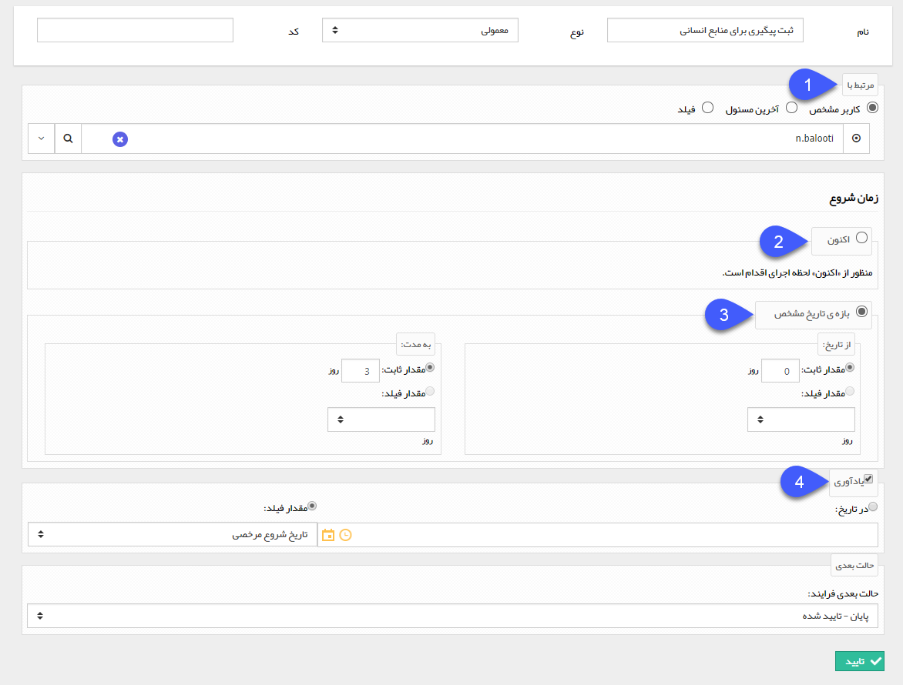

# ثبت پیگیری    

**ثبت پیگیری**

با استفاده از این فعالیت میتوانید یک پیگیری روی همین آیتم برای یک کاربر مشخص ایجاد کنید.

به طور مثال فرض کنید که یک فرایند روی آیتم فرم درخواست مرخصی طراحی کرده اید و میخواهید در انتهای فرایند یک پیگیری برای مسئول منابع انسانی جهت ثبت مرخصی در سیستم اتوماسیون یه صورت خودکار توسط سیستم ایجاد شود.

 

برای ثبت این فعالیت، پس از تعیین نام، نوع و حالت بعدی فرآیند، تنظیمات را مطابق با توضیحات زیر انجام دهید.

1\. **مرتبط با:** کاربری که باید این پیگیری برای او ایجاد شود را تعیین کنید.

2\. **اکنون:** در صورتی که این گزینه را انتخاب کنید، زمان شروع و موعد مقرر پیگیری ایجاد شده، روز اجرای فعالیت (روزی که فرآیند وارد این مرحله شود) خواهد بود.

3\. **بازه ی تاریخ:**  در صورت انتخاب این گزینه میتوانید تاریخ شروع و موعد مقرر پیگیری ایجاد شده را مدت زمانی پس از اجرای فعالیت در نظر بگیرید. به دو صورت می توان این زمان را تعیین کرد. اول به صورت یک مقدار ثابت، و راه دوم انتخاب یک فیلد عددی ایجاد شده در آیتم تحت چرخه است. به طور مثال در شکل بالا، تاریخ شروع پیگیری، روز اجرای فعالیت و موعد مقرر، سه روز بعد از آن خواهد بود.

4\. **ثبت یادآوری:** می توانید برای پیگیری ایجاد شده، یک یادآوری نیز فعال کنید، زمان یادآوری می تواند یک تاریخ مشخص و یا یک مقدار وارد شده در یکی از فیلدهای از نوع تاریخ آیتم تحت چرخه باشد.