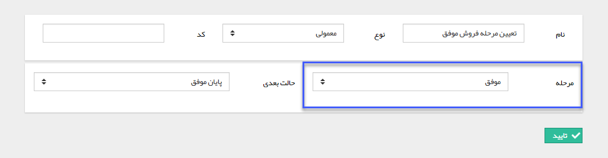

# تعیین مرحله فروش    

**تعیین مرحله فروش فرصت**

این فعالیتتنها در فرایندهای طراحی شده روی آیتم فرصتکاربرد دارد. با استفاده از این فعالیت میتوانید فرایند را به صورتی طراحی کنید که در طی اجرای فرایند، مرحله فروش به صورت خودکار توسط سیستم تغییر کند. در این صورت میتوانید تحلیل بهتری برای پراکندگی فرصت ها در هریک از مراحل فروش (با استفاده از [گزارشات تحلیلی](../../../../../ManagementAndReports/GozareshateTahlili/Salescondition.md)) داشته باشید و همچنین از خطای کاربری(فراموش کردن تغییر مرحله فروش به صورت دستی) اجتناب کنید.

برای مثال فرض کنید که یک مرحله فروش به نام پیش فاکتور تعریف کرده اید، می توانید در طراحی فرایند قبل از کارتابل صدور پیش فاکتور، فعالیت تعیین مرحله فروش را قرار دهید تا بتوانید پراکندگی فرصت های باز در این مرحله را به صورت دقیق در اختیار داشته باشید. یا قبل از هدایت چرخه به حالت نهایی با استفاده از فعالیت های تعیین مرحله فروش و تعیین فرصت های موفق و ناموفق آمار دقیقی از فرصت های از دست رفته و محقق شده داشته باشید.

تنظیمات این فعالیت به صورت زیر می باشد. کافیست نام، نوع و حالت بعدی فرآیند را تعیین کرده و مشخص کنید فیلد مرحله فروش به کدام مرحله تغییر کند.

نکته: برای ویرایش مراحل فروش به قسمت [مدیریت مراحل فروش](../../../../../BaseInformatio/SellsManagement.md) مراجعه کنید.