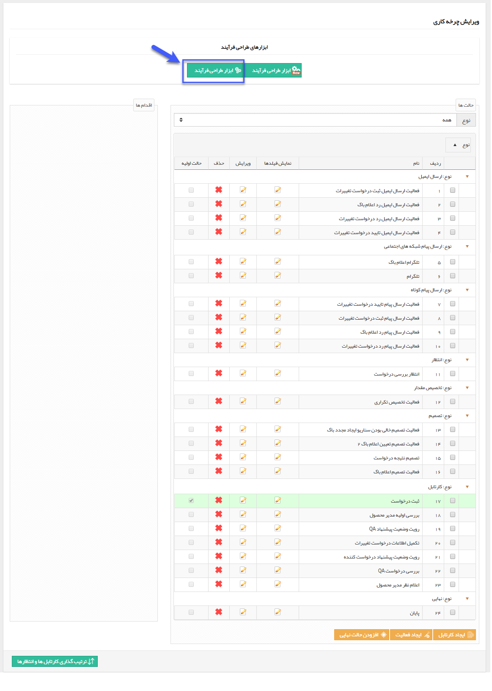
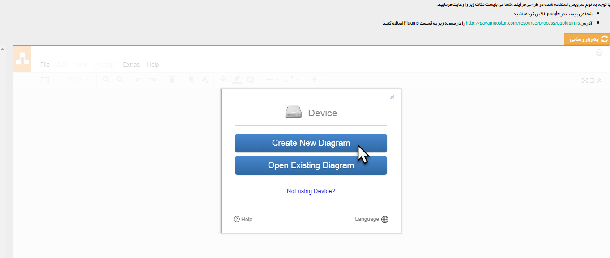
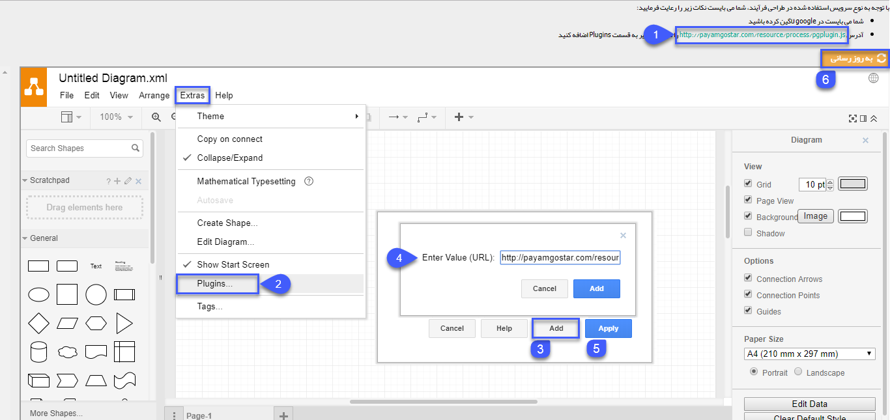
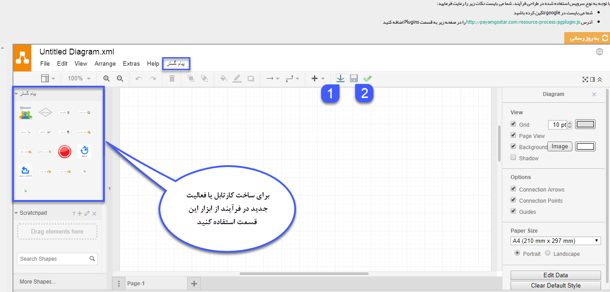
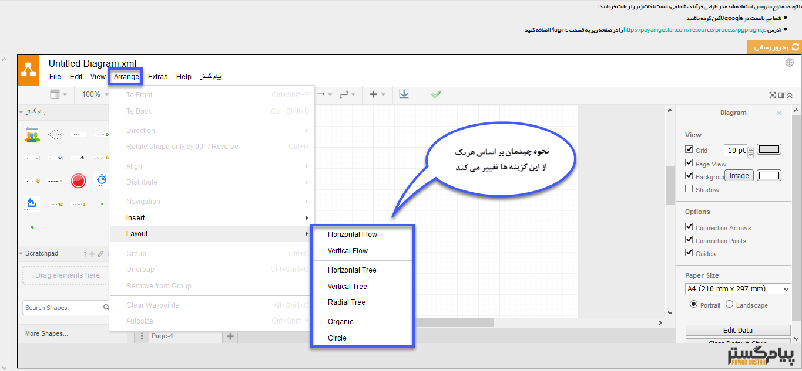
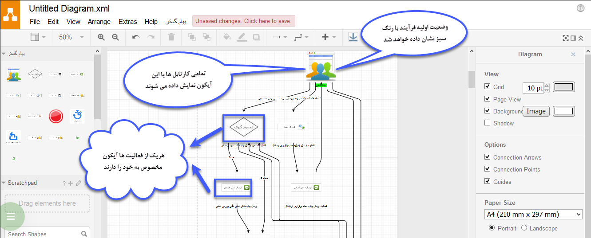

# طراحی فرآیند به صورت شماتیک با ابزار گوگل    

### طراحی فرآیند به صورت شماتیک با ابزار گوگل

این ابزار به شما اجازه می دهد تا چرخه کاری خود را ایجاد کنید و در نرم افزار ذخیره کنید و یا بعد از طراحی چرخه و وارد کردن آن در نرم افزار پیام گستر طراحی خود را بازبینی کرده و ایرادات را رفع نمایید.  همچنین می توانید از این فلوچارت برای توضیح و ارائه دادن چرخه به کارمندان و مدیران استفاده نمایید.

با زدن دکمه ابزار طراحی فرآیند صفحه ای جدیدی باز می شود. در این صفحه ابتدا روی create new diagram کلیک کنید تا یک دیاگرام جدید برای بارگذاری فرآیند ایجاد شود.

  
برای اولین بار که وارد نرم افزار می شوید باید پلاگین پیام گستر را به نرم افزار اضافه کنید و مجددا بروزرسانی را بزنید تا نرم افزار با پلاگین اجرا شود:

1\. ابتدا لینک پلاگین را کپی کنید.

2\. از قسمت Extras وارد تب پلاگین (Plugin) شوید.

3\. بر روی کلید Add کلیک کنید.

4\. لینک پلاگین را که در مرحله اول کپی کرده اید را، در این قسمت جایگذاری (Paste) کرده و آن را Add کنید.

5\. روی دکمه Apply کلیک کنید.

6\. بعد از اضافه کردن پلاگین، بر روی دکمه بروز رسانی را کلیک کنید تا پلاگین پیام گستر فعال شود.

با اضافه شدن پلاگین، تب مربوط به پیام گستر به نرم افزار اضافه می شود.

**پلاگین پیام گستر: **در این ابزار می توانید از منوهای زیر استفاده کنید:

1\. **بارگزاری فرآیند:** با زدن این دکمه چرخه طراحی شده در پیام گستر وارد صفحه این ابزار می شود.

2\. **ذخیره فرآیند:** با استفاده از این منو، طراحی موجود در این ابزار، وارد پیام گستر می شود.

**نکته:** این دو گزینه در منوی پیام گستر بالای پنجره نیز قابل دسترسی است.

**نکته:** پس از بارگزاری چرخه در نرم افزار  تمامی کارتابل ها و فعالیت ها برروی هم می افتند و می توانید از منوی Arrange در قسمت Layout چیدمان دلخواه خود را انتخاب کنید تا فرآیند بر آن اساس مرتب شود.

به طور مثال چیدمان Vertical Flow، فرآیند را به صورت یک جریان عمودی مرتب خواهد کرد(مانند شکل زیر)

 

**توجه:** پس از ساختن چرخه خود، حتما ذخیره را بزنید تا دفعات بعدی که چرخه مذکور را باز می کنید نیاز به طراحی مجدد نباشد.