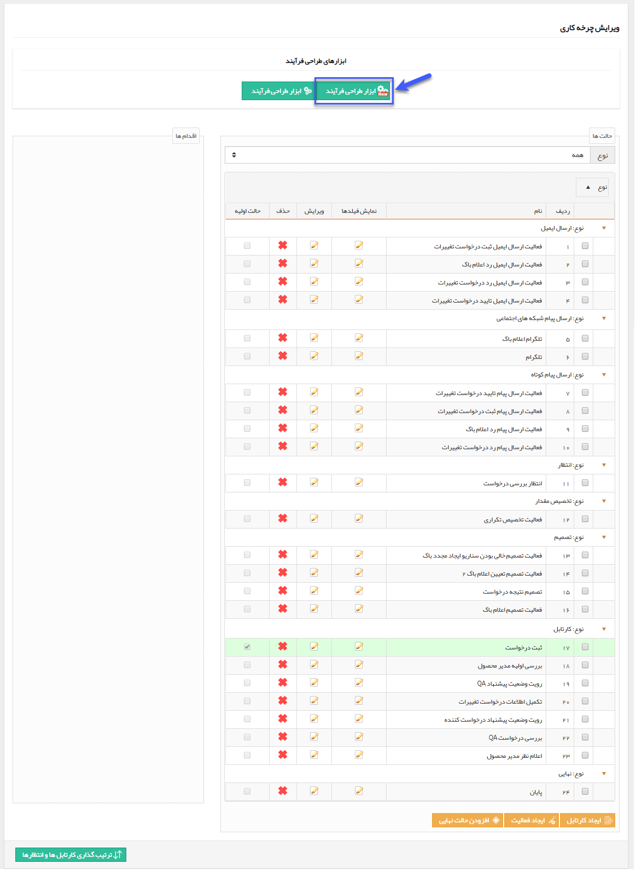
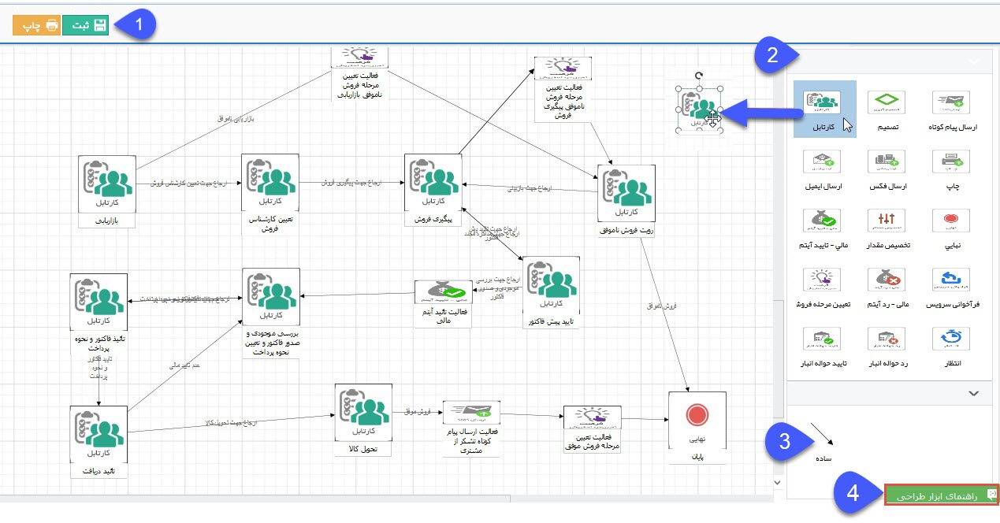
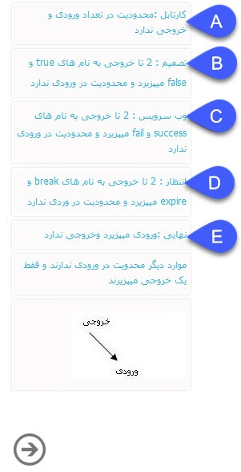
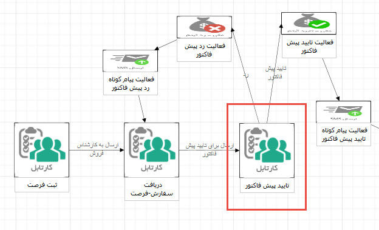
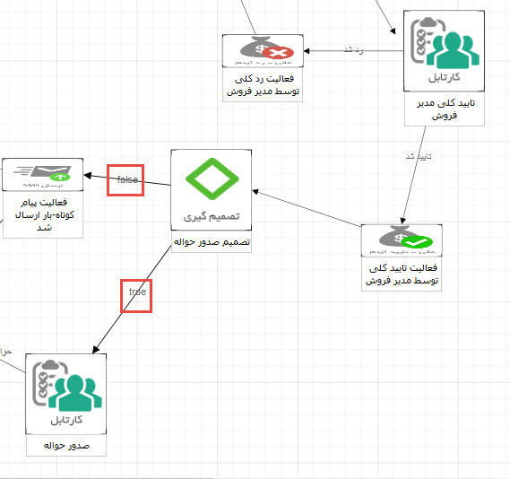
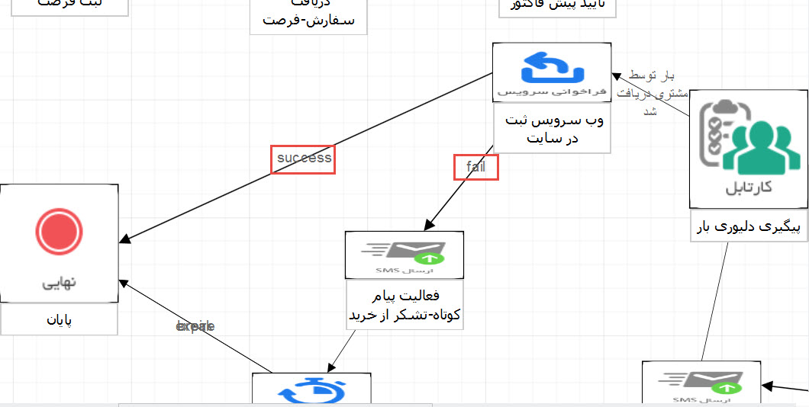
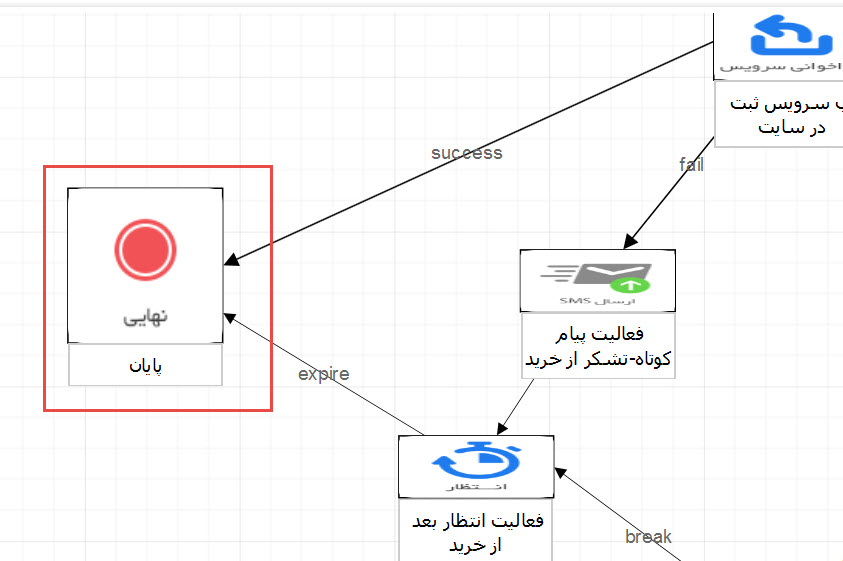

# طراحی فرآیند به صورت شماتیک با ابزار پیام گستر        

**طراحی فرآیند به صورت شماتیک با ابزار پیام گستر**

با استفاده از این ابزار می توانید گردش کاری دلخواه را به صورت شماتیک ایجاد کرده و یا گردش کاری کهدر نرم افزار ایجاد کرده اید را مشاهده و بازبینی کنید .

  با کلیک بر روی این گزینه یک صفحه جدید باز می شود.

1\. ثبت: پس از طراحی و یا ویرایش چرخه کاری در این قسمت، با استفاده از این دکمه می توانید آن را در نرم افزار ذخیره کنید.

2. انتخاب: تمامی مراحل موجود در گردش کاری (کارتابل ، فعالیت ها) را میتوانید در این قسمت انتخاب کنید و به سمت صفحه کار در چپ بکشید و رها کنید (Drag&Drop).

نکته: با نگه داشتن کلید Alt و کلیک کردن بر روی هر فعالیت یا کارتابل، می توانید تنظیمات مرتبط با آن را انجام دهید.

نکته: با دوبار کلیک بر روی هر کارتابل و یا فعالیت می توانید نام آن را درج کنید.

3\. اقدام: این علامت نشان دهنده اقدام است. باید رابطه بین مراحل مختلف توسط این علامت برقرار باشد. با دوبار کلیک روی اقدام ها می توانید نام آن را درج کنید.

4\. راهنمای ابزار طراحی: با استفاده از این قسمت می توانید راهنمای ابزار طراحی فرآیند را مشاهده کنید.

****

A. به این معنی است که تعداد نامحدودی از اقدامات می تواند به کارتابل ختم شود و یا از آن آغاز گردد. (برای مثال در تصویر زیر یک اقدام به کارتابل "تایید پیش فاکتور" می رود و دو اقدام از آن خارج می شود.)

B. تعداد نامحدودی اقدام می تواند به یک فعالیت از نوع تصمیم برسد اما تنها دو خروجی با نام های true (حالت بعدی در صورتی که شرط تصمیم برقرار باشد) و false (حالت بعدی در صورتی که شرط تصمیم برقرار نباشد) میتواند از آن خارج شود.

C. تعداد نامحدودی اقدام می تواند به یک فعالیت از نوع وب سرویس برسد اما تنها دو خروجی با نام های success (حالت بعدی در صورت اجرای موفق وب سرویس) و fail (حالت بعدی در صورت خطای وب سرویس) می تواند از آن خارج شود. (برای مثال در تصویر زیر اگر وب سرویس "ثبت در سایت" به درستی عمل کند، گردش کاری آیتم به مرحله ی "پایان" و در صورت خطای وب سرویس به مرحله "فعالیت پیام کوتاه" می رود.)

D. تعداد نامحدودی اقدام می تواند به یک فعالیت از نوع انتظار برسد اما تنها دو خروجی با نام های break (حالت بعدی در صورت برقرار شدن شرط انتظار) و expire (حالت بعدی در صورت منقضی شدن زمان انتظار) می تواند از آن خارج شود. (برای مثال در صورتی که شرط انتظار برقرار شود، گردش کار آیتم به مرحله "فعالیت انتظار بعد از خرید" و در صورت برقرار نشدن شرط انتظار، پس از پایان زمان انتظار به مرحله ی "فعالیت پیام کوتاه" می رود.)

E. حالت نهایی به تعداد نامحدودی ورودی می پذیرد اما هیچ اقدامی از آن خارج نمیشود.

\* نکته: به محل اتصال ورود و خروج اقدام توجه گردد.