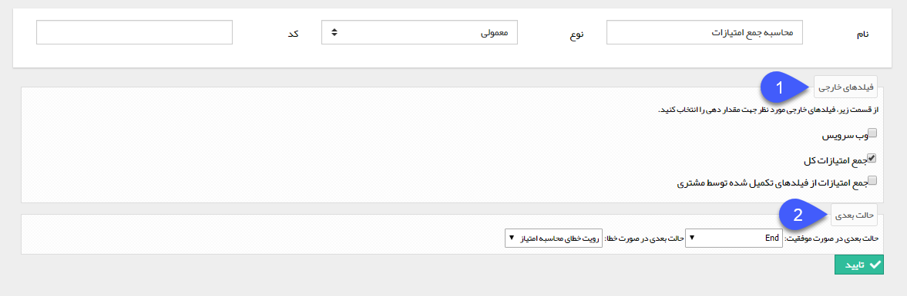

# به روز رسانی فیلدهای محاسباتی

به روز رسانی فیلدهای محاسباتی

با استفاده از این فعالیت می توانید مقدار فیلدهای محاسباتی موجود در آیتم (فیلدهای از نوع فایل اکسل و وب سرویس) را به صورت خودکار توسط سیستم به روز رسانی کنید. برای مثال فرض کنید که یک فرم نظرسنجی طراحی کرده اید و سوالات مرتبط با این فرم توسط کاربران متفاوتی در مراحل مختلف چرخه تکمیل خواهد شد و می خواهید برای تجمیع نتایج سوالات با استفاده از یک فیلد فایل اکسل و وزن دهی به سوالات، یک امتیاز کلی داشته باشید، می توانید با استفاده از این فعالیت بین هر کدام از مراحل چرخه مقدار فیلد امتیاز نهایی را به صورت خودکار توسط سیستم به روز رسانی کنید.

برای ایجاد این فعالیت، پس از تعیین نام و نوع فعالیت، سایر تنظیمات را مطابق با توضیحات زیر انجام دهید.

1\. در این قسمت، تمامی فیلدهای محاسباتی (فیلدهای از نوع فایل اکسل و از نوع وب سرویس) ساخته شده برای آیتم تحت چرخه نمایش داده می شود و می توانید فیلد یا فیلدهایی که قصد بروزرسانی مقدار آن ها با استفاده از این فعالیت را دارید انتخاب نمایید.

2\. حالت بعدی فرآیند در صورت اجرای موفق فعالیت (بروزرسانی موفق مقدار فیلدها) و حالت بعدی در صورت بروز خطا را مشخص کنید.