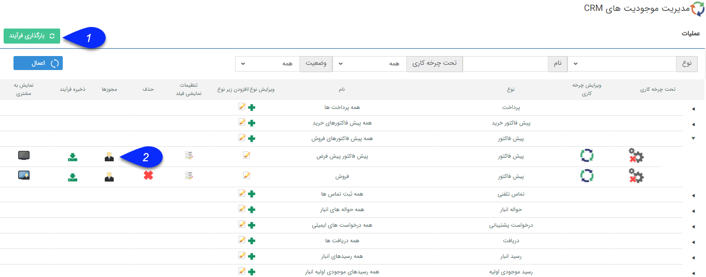
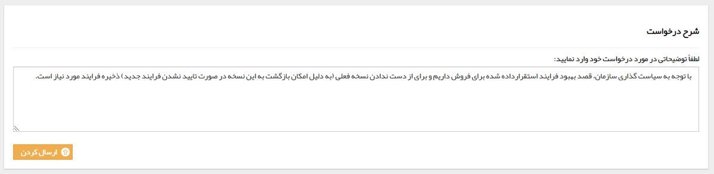
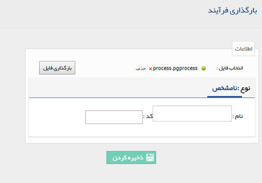
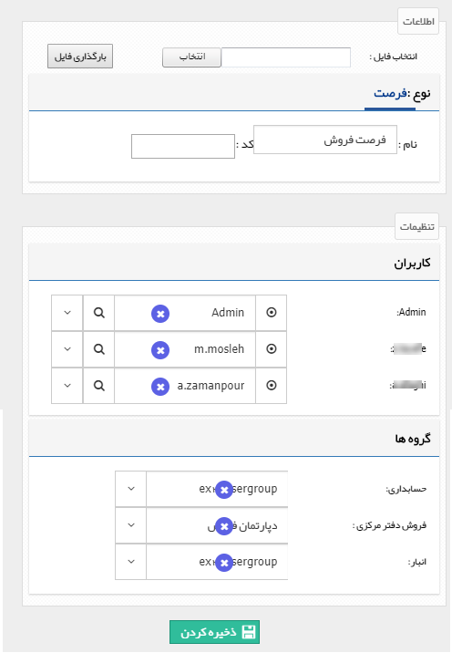

# ذخیره و بارگذاری فرآیند    

**ذخیره و بارگذاری فرآیند**

با استفاده از این ابزار می توانید چرخه کاری یکی از موجودیت ها را ذخیره کرده و در زمان دیگری مجدداً آن را بارگذاری کنید. برای کاربردهایی مانند نگهداری نسخه فعلی فرایند یک آیتم قبل از اعمال تغییرات در آن (جهت بازگشت به حالت قبلی در صورت نیاز) یا آیتم هایی که فرایند و فیلدهای مشابه دارند می توانید از این قابلیت استفاده کنید.

در نظر داشته باشید برای ذخیره و بارگذاری یک فرایند در نرم افزار، یک درخواست به پنل مدیریتی شرکت پیام گستر ارسال خواهد شد و تنها در صورت تایید، می توانید ذخیره و بارگذاری را انجام دهید. پس از بارگذاری فرایند ذخیره شده، تمامی فیلدها به همراه فرایند استقرار داده شده روی آیتم، در قالب آیتم جدیدی در نرم افزار بارگذاری خواهند شد.

 

1\. **ذخیره فرآیند:** با کلیک بر روی این دکمه می توانید درخواست ذخیره فرایند را ثبت کنید. توضیحاتی در ارتباط با درخواست خود (دلیل ذخیره فرآیند) وارد کرده و روی دکمه ارسال کردن کلیک کنید. بعد از پذیرفته شدن درخواست فایل مربوط به این فرآیند ذخیره خواهد شد و می توانید در آینده آن را بارگذاری کنید.

2\. **بارگذاری فرآیند:** با کلیک بر روی این دکمه، می توانید فایلی که از قبل ذخیره کرده اید را بارگذاری کنید. برای انجام این کار نیز باید توضیحی برای درخواست بارگذاری وارد نمایید. در صورت پذیرفته شدن درخواست، صفحه زیر را مشاهده خواهید کرد.

 

در قسمت انتخاب فایل، باید فایل ذخیره شده از فرایند را بارگذاری کرده و سپس روی دکمه بارگذاری فایل کلیک کنید. (این فایل دارای پسوند pgprocess می باشد)

پس از بارگذاری فایل، مطابق شکل زیر کاربران و گروه های متناظر با کاربران و گروه های استفاده شده در فرایند ذخیره شده را مشخص کنید و روی دکمه ذخیره کردن کلیک کنید.

