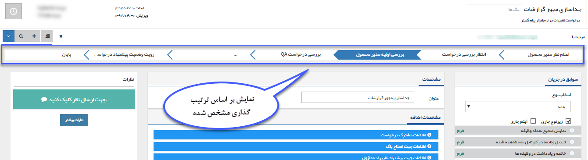
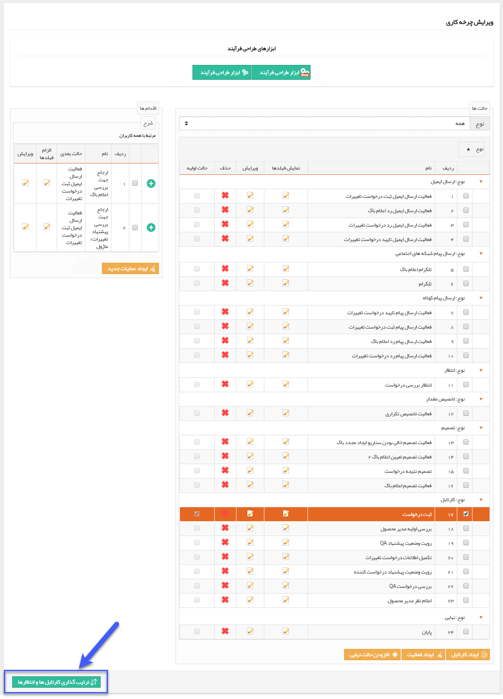
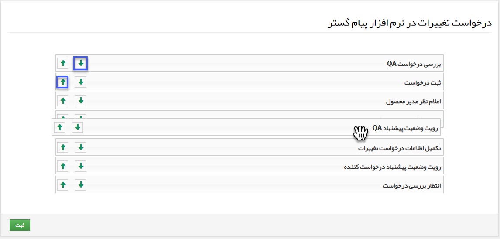

# ترتیب گذاری کارتابل ها و انتظارها        

### ترتیب گذاری کارتابل ها و انتظارها

در این قسمت می توانید ترتیب گذاری مراحل مختلف فرآیند (کارتابل ها و انتظارها) را مشخص کنید. این ترتیب گذاری در گزارشات فرایندی، قسمت [نمایش کانبان](../../../../ManagementAndReports/Workflow/Kanbanview.md) و همچنین پروسه نمایش داده شده در آیتم تحت فرایند تاثیرگذار است و ارتباطی با چگونگی گردش کار ندارد، زیرا چگونگی گردش کار فرآیند با استفاده از اقدام ها و تنظیمات فعالیت ها مشخص می گردد.

**نکته:** توجه داشته باشید یک فرایند در جریان، در یکی از کارتابل ها یا انتظار ها می باشد (زیرا سایر فعالیت های فرایند به سرعت انجام می شوند و پس از آن فرآیند به حالت بعدی هدایت خواهد شد)، به همین دلیل در این قسمت فقط ترتیب گذاری کارتابل ها و انتظارها را انجام می دهید.

برای ترتیب گذاری در قسمت ویرایش چرخه کاری، روی دکمه ترتیب گذاری کارتابل ها و انتظارها کلیک کنید.

با استفاده از کشیدن و رها کردن (Drag&Drop) و یا فلش های سبز رنگ، می توانید ترتیب بندی کانبان را برای این گردش کاری تعیین کنید.

