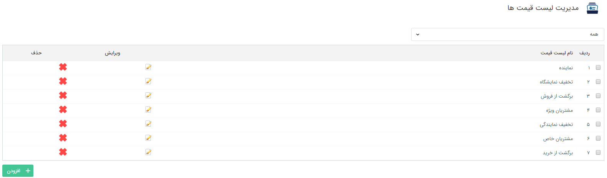
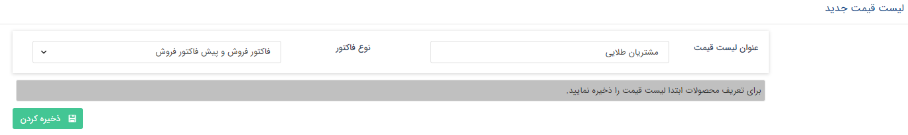
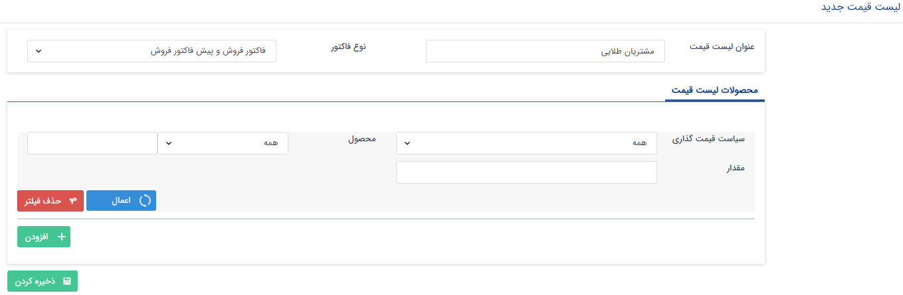
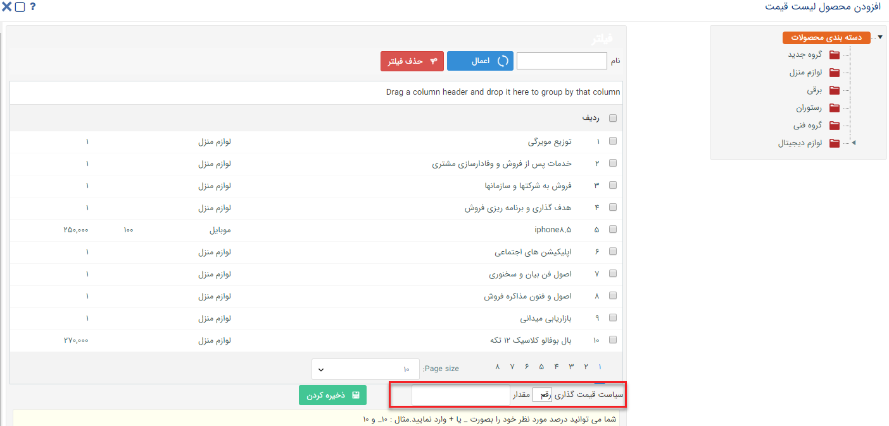
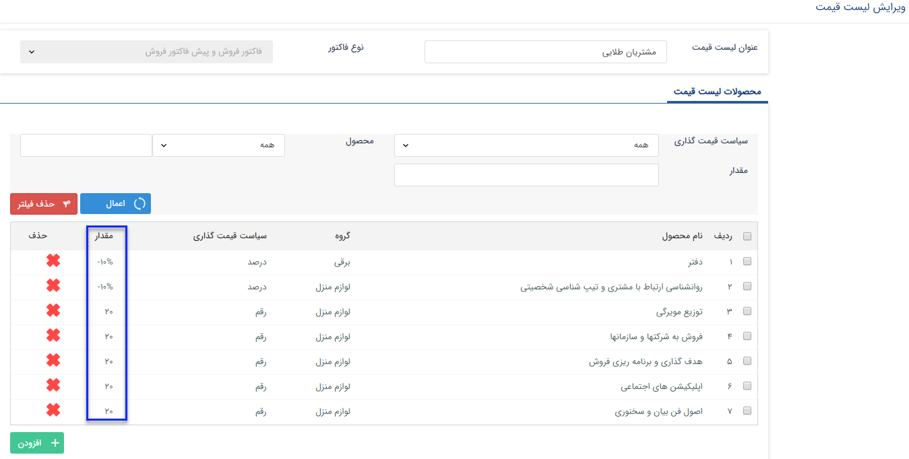

# مدیریت لیست قیمت ها    

**مدیریت لیست قیمت ها**

در این قسمت می توانید بر حسب نیاز خود لیست قیمت های مختلفی را برای انواع فاکتور و پیش فاکتور ایجاد کنید. در لیست قیمت های ایجاد شده می توانید درصد تخفیف یا قیمت مشخصی برای برخی از محصولات خود در نظر بگیرید و در زمان مناسب از آن استفاده کنید. علاوه بر این قابلیت اعمال خودکار لیست قیمت در صورت قرار گرفتن مشتری در یک کلاس مشخص نیز وجود دارد. برای اطلاعات بیشتر [مدیریت کلاس بندی مشتریان](ClientsClassroomManagement.md) را مطالعه کنید.

 

همان طور که مشاهده می کنید لیست قیمت های تعریف شده در این قسمت قابل مشاهده، ویرایش و حذف هستند. همچنین با کلیک بر روی دکمه اضافه کردن می توانید لیست قیمت جدیدی را ایجاد نمایید.

 

ابتدا عنوان دلخواهی برای لیست قیمت برگزینید و پس از آن مشخص کنید که این لیست قیمت برای کدام نوع از فاکتورها لحاظ گردد. پس از تعیین این موارد و ذخیره کردن لیست، می توانید محصولات و سیاست قیمت گذاری آن ها در این لیست را تعریف کنید.

 

با کلیک بر روی دکمه اضافه کردن، محصولات این لیست قیمت را تعریف کنید.

 

ابتدا محصولات را انتخاب کرده، سپس سیاست قیمت گذاری مربوط به آن ها را در این لیست قیمت مشخص کنید. در صورت انتخاب گزینه رقم، می توانید یک قیمت ثابت برای محصولات در این لیست قیمت وارد کنید و در صورت انتخاب گزینه درصد، می توانید مشخص کنید که درصد خاصی از قیمت این محصول کم شود(تخفیف) یا به آن اضافه گردد. این درصد بر روی قیمت تعیین شده برای محصول در قسمت [مدیریت محصولات](../BaseInformatio/ProduceManagement/Addproduct.md) لحاظ خواهد شد.

می توانید سیاست قیمت گذاری متفاوتی برای محصولات مختلف در یک لیست قیمت در نظر بگیرید.

 