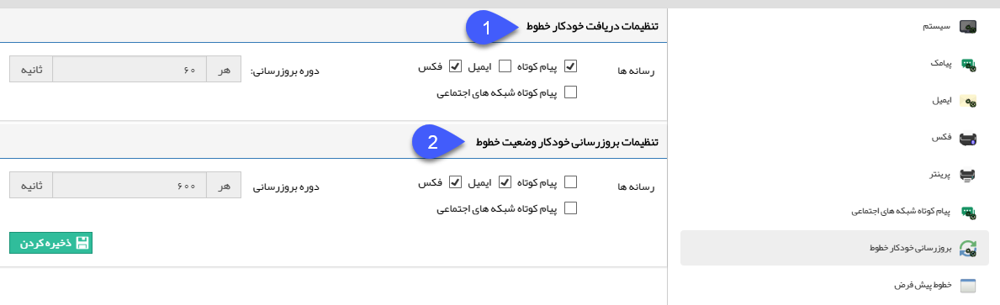

# بروز رسانی خودکار خطوط        

**بروز رسانی خودکار خطوط**

از این قسمت می توانید زمان بروزرسانی خطوط را تنظیم نمایید، در برنامه های تبلیغاتی دو طرفه، که نیاز است بعد از دریافت پاسخ از مخاطب، پاسخی برای او ارسال شود، نیاز به بروزرسانی خطوط است.

 

1\. تنظیمات دریافت خودکار خطوط: رسانه هایی که پیام های دریافتی آن ها، هر ۱ دقیقه باید بروزرسانی شوند را تعیین نمایید.

2\. تنظیمات بروز رسانی خودکار وضعیت خطوط: رسانه هایی که باید هر ۱۰ دقیقه وضعیت پیام های ارسالی آنان بررسی شود را تعیین نمایید.

نکته: در نسخه فعلی نرم افزار امکان ویرایش بازه زمانی بروز رسانی ها وجود ندارد.