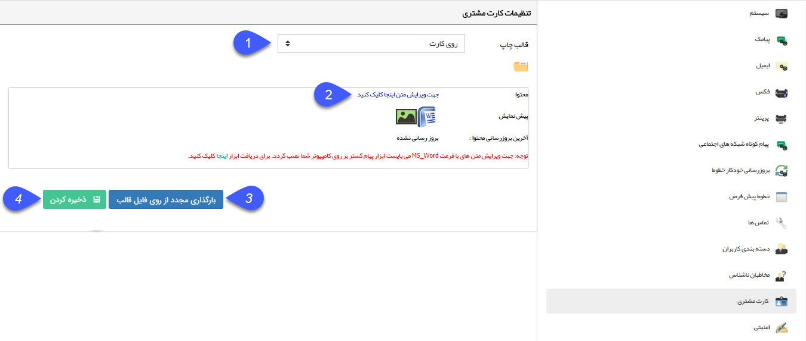

# کارت مشتری    

**کارت مشتری**

در صورتی که ماژول مربوط به چاپ کارت برای مشتریان فعال باشد می توانید از طریق این قسمت  قالب رو و پشت کارت را طراحی و ذخیره نمایید تا بتوانید برای مشتریان خود کارت چاپ کنید. (برای اطلاع از نحوه چاپ کارت مشتری به [مشخصات عمومی](../../PayamGostarSyncBank/JobsForFirst/GeneralSpecification.md) مراجعه کنید.)

تجهیزات مورد نیاز: پرینتر چاپ کارت

 

1\. **قالب چاپ:** تعیین کنید که قالبی که می خواهید طراحی کنید برای روی کارت و یا پشت کارت استفاده شود.

2\. **محتوا:** برای اطلاع از نحوه ویرایش قالب چاپ به [تنظیم قالب چاپ](../Personalizing/Totalview/printpreviewdesign.md) مراجعه کنید.

3. **بارگذاری مجدد از روی قالب:** در صورتی که بخواهید قالب را به حالت اولیه (پیشفرض سیستم) برگردانید، از دکمه بارگذاری مجدد از روی فایل قالب استفاده کنید.

4. **ذخیره کردن:** بعد از طراحی قالب و زدن دکمه ذخیره و ارسال به سرور، دکمه ذخیره کردن صفحه اصلی تنظیمات کارت مشتری را نیز انتخاب کنید .