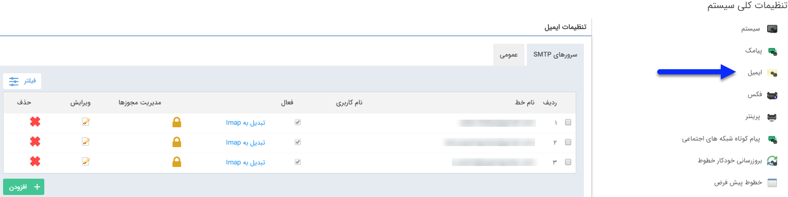
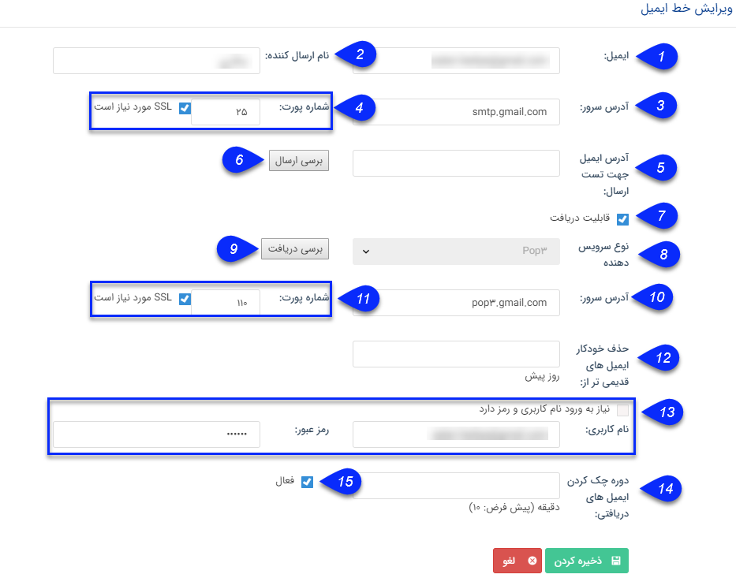

# ایمیل    

**ایمیل**

برای تنظیم ایمیل های مورد استفاده در نرم افزار و ارسال پیام از طریق آن ها ، از این قسمت اقدام نمایید

**سرورهای** **SMTP** **:** در این بخش می توانید خطوط ارسال ایمیل از طریق سرورهای SMTP را مدیریت کنید. شما می توانید از طریق کلیه ارائه دهندگان سرویس SMTP ایمیل خود را ارسال نمائید. برای مثال اگر می خواهید ایمیل های خود را از طریق [Gmail](http://www.gmail.com) شخصی و یا شرکت خود ارسال نمایید، کافیست با ایجاد یک خط جدید و درج تنظیمات مربوطه، ایمیل های خود را از طریق [Gmail](http://www.gmail.com) ارسال کنید. این تنظیمات عبارتند از :

  

1\. ایمیل: نامی است که به حساب کاربری ایمیل خود می‌دهید.

2.نام ارسال کننده: با نوشتن نام در این بخش، ایمیل ها در صندوق دریافت (Inbox) مخاطب با این عنوان نمایش داده می شود .

3. آدرس سرور (SMTP): آدرس سرور ارسال Smtp ایمیل را واردکنید.

4\. شماره پورت (SMTP): شماره درگاهی است که سرویس دهنده ایمیل شما از آن استفاده می‌کند و ssl بودن و یا نبودن آن را مشخص کنید.

5. آدرس ایمیل جهت تست ارسال: آدرس ایمیل مورد نظر خود را وارد کنید.

6\. بررسی ارسال : جهت بررسی صحیح بودن تنظیمات مرتبط با ارسال ایمیل، روی این دکمه کلیک کنید. در صورت صحیح بودن اطلاعات، پیامی مبنی بر موفق بودن تنظیمات روی صفحه نمایش داده می شود.

7\. قابلیت دریافت: برای انجام دادن تنظیمات مربوط به دریافت این گزینه را فعال کنید.

8\. نوع سرویس دهنده: سرویس دهنده دریافت مرتبط با ایمیل خود را انتخاب کنید.

نکته: سرور مربوط به دریافت ایمیل روی یکی از دو حالت pop3 یا imap تنظیم می شود. تغییر سرور از pop3 به imap از لیست ایمیل ها با کلیک روی "تبدیل به imap" امکان پذیر است.

9\. بررسی دریافت: جهت بررسی صحیح بودن تنظیمات مرتبط با دریافت ایمیل، روی این دکمه کلیک کنید. در صورت صحیح بودن اطلاعات، پیامی مبنی بر موفق بودن تنظیمات روی صفحه نمایش داده می شود.

10.  آدرس سرور (POP3): آدرسی است که برای دریافت ایمیل از طریق ارائه دهنده ایمیل استفاده می شود

11\. شماره پورت ( POP3): شماره درگاهی است که سرویس دهنده ایمیل شما برای دریافت از آن استفاده می‌کند و ssl بودن و یا نبودن آن را مشخص کنید. 

12\. حذف خودکار ایمیل های قدیمی: می توانید بر حسب روز تعیین کنید که چه ایمیل هایی به صورت خودکار از صندوق پست الکترونیک حذف گردند.

13\. نام کاربری و رمزعبور: نام کاربری شما در سرویس‌دهنده ایمیل (معمولاً همان آدرس ایمیل شماست) و رمزعبور نیز کلمه‌ی عبوری است که در هنگام استفاده از ایمیل خود به کار می‌برید. در مورد  [Gmail](http://www.gmail.com)  قالب آن به صورت username@gmail.com می ‌باشد.

14\. دوره چک کردن ایمیل های دریافتی: در این قسمت مدت زمان مورد نظر برای بروزرسانی ایمیل های دریافتی (inbox) و نمایش آن ها در نرم افزار را به دقیقه وارد کنید.

15\. فعال: می توانید این خط ایمیل را فعال و یا غیر فعال نمایید.