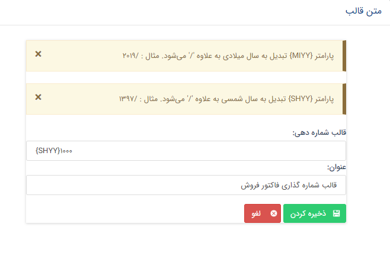
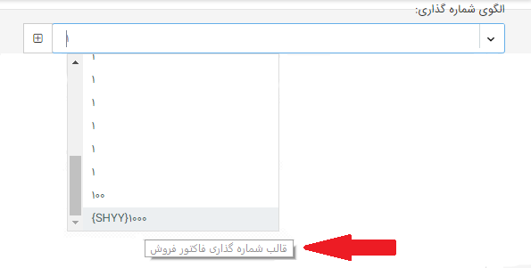

# قالب شماره دهی

> **قالب شماره دهی**
> 
> قالب شماره دهی به دو شکل سیستمی و دستی قابل انجام می باشد:
> 
> **شماره دهی سیستمی**
> 
> برای تعریف قالب شماره دهی، کاربر باید مجوز "شخصی سازی" را داشته باشد.
> 
> کلیه آیتم های CRM قابل شماره دهی می باشند. برای شماره دهی به آیتم ها باید دو مرحله  زیر انجام شود:
> 
> 1\. تعریف قالب شماره دهی مورد نظر
> 
> 2\. استفاده از قالب های شماره دهی تعریف شده
> 
> برای انجام مرحله اول،  کاربر باید با مشاهده لیست قالب های شماره دهی و استفاده از امکان افزودن، قالب شماره دهی مورد نظر خود را در فرم زیر وارد کند: 

> > 
> > 
> > **قالب شماره دهی:** در این قسمت قالب موردنظر جهت شماره دهی را وارد می کنیم.
> > 
> > **عنوان:** عنوان مرتبط با قالب را وارد می کنیم.
> > 
> > با ذخیره قالب جدید، این قالب در لیست قالب ها قرار گرفته و به کاربر نمایش داده می شود.
> > 
> > پس از تعریف قالب  شماره دهی،  در مرحله دوم کاربر می تواند در زمان تعریف آیتم ها، به آنها قالب شماره دهی، اختصاص دهد.
> > 
> > انتخاب قالب شماره گذاری برای آیتم ها اجباری می باشد. 
> > 
> > **انتخاب قالب شماره دهی برای آیتم**
> > 
> > پس از ساخت قالب ها در تنظیمات، می توانیم آن ها را به آیتم ها اختصاص دهیم
> > 
> > با نگه داشتن اشاره گر روی هر قالب، نام قالب نمایش داده میشود:
> > 
> > 
> > 
> > نکته: امکان استفاده از یک قالب برای آیتم های مختلف وجود دارد. در صورتی که از یک قالب برای چندین آیتم استفاده شود در زمان شماره دهی به هر آیتم، آخرین شماره قالب مورد نظر به عنوان آخرین شماره اختصاص یافته در نظر گرفته شده و سیستم این شماره را یک واحد افزایش داده و به آیتم اختصاص می دهد. لازم به ذکر است که در این روش کلیه شماره های یک قالب به آیتم های مختلف اختصاص می یابند. به این ترتیب در کلیه نمونه های یک نوع آیتم، شماره ها ممکن است پشت سر هم نباشند. 
> > 
> > به طور مثال اگر از قالب شماره دهی A\_1000 در  هویت حقوقی و پیش فاکتور پیش فرض استفاده شده باشد و فرض کنیم اول یک هویت ایجاد شده و بعد پیش فاکتور پیش فرض، شماره A\_1000 به هویت و شماره A\_1001 به پیش فاکتور پیش فرض اختصاص می یابد.
> 
> > > > > > شماره دهی دستی
> > > > > > 
> > > > > > در صورتی که شماره ای به صورت دستی به سیستم وارد شود ، بررسی تکراری بودن شماره فقط در آیتم جاری صورتی می گیرد.
> > > > > > 
> > > > > > موارد زیر در مورد وارد کردن شماره دستی باید درنظر گرفته شوند:
> > > > > > 
> > > > > > 1\. در صورتی که کاربر شماره ای را به صورت دستی وارد کند، تنها در صورتی ذخیره می شود که در آیتم جاری تکراری نباشد.
> > > > > > 
> > > > > > 2\. در صورتی که آخرین شماره در یک آیتم به صورت دستی وارد شده باشد، شماره دهی های بعدی این آیتم، از آخرین شماره ای که کاربر به صورت دستی وارد کرده بوده، ادامه می یابد.