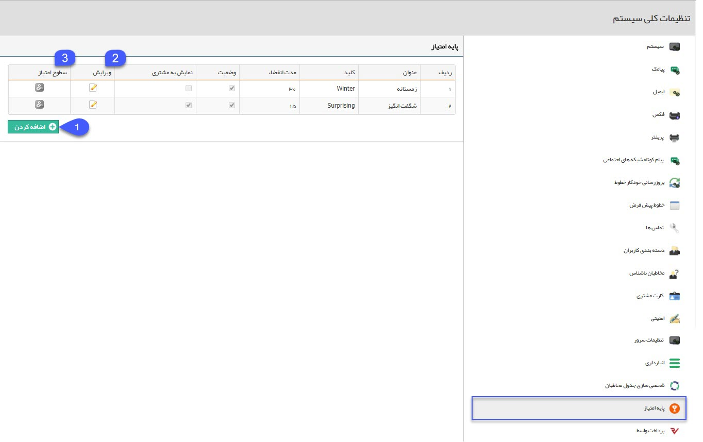
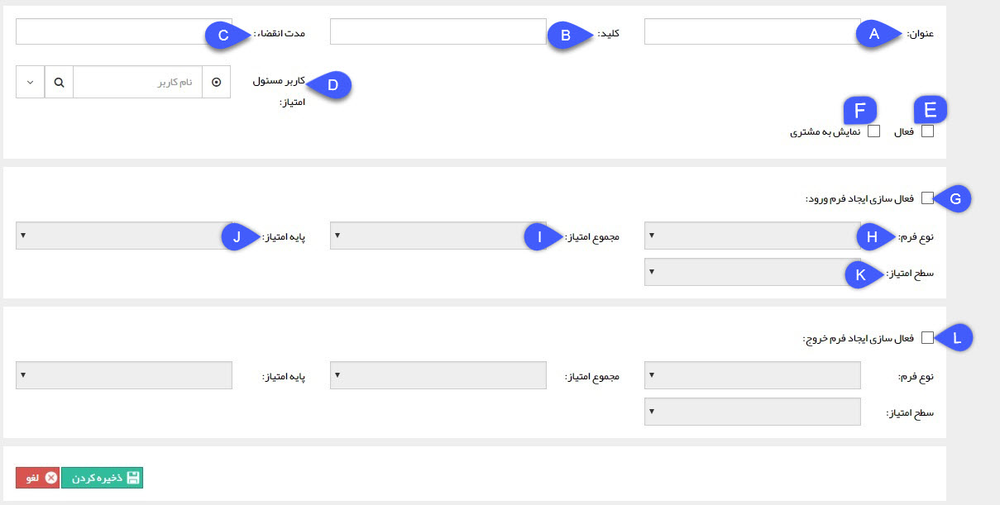
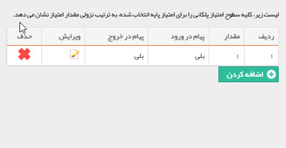

# پایه امتیاز

**پایه امتیاز**

در این صفحه پایه امتیاز های سیستم امتیاز دهی به مشتریان را می توانید ایجاد نمایید. از این پایه امتیاز در تعریف امتیاز هر محصول در [مدیریت محصولات](BaseInformatio\ProduceManagement.md) ، [گزارش کلی امتیازات](../../ManagementAndReports/SalesReport/Customers/RptIdentityPoints.md) و [گزارش تراکنش های امتیازات](../../ManagementAndReports/SalesReport/Customers/RptIdentityTransactions.md)  استفاده می شود. برای هر پایه امتیاز می توانید سطوح امتیازی مختلفی تعریف کنید که در زمان ورود مشتری به هر سطح امتیاز یا خروج از آن، امکان اعمال تنظیماتی برای ارسال یک پیام برای کاربر مسئول امتیاز یا ایجاد یک فرم به صورت خودکار توسط سیستم (به طور مثال فرمی برای در نظر گرفتن هدیه برای مشتری با توجه به سطح امتیازی آن داشته باشید) وجود دارد.

 

1\. **اضافه کردن:** با کلیک بر روی این دکمه می توانید یک پایه امتیاز جدید تعریف نمایید.

 

\_\_\_\_\_\_\_\_\_\_\_\_\_\_\_\_\_\_\_\_\_\_\_\_\_\_\_\_\_\_\_\_\_\_\_\_\_\_\_\_\_\_\_\_\_\_\_\_\_\_\_\_\_\_\_\_\_\_\_\_\_\_\_\_\_\_\_\_\_\_\_\_\_\_\_\_\_\_\_\_\_\_\_\_\_\_\_\_\_\_\_\_\_\_\_\_\_\_\_\_\_\_\_\_\_\_\_\_\_\_\_\_\_\_\_\_\_\_\_\_\_\_\_\_\_\_\_\_\_

A. عنوان: یک عنوان دلخواه برای پایه امتیاز برگزینید.

B. کلید: برای استفاده از پایه امتیاز در وب سرویس از این فیلد استفاده می شود.

C. مدت انقضا (به روز) : مدت زمان اعتبار امتیاز را از تاریخ ایجاد تعیین کنید. (برای مثال اگر عدد 10 را وارد کنید، هر مشتری که در این پایه امتیاز ، امتیازی کسب کند تا 10 روز فرصت استفاده از آن را دارد.)

D. کاربر مسئول امتیاز: پیام های مرتبط با تغییر امتیاز های مشتریان در این پایه امتیاز به این کاربر ارسال خواهد شد.

E. فعال: وضعیت فعال بودن این پایه امتیاز را تعیین نماید.

F. نمایش به مشتری: با فعال کردن نمایش به مشتری، مشتریان از طریق باشگاه مشتریان می توانند تراکنش های امتیازی خود در این پایه امتیاز را مشاهده کنند .

G. فعال سازی ایجاد فرم ورود: با فعال کردن این گزینه، هر زمان که مشتری با افزایش امتیازات خود وارد سطح امتیازی جدیدی شود، یک فرم به صورت خودکار توسط سیستم ایجاد خواهد شد، مجموع امتیاز مشتری، پایه امتیاز و سطح امتیاز او در فیلدهای این فرم درج خواهند شد.

H. نوع فرم: از فرم های تعریف شده در قسمت مدیریت فرم ها، یک فرم را برای ایجاد خودکار در هنگام ورود مشتری به سطوح امتیازی این پایه امتیاز، انتخاب کنید.

I. مجموع امتیاز: از بین فیلدهای از نوع عدد فرم انتخاب شده در مرحله قبل، یک فیلد را برای درج مجموع امتیاز مشتری انتخاب کنید.

J. پایه امتیاز: از بین فیلدهای از نوع متن فرم انتخاب شده، یک فیلد را برای درج پایه امتیاز انتخاب کنید.

K. سطح امتیاز: از بین فیلدهای از نوع عدد فرم انتخاب شده، یک فیلد را برای درج سطح امتیاز انتخاب کنید.

L. فعال سازی ایجاد فرم خروج:   با فعال کردن این گزینه، هر زمان که مشتری با کاهش امتیازات خود از یک سطح امتیازی خارج شود، یک فرم به صورت خودکار توسط سیستم ایجاد خواهد شد، مجموع امتیاز مشتری، پایه امتیاز و سطح امتیاز او در فیلدهای این فرم درج خواهند شد.

\_\_\_\_\_\_\_\_\_\_\_\_\_\_\_\_\_\_\_\_\_\_\_\_\_\_\_\_\_\_\_\_\_\_\_\_\_\_\_\_\_\_\_\_\_\_\_\_\_\_\_\_\_\_\_\_\_\_\_\_\_\_\_\_\_\_\_\_\_\_\_\_\_\_\_\_\_\_\_\_\_\_\_\_\_\_\_\_\_\_\_\_\_\_\_\_\_\_\_\_\_\_\_\_\_\_\_\_\_\_\_\_\_\_\_\_

2. **ویرایش:** با استفاده از آیکون های این ستون پایه های امتیاز ایجاد شده را می توانید ویرایش کنید.

3. **سطوح امتیاز:**   سطوح امتیازی این پایه را تعیین نمایید.

با کلیک بر روی کلید اضافه کردن می توانید یک سطح جدید در این پایه امتیاز تعریف کنید. توجه داشته باشید که می توانید تعیین کنید که در صورت ورود یک مشتری یا خروج از این سطح، یک پیام به مسئول این پایه امتیاز ارسال شود.

برای تعیین پیام های ارسال شده به مسئول پایه امتیاز به قسمت [مدیریت پیام های سیستم](../SystemMessagesManagement.md) مراجعه کنید.