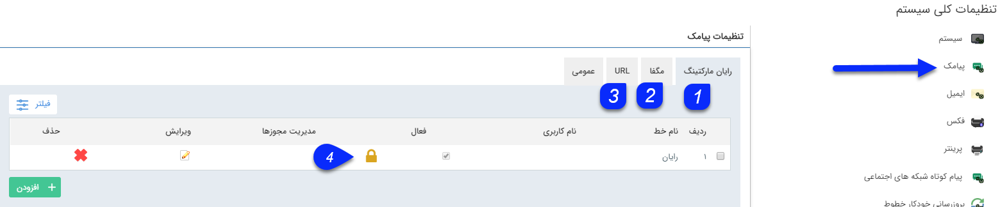
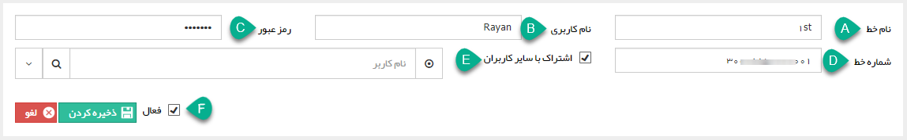
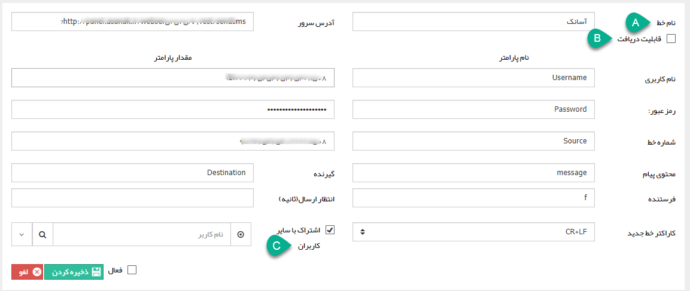

# پیامک       

**پیامک**

 در این قسمت می‌توانید خطوطی که جهت ارسال پیامک از آنها استفاده می کنید را تنظیم نمایید.

 

1\. **رایان مارکتینگ:** برای ارسال از طریق خطوط ثابت، تنظیمات خط باید از این طریق صورت گیرد. با انتخاب دکمه اضافه کردن، پنجره ای نمایش داده می شود و می توانید اطلاعات مربوط به خط را در این پنجره وارد نمایید.

 

A. نام خط: نام خط به صورت انتخابی (دلخواه) است.

B. نام کاربری: نام کاربری که شما در سایت [rayanmarketing.com](http://www.rayanmarketing.com/) می سازید و خط ثابت بر روی آن فعال می شود را در این قسمت وارد کنید.

C. رمز عبور مربوط به کاربری خود در سایت rayanmarketing.com را در این قسمت وارد کنید.

D. شماره خط: شماره خط حتما باید به صورت "شماره خط-کدشهر-98" وارد شود.

E. اشتراک با سایر کاربران: در صورت فعال بودن این گزینه این خط در دسترس تمامی کاربرانی که مجوز ارسال و یا دریافت پیامک را دارند، قرار خواهد گرفت. در غیر این صورت باید کاربری که اجازه استفاده از این خط جهت ارسال پیامک دارد را انتخاب نمایید.

F. وضعیت فعال بودن خط را مشخص کنید، در صورت نیاز می توانید در برهه های زمانی خاص، خط را در نرم افزار پیام گستر غیرفعال کنید تا کاربران نتوانند از آن استفاده کنند.

2. **مگفا:** در صورت استفاده از سرویس‌های شرکت مگفا برای ارسال پیام‌کوتاه، می‌توانید تنظیمات مربوط به خط مگفای خود را در این قسمت وارد کرده و برای ارسال پیام‌های‌کوتاه خود استفاده نمایید. فقط کافی است اطلاعات خط خود را در این قسمت وارد نمایید.

3.**URL:** برای تنظیم خطوط از این طریق، سرویس استفاده از  URL باید برای شما فعال باشد. مستندات تنظیم URL باید از اپراتور ارائه دهنده خدمات دریافت شود و بدین صورت تنظیم می گردد**.**

A. نام خط: یک نام دلخواه برای این خط برگزینید و سایر مقادیر را متناظر با مستندات ارائه شده از طرف اپراتور وارد کنید.

B. قابلیت دریافت: در صورتی که این خط پیامکی قابلیت دریافت پیام دارد و قصد نمایش پیام های دریافتی آن در نرم افزار پیام گستر را دارید، این گزینه را فعال کنید.

C . ا شتراک با سایر کاربران: برای اختصاص دادن خط به یک کاربر و یا اشتراک آن با سایر کاربران می توانید، از این گزینه استفاده کنید.

4\. مجوز خطوط: با استفاده از این قسمت می توانید کاربرانی که مجوز دسترسی به ارسال و یا دریافت و یا لیست سیاه خط پیامکی دارند را مشخص کنید.