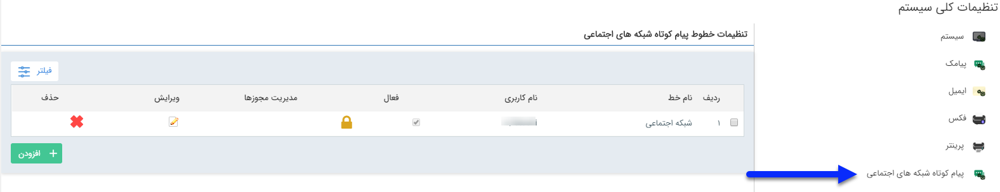
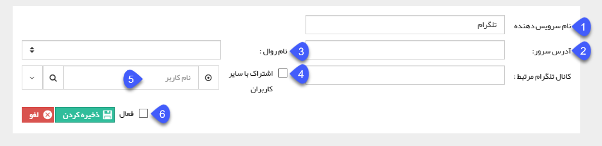

# پیام کوتاه شبکه های اجتماعی    

**پیام کوتاه شبکه های اجتماعی**

 

 از این طریق می توانید خط ارسال پیام های خود بر روی شبکه های اجتماعی را تنظیم نمایید.

 .

1\. نام سرویس دهنده: نامی برای خط برگزینید.

2\. آدرس سرور: آدرس سرور ارسال پیام کوتاه شبکه های اجتماعی را می توانید تعیین کنید.

3\. نام روال: سرویس مرتبط نصب شده را انتخاب کنید.

4. ا شتراک با سایر کاربران: اگر این گزینه فعال باشد تمامی کاربران می توانند از خط مورد نظر استفاده کنند.

5\. نام کاربری: در صورت فعال نبودن اشتراک با سایر کاربران، می توانید یکی از کاربران را به عنوان مالک خط تعیین کنید.

6\. فعال: می توانید این خط ارسال پیام را فعال و یا غیر فعال نمایید.