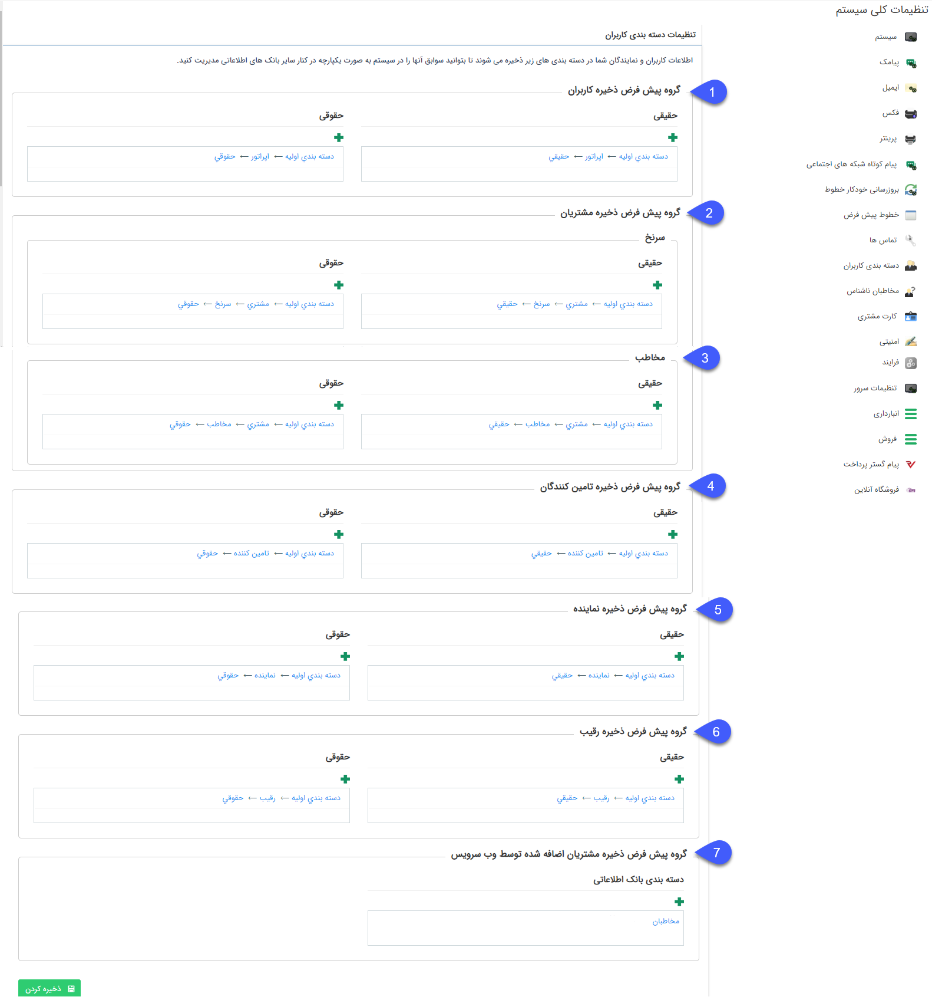

# دسته بندی کاربران    

دسته بندی کاربران

در این قسمتدسته بندیپیش فرض ذخیره انواع پروفایل های هویت مشخص می شود.

 

1\. **گروه پیش فرض ذخیره کاربران:** با ساختن یک دسته بندی در بانک اطلاعاتی و انتخاب آن در قسمت تنظیمات کاربران به عنوان پیش فرض، بعد از ساختن کاربر جدید برای پیام گستر، پروفایل متناظر با کاربران و اطلاعات آن ها در این دسته بندی ذخیره می شود.

  نکته: تعیین این گزینه جهت ایجاد کاربر جدید **الزامی** می باشد.

2\. **گروه پیش فرض ذخیره مشتریان:** در صورتی که ماژول [باشگاه مشتریان](../../MajolhayeTakmili/BashgaheMoshtarian.md) را خریداری کرده باشید، با ساختن یک دسته بندی در بانک اطلاعاتی و انتخاب آن در گروه پیش فرض مشتریان، پروفایل متناظر با مشتریانی که در در باشگاه ثبت نام می کنند یا کاربری آن ها از قسمت [مدیریت اعضای باشگاه مشتریان](../Customersclubmanagement.md) ایجاد می شود، در این دسته بندی ساخته می شود. 

نکته: تعیین این گزینه برای امکان ثبت نام مشتریان در باشگاه، **الزامی** است.

**3\. گروه پیش فرض ذخیره مخاطب:**  با ساختن یک دسته بندی در بانک اطلاعاتی و انتخاب آن در قسمت تنظیمات کاربران به عنوان گروه پیش فرض مخاطب، پس از ساختن هویت جدید از نوع مخاطب، پروفایل متناظر با مخاطب و اطلاعات آن ها در این دسته بندی ذخیره می شود.

**4****. گروه پیش فرض ذخیره تامین کننده:** با ساختن یک دسته بندی در بانک اطلاعاتی و انتخاب آن در قسمت تنظیمات کاربران به عنوان گروه پیش فرض تامین کننده، پس از ساختن هویت جدید از نوع تامین کننده، پروفایل متناظر با هویت و اطلاعات آن ها در این دسته بندی ذخیره می شود.

**5\. گروه پیش فرض ذخیره نماینده:** با ساختن یک دسته بندی در بانک اطلاعاتی و انتخاب آن در قسمت تنظیمات کاربران به عنوان گروه پیش فرض نماینده،پس از ساختن هویت جدید از نوع  نماینده، پروفایل متناظر با هویت و اطلاعات آن ها در این دسته بندی ذخیره می شود.

**6\. گروه پیش فرض ذخیره رقیب:** با ساختن یک دسته بندی در بانک اطلاعاتی و انتخاب آن در قسمت تنظیمات کاربران به عنوان گروه پیش فرض رقیب، پس از ساختن هویت جدید از نوع رقیب، پروفایل متناظر با هویت و اطلاعات آن ها در این دسته بندی ذخیره می شود.

7**. گروه پیش فرض ذخیره مشتریان اضافه شده توسط** **وب سرویس:** در صورتی که وب سرویسی برای ذخیره مخاطبان را نیز تهیه و فعال کرده باشید، مخاطبانی که از این طریق ایجاد می شوند در این دسته بندی ذخیره می شوند.