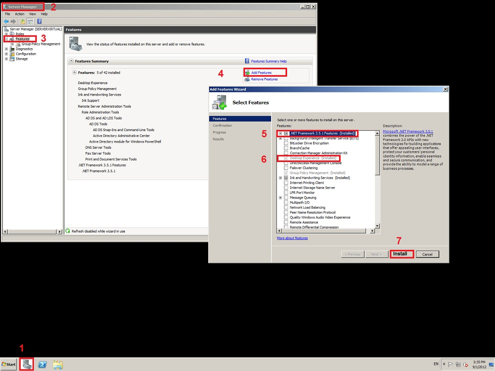

# نصب پیام گستر روی ویندوز سرور 2008    

**نصب پیام گستر روی ویندوز سرور** **2008**

در ویندوز سرور 2008 برای نصب  پیام گستر و راه اندازی فکس ویندوز می بایست اقدامات زیر صورت گیرد.

**.Net Frame Work Feature**

**Desktop Experience Feature**

برای توضیحات بیشتر در مورد فکس به بخش نصب [راه اندازی فکس در ویندوز سرور](../RahAndaziFaxeWin/2008.md)2008  مراجعه کنید**.**