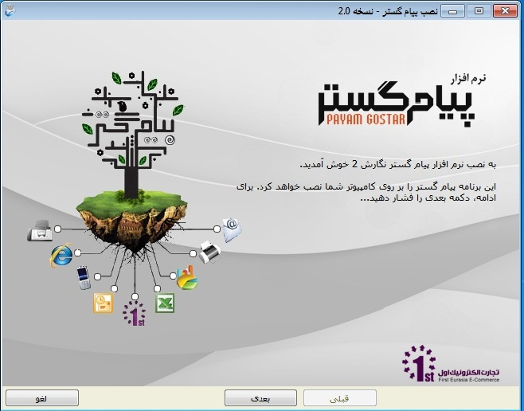
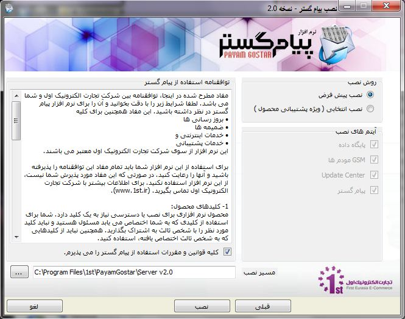
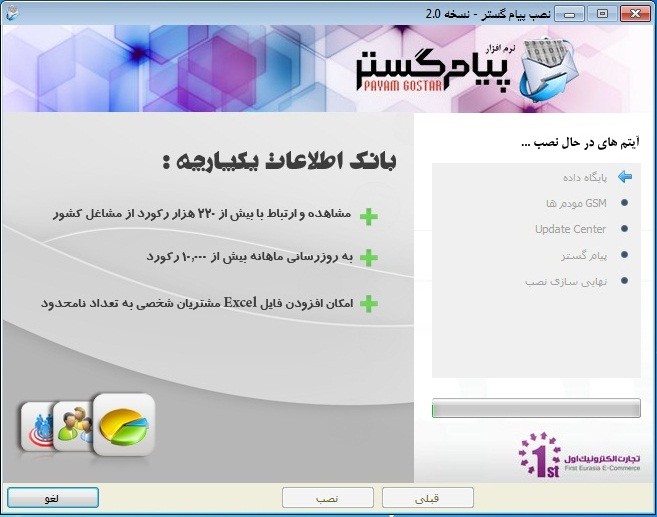
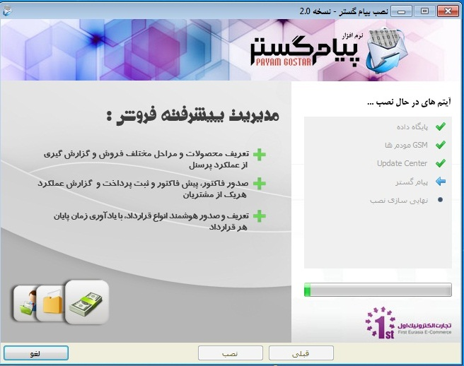
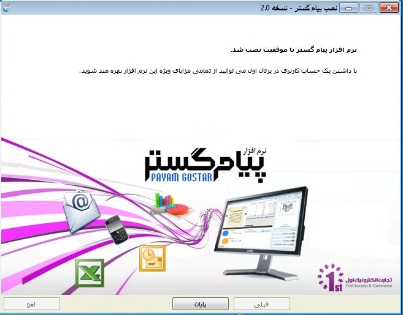
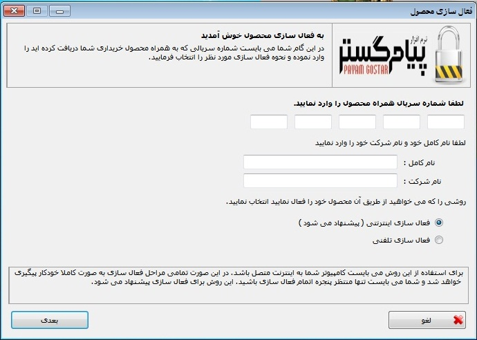
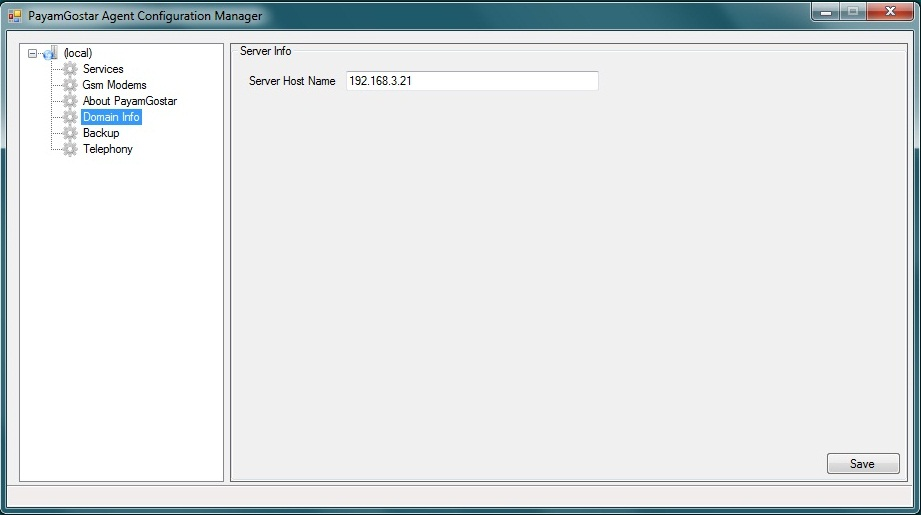
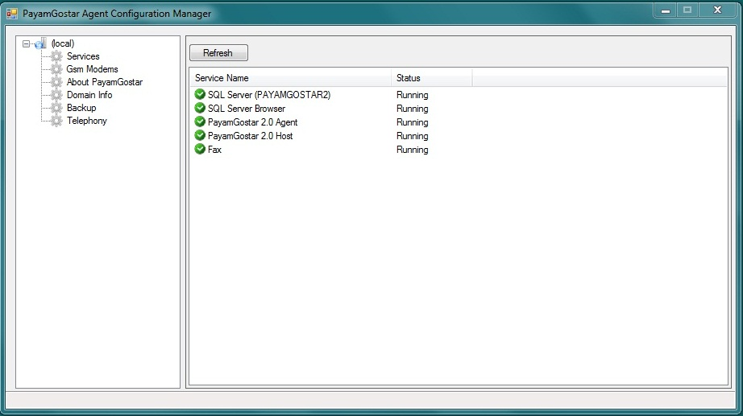

# مراحل نصب نرم افزار    

**نصب**  **نرم**  **افزار**

1\. برای نصب پیام گستر، ابتدا باید قسمت Server آن را نصب نمایید DVD پیام گستر Part –Server  را در DVDROM  قرار می دهیم .

در صورتی که سیستم شما پیش نیازهای لازم را داشته باشد با انتخاب نصب پیش فرض پیام گستر مواردی را که نیاز به  نصب  دارد  به صورت خودکار نصب می نماید. به طور مثال اگر نرم افزار  Officeبر روی سیستم شما نصب باشد تیک این آیتم برداشته خواهد شد و نصب دوباره صورت نمی  پذیرد.

در سمت راست پنجره توافقنامه استفاده از پیام گستر نوشته شده است که با پذیرش  قوانین و مقررات و انتخاب دکمه بعدی نصب نرم افزار آغاز می شود و پنجره زیر نمایش داده می شود و تک تک آیتم ها به دنبال یکدیگر نصب می شوند.

2. پس از اتمام مراحل نصب، نرم افزار شما باید فعالسازی شود .

برای فعالسازی سرور پیام گستر برروی آیکون  Payamgostar 2.0  Server Activation (مسیر فایل را مطابق تصویر طی نمایید) کلیک کنید.

صفحه زیر باز می شود. در این پنجره باید شماره سریالی را که همراه با نرم افزار دریافت نموده اید به همراه اطلاعات خود وارد نمایید.  در صورتی که سیستم شما به اینترنت متصل باشد، روش فعالسازی اینترنتی را انتخاب نمایید و روی آیکون بعدی کلیک کنید، فعالسازی به صورت کاملاً خودکار  صورت می پذیرد.

در غیر این صورت گزینه فعالسازی تلفنی را انتخاب کنید. با انتخاب این گزینه در صفحه بعد یک کد درخواست به شما نمایش داده می شود. برای فعالسازی محصول  باید با شرکت تماس گرفته و کد درخواست خود را اعلام نمایید تا کد فعالسازی محصول به شما داده شود. پس از این مرحله در صورتی که کد فعالسازی شما صحیح  باشد، محصول شما فعال می شود.

  3\. پس از فعالسازی Server ، باید WebConsole را هم نصب نمایید .

 4. قبل از نصب Web Console و Feature  های آن مخصوصاً Net Frame Work 4.0 ، حتماً Feature مربوط به IIS ویندوز را نصب کنید و حتماً توجه شود که تیک مربوط به ASP . Net نیز زده شود  و سپس DVD مربوط به Webconsole را نصب می نمایید.

5\.   بعد از نصب IIS و Net Frame Work 4.0 ، سیستم باید  Restart  شود.

6\. سپس می بایستIIS  ویندوز را راه اندازی کنیم و در آن یکSite  بوجود بیاوریم.

7\.   بعد از نصب سرور و وب کنسول می بایست در قسمت PayamGostar Agent Configuration2.0 در قسمت LocalàDomain Info آدرس سرور پیام گستر را به صورت IP و یا به صورت DNS Name وارد نماییم. (در این صورت نیاز به راه اندازی DNS Server داریم.)

8\. پس از تکمیل مراحل بالا، در قسمت Payamgostar Agent Configuration2.0 در قسمت Services، سرویس های راه اندازی سیستم را می توانیم start نماییم.

نکات مهم:

1\. هر شماره سریال را می توانید بر روی یک سیستم فعال کنید. در صورتی که بخواهید یک سریال را همزمان بر روی دو سیستم استفاده کنید، پیام گستر غیرفعال می شود.

2\. در صورتی که بخواهید پیام گستر را به سیستم دیگری منتقل نمایید، باید به طور کامل از سیستم قبلی حذف( Uninstall) کنید و بر روی سیستم جدید نصب و فعالسازی را انجام دهید. ( [راهنمای جمع آوری سیستم](../UnistallTheSoftware/UnistallTheSoftware.md))

3\. امکان چندین بار نصب پیام گستر روی سیستمی که تغییر نکرده باشد، وجود دارد. مانند زمانی که بخواهید سیستم عامل  ( windows) سیستم خود را تغییر دهید.