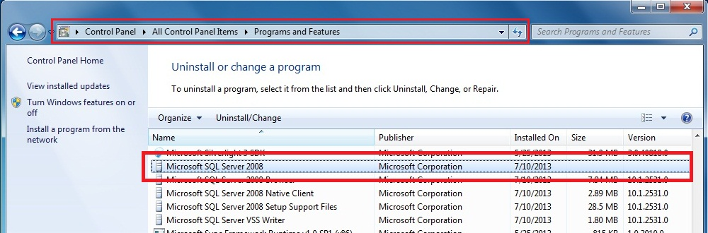
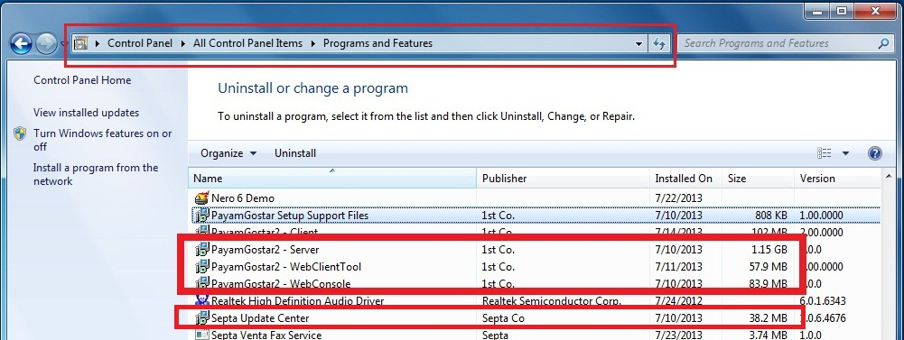
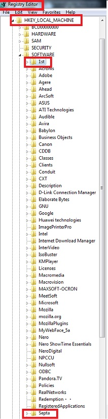
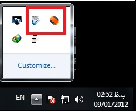
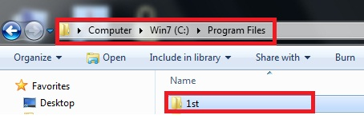
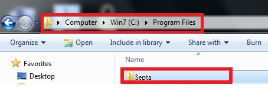

# نحوه پاک کردن نرم افزار      

**نحوه پاک کردن نرم افزار**

**نکته:** در صورتی که اطلاعات موجود در نرم افزار برای شما اهمیت دارد، لطفا قبل از حذف نرم افزار از اطلاعات موجود پشتیبان تهیه نمایید.

ابتدا می بایست پایگاه داده مربوط به نرم افزار را پاک کنیم، ویرایش ها پایگاه داده 2008 است، باید به این نکته توجه شود که پایگاه داده مربوط به پیام گستر را پاک کنیم.

****سپس باید نرم افزار پیام گستر و مرکز بروز رسانی را پاک کنیم.**

****** 

**

**سپس می بایست رجیستری ها و فایل های مربوط به پیام گستر را پاک کنیم****.**

**

**Start-->Run-->Regedit**

****

**

**و برای پاک کردن فایل های پیام گستر ابتدا می بایست تمامی آن ها را اعم از مرکز بروزرسانی و هرچه مربوط به پیام گستر را از ویندوز خارج کنیم**

**

**

**و سپس فایل های پیام گستر را از آدرس های مربوطه پاک می کنیم.**

**

****

