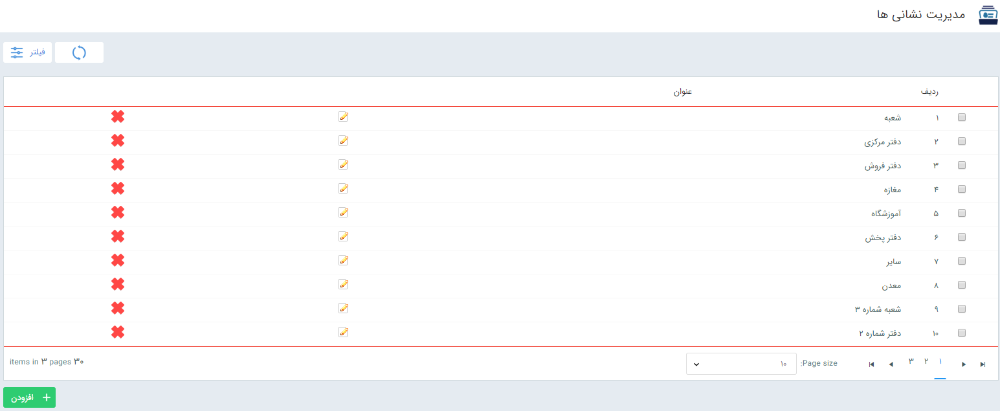

## مدیریت نشانی ها

از این قسمت می توانید نشانی های داخل سیستم را تعریف کنید.

با کلیک روی گزینه افزودن، برای آدرس مورد نظر، یک نام وارد کرده و ذخیره می نمایید.

> نکته: برای حذف نشانی از لیست،به دلیل این که ممکن است نشانی استفاده شده باشد،  لازم است که آدرس دیگری به صورت جایگزین آدرسی که قصد حذف آن را دارید انتخاب کنید.

نشانی هایی که در این قسمت ایجاد می شوند برای وارد کردن اطلاعات ارتباطی هویت ها مورد استفاده قرار می گیرند.

