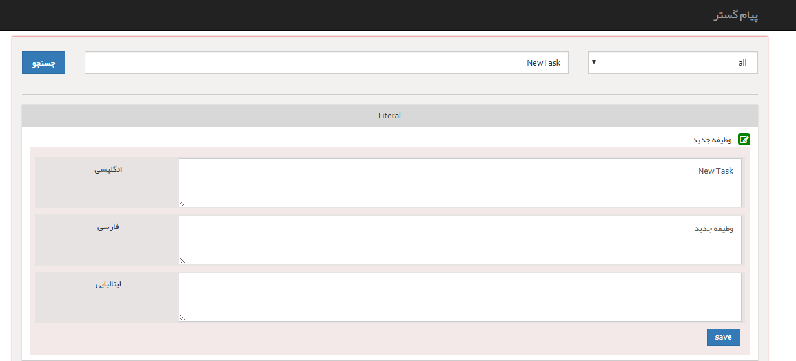

## ویرایش عبارت ها

در این قسمت می توانید با استفاده از فیلتر جستجو، کلید متناظر با هریک از عبارت ها را وارد کرده و به راحتی عنوان متناظر با آن کلید را برای هریک از زبان ها ویرایش کنید. برای اطلاع از کلید هریک از عبارت ها می توانید در قسمت<a href="file%3A%2F%2F%2FC%3A%5CUsers%5CH.abasi%5CDesktop%5Chelp%5Cmd%20help%5CBasic%20Information%5CLanguage-management%5CSystem-language%5CSystem-language.md" target="_blank"> زبان سیستم</a> ، فایل اکسل زبان ها را دانلود کنید.

توجه داشته باشید نیازی به وارد کردن کلید به صورت کامل نیست و در صورتی که قسمتی از کلید را نیز در این قسمت وارد کنید، می توانید در نتایج جستجو، عبارت مورد نظر خود را بیابید.

