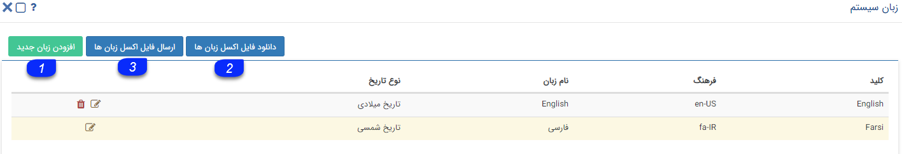
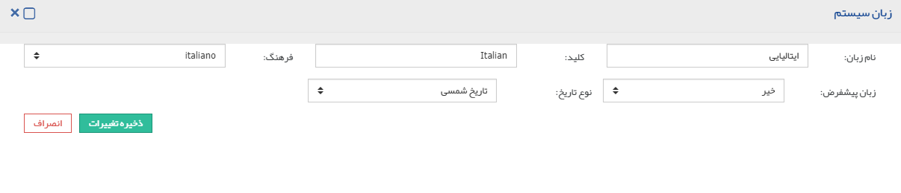

## زبان سیستم

>  مسیر دسترسی:  **اطلاعات پایه** >**مدیریت زبان‌ها** > **زبان سیستم** 

در این قسمت لیست زبان های تعریف شده در سیستم نمایش داده می شود. می توانید هر کدام از زبان ها را حذف کنید (به جز فارسی). همچنین می توانید زبان جدیدی برای سیستم تعریف کرده یا عبارت های هرکدام از زبان ها را از طریق فایل اکسل ویرایش کنید.

1. افزودن زبان جدید: با کلیک بر روی این دکمه می توانید یک زبان جدید برای سیستم تعریف کنید، توجه داشته باشید در صورت تعریف زبان جدید باید معادل همه عبارت های موجود در نرم افزار را برای آن زبان در فایل اکسل زبان ها وارد نمایید، در غیر اینصورت کلید متناظر با هر عبارت برای آن زبان در نرم افزار نمایش داده خواهد شد.

نام زبان، یک کلید دلخواه، فرهنگ و نوع تاریخ متناظر با این زبان را مشخص کرده و تغییرات را ذخیره نمایید

 توجه داشته باشید در صورتی که زبان مورد نظر را به عنوان زبان پیشفرض مشخص کنید، برای کاربران جدید تعریف شده، نرم افزار با این زبان نمایش داده خواهد شد، اما کاربران می توانند در قسمت تنظیمات من > زبان سیستم، آن را تغییر دهند. 

1.  دانلود فایل اکسل زبان ها : با کلیک بر روی این دکمه فایل اکسلی حاوی معادل عبارت های موجود در نرم افزار برای هریک از زبان ها دانلود خواهد شد. به ازای هریک از عبارت ها یک کلید وجود دارد که این کلیدها در ستون اول فایل اکسل نمایش داده می شوند. علاوه بر این به ازای هر زبان تعریف شده در سیستم، یک ستون اضافی در فایل اکسل وحود دارد که باید  معادل آن عبارت در آن زبان را در آن ستون وارد نمود. توجه داشته باشید در صورتی که هریک از مقادیر در ستون زمان مورد نظر خالی باشد، مقدار کلید متناظر با آن عبارت در صورت استفاده از آن زبان نمایش داده خواهد شد.

2. ارسال فایل اکسل زبان ها: در صورت تعریف زبان جدید می توانید معادل هریک از عبارت ها را در فایل اکسل تعریف کرده و از طریق این دکمه آن ها را در نرم افزار بارگذاری کنید. همچنین می توانید با ویرایش هریک از عبارت های موجود در فایل اکسل، نام فیلدها و سایر موارد پیشفرض موجود در نرم افزار را ویرایش نمایید. در واقع این فایل اکسل، لغتنامه تمامی زبان های تعریف شده در سیستم می باشد.