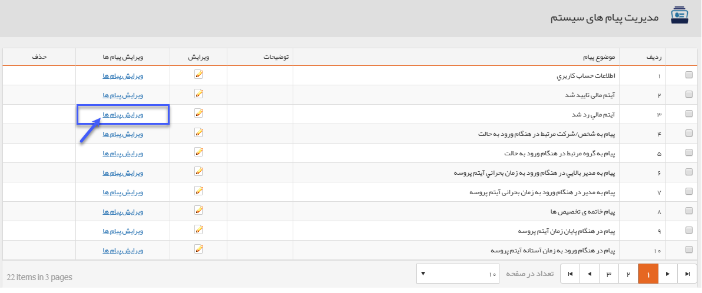
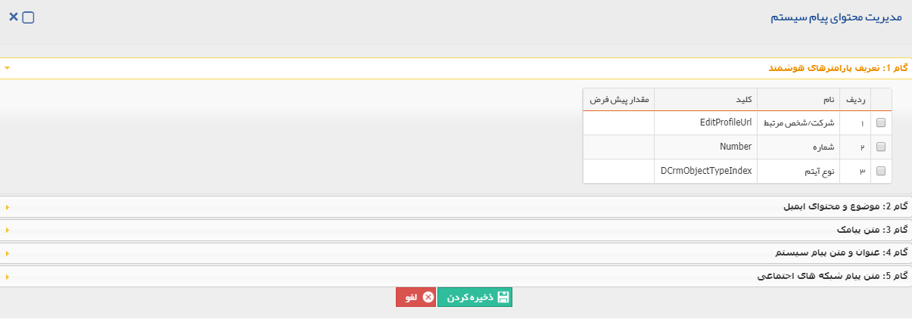
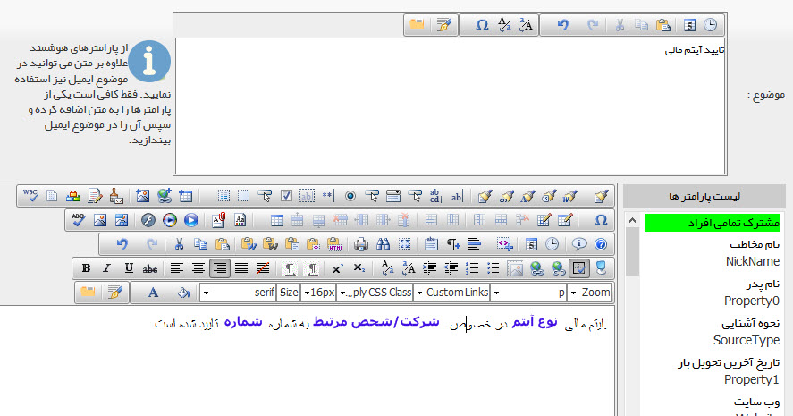
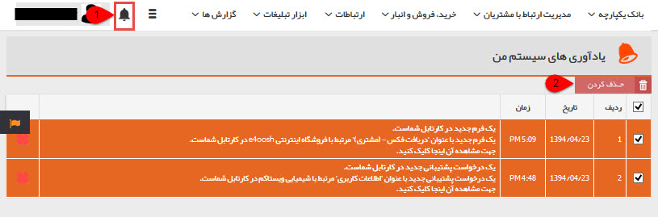

## مدیریت پیام های سیستم

> مسیر دسترسی:  **اطلاعات پایه** >**مدیریت پیام‌های الگو** 

موقعیت هایی برای ارسال پیام های سیستمی به صورت پیش فرض تعریف شده است که به کاربران نرم افزار یا مخاطبان ارسال می شود. همانطور که در تصویر مشاهده می نمایید این موقعیت ها شامل پیام هایی در هنگام تغییر رمز، تایید آیتم مالی و یا رد آیتم مالی و ... می باشد.

با کلیک بر روی لینک ویرایش پیام ها در روبروی هر پیام امکان نوشتن پیام و ویرایش پیام های قبلی فراهم می شود.

با کلیک بر روی لینک ویرایش پیام ها در روبروی هر پیام، پنجره ای به شکل زیر باز خواهد شد.

گام 1- پارامترهایی است که برای این پیام به صورت هوشمند توسط برنامه نویسان پیام گستر قرارداده شده است.

پیام ارسالی می تواند ایمیل، پیام کوتاه، پیام کوتاه شبکه اجتماعی و یا پیام سیستمی باشد. با تنظیم متن مورد نظر در هریک از گام ها، پیام مرتبط فعال خواهد شد. توجه داشته باشید که می توانید برای هرکدام از موقعیت های تعریف شده، متنی برای ارسال از طریق همه رسانه ها تنظیم نمایید. به طور مثال برای اطلاع رسانی تخصیص وظیفه به کاربران، هم پیام کوتاه و هم ایمیل تنظیم نمایید.

برای اطلاعات بیشتر در خصوص نحوه تنظیم پیام به [اطلاعات مشترک ابزارها](https://github.com/1stco/PayamGostarDocs/blob/master/help%202.5.4/Marketing/moshtarak-abzar/moshtarak-abzar.md) و برای اطلاع از چگونگی عملکرد پارامترهای هوشمند به متن هوشمند مراجعه کنید.

1. هر کاربر هنگام دریافت پیام های سیستمی، به تعداد پیام های خوانده نشده عددی را در کنار آیکون زنگوله در صفحه بالای نرم افزار مشاهده می نماید. با کلیک بروی آیکون مورد نظر صفحه ای نمایش داده می شود و می توانید متن کامل پیام ها را مشاهده نمایید .

2. حذف کردن: می توانید تمامی پیام های سیستمی انتخاب شده را حذف کنید.

