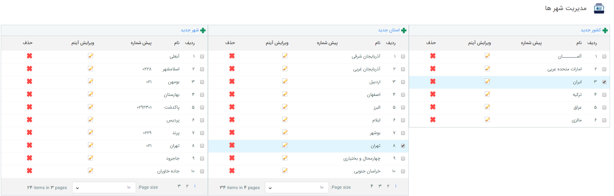

## مدیریت کشورها،استان هاو شهرها

> مسیر دسترسی:  **اطلاعات پایه** >**مدیریت کشور، استان و شهر** 

از طریق این صفحه می توانید کشورها، شهرها و استان هایی که در آدرس[ مشخصات عمومی ](https://github.com/1stco/PayamGostarDocs/blob/master/help%202.5.4/Integrated-bank/Database/General-specifications/General-specifications.md)مخاطبان وارد می کنید را به دلخواه و به راحتی مدیریت نمایید.

برای مشاهده استان های هر کشور بر روی نام آن کشور کلیک نمایید تا ستون استان های آن نمایش داده  شود، برای نمایش شهرها، برروی استان مورد نظر کلیک نمایید تا ستون مربوط به شهر ها نمایش داده شود.

برای اضافه کردن مورد جدید به هر کدام از ستون ها (کشور،شهر، استان) کافی است بر روی علامت + در بالای هر ستون کلیک کنید.

