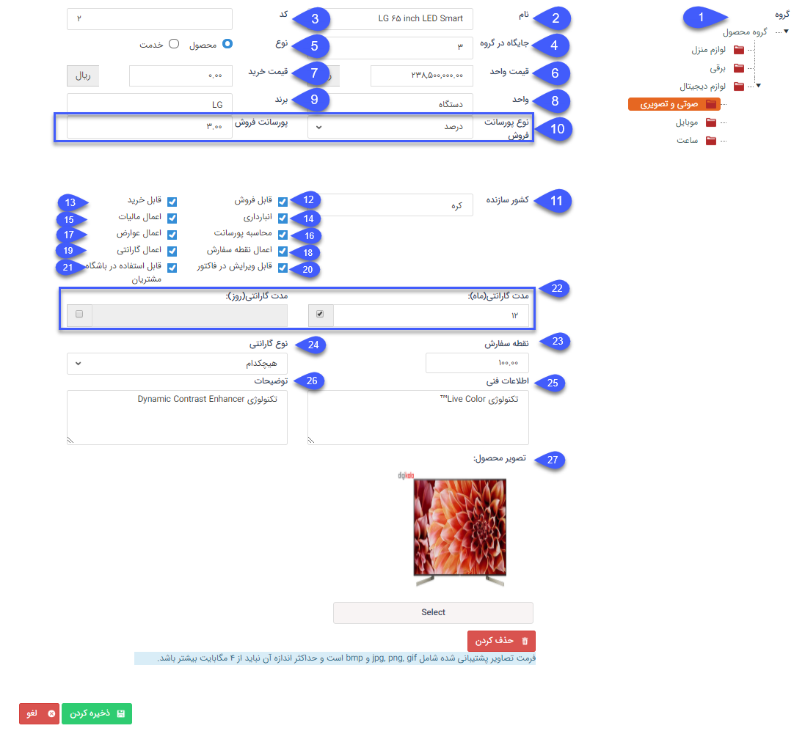

## اضافه کردن محصولات

پنجره ای نمایش داده می شود که می توانید محصول جدیدی به لیست محصولات اضافه نمایید .

 
1. گروه: ابتدا گروهی که کالای مورد نظر که می خواهید محصول  در آن اضافه شود را انتخاب کنید.

2. نام: نامی برای محصول خود برگزینید.

3. کد: می توانید به صورت دستی و یا با استفاده از بارکدخوان کد محصول مورد نظر را وارد کنید. (توجه داشته باشید در صورتی که نرم افزار به نرم افزارهای حسابداری همچون سپیدار یا همکاران متصل باشد، باید این کد محصول در هر دو نرم افزار یکسان باشد.)

> نکته : لازم به ذکر است تعداد کاراکتر مجاز برای نام کالا 1000 کاراکتر و برای کد کالا 50 کاراکتر می باشد. 

4. شناسه مرجع : از این فیلد می توان برای سینک پیام گستر با فروشگاه آنلاین و یا سینک پیام گستر با نرم های دیگر استفاده کرد.

 5. جایگاه در گروه: اولویت نمایش محصول در گروه محصولات در هنگام صدور انواع فاکتور و پیش فاکتور را تعیین نمایید.

این فیلد میتواند مقدار تکراری داشته باشد.

 در صورتی که در گروه بعضی از محصولات جایگاه نداشته باشند، بالاتر از سایر محصولات در لیست نمایش داده می  شوند. 

6. نوع: مشخص کنید که این اطلاعات مرتبط با یک محصول است یا یک خدمت. (توجه داشته باشید که  خدمت شامل انبارداری نمی شود)

7. قیمت واحد: قیمت فروشی که در پیش فاکتور و فاکتورهای فروش به صورت خودکار برای این محصول وارد خواهد شد را تعیین کنید. (در فاکتور و پیش فاکتور فروش قابل ویرایش می باشد)

8. قیمت خرید: می توانید قیمت خرید کالا را نیز تعیین نمایید. این قیمت در پیش فاکتور و فاکتورهای خرید به صورت خودکار برای این محصول وارد خواهد شد.(در فاکتور و پیش فاکتور خرید قابل ویرایش می باشد)

9. واحد: واحد کالا را تعیین نمایید، برای تغییر گزینه های این لیست به[ مدیریت آیتم های سیستم ](https://github.com/1stco/PayamGostarDocs/blob/master/help%202.5.4/Basic-Information/Management-of-system-items/Management-of-system-items.md)مراجعه کنید.

10. برند: مارک یا برند محصول خود را وارد کنید.

11. پورسانت فروش:  می توانید برای محصول خود پورسانتی بر حسب درصد و یا یک رقم ثابت در نظر بگیرید.با مشخص کردن پورسانت مربوط به محصول و نوع پورسانت می توانید از قسمت مدیریت و گزارشات،[ گزارش پورسانت محصول محور ](https://github.com/1stco/PayamGostarDocs/blob/master/help%202.5.4/Management-and-reports/Sales-reports/Payroll-calculation/Product-centric-commission/Product-centric-commission.md)، پورسانت هرکارشناس را در بازه زمانی مشخص نسبت به محصولاتی که به فروش رسانده است، مشاهده نمایید.

توجه: ابتدا باید چک باکس "محاسبه پورسانت" را فعال کرده باشید.

12. کشور سازنده: کشور سازنده محصول خود را تعیین کنید.

13. قابل فروش: می توانید تعیین کنید که این کالا برای فروش (ثبت در در پیش فاکتور و فاکتور فروش) توسط کاربران مجاز است و یا خیر. در صورت فعال نبودن این گزینه در هنگام صدور فاکتور و یا پیش فاکتور فروش، کالا نمایش داده نمی شود.

14. قابل خرید: می توانید تعیین کنید که این کالای برای خرید(ثبت در پیش فاکتور و فاکتور فروش) توسط کاربران مجاز است و یا خیر. در صورت فعال نبودن این گزینه در هنگام صدور فاکتور و یا پیش فاکتور خرید، کالا نمایش داده نمی شود.

15. انبارداری: در صورتی که این گزینه را فعال نمایید:

الف) اگر از انبارداری تعدادی استفاده می کنید، تعدادی از محصول  که در هر فاکتور تایید شده وجود دارد از موجودی انبار کسر می گردد. همچنین موجودی این محصول در هنگام صدور فاکتور نمایش داده خواهد شد.
ب) اگر انبارداری پیشرفته را در اختیار داشته باشید، اجازه ورود این کالا به عنوان یک محصول مجاز در انبارهای مختلف از طریق مدیریت انبار ها را خواهید داشت

16. اعمال مالیات: می توانید تعیین کنید که  برای این محصول مالیات اعمال شود در فاکتور و  پیش فاکتور ها یا خیر .

17. محاسبه پورسانت: مشخص کنید که پورسانت برای این محصول لحاظ گردد یا خیر. در صورتی که این گزینه را فعال کنید باید نوع و میزان پورسانت را نیز تعیین کنید.

18. اعمال عوارض:  می توانید تعیین کنید  برای این محصول عوارض اعمال شود در فاکتور و  پیش فاکتور ها یا خیر .

19. اعمال نقطه سفارش: مشخص کنید که برای این محصول، نقطه سفارش مشخصی دارید یا خیر. در صورت فعال کردن این گزینه، نقطه سفارش آن (کف یا حداقل موجودی انبار برای این محصول) را نیز تعیین کنید.

> نکته: توجه داشته باشید در صورتی که از انبارداری پیشرفته استفاده کنید، نقطه سفارش محصول به ازای هر انبار در مدیریت انبار ها تعریف خواهد شد . 

20. اعمال گارانتی: مشخص کنید که این محصول شامل گارانتی می شود یا خیر.

21. قابل ویرایش در فاکتور: می توانید تعیین کنید که نام این کالا هنگام ثبت فاکتور یا پیش فاکتور قابل ویرایش باشد یا خیر.

22. قابل استفاده در باشگاه مشتریان: با فعال بودن این گزینه هنگام ثبت فاکتور و یا پیش فاکتور در باشگاه مشتریان، محصول به مشتری نمایش داده می شود.

23.  مدت گارانتی: مدت زمان گارانتی این محصول را بر اساس ماه یا روز مشخص کنید.

24. نقطه سفارش: کف موجودی انبار ( نقطه سفارش) برای این محصول را مشخص کنید.

در واقع نقطه سفارش عددی است که هنگام رسیدن موجودی انبار به این مقدار، باید سفارش خرید یا تولید انجام شود. 

25. نوع گارانتی: مشخص کنید که گارانتی این محصول چه زمانی فعال می شود (هنگام ثبت رسید انبار یا هنگام تایید اصالت کالا) و همچنین مدت گارانتی براساس روز و یا ماه قابل تعیین است .

26. اطلا عات فنی: توضیحات فنی محصول خود را در این قسمت ثبت کنید. (مانند ابعاد، میزان مصرف انرژی و ... )

27. توضیحات: توضیحات محصول خود را در این قسمت ثبت کنید. (مانند مورد استفاده، مزایا، نحوه استفاده و ... )

28. تصویر محصول: می توانید تصویر این محصول را در این قسمت بارگزاری کنید.
 
 
> نکته: می توانید از برند، کشور سازنده، اطلاعات فنی، توضیحات و تصویر محصول در تنظیم قالب چاپ فاکتورها و تراکنش های انبار استفاده کنید .

