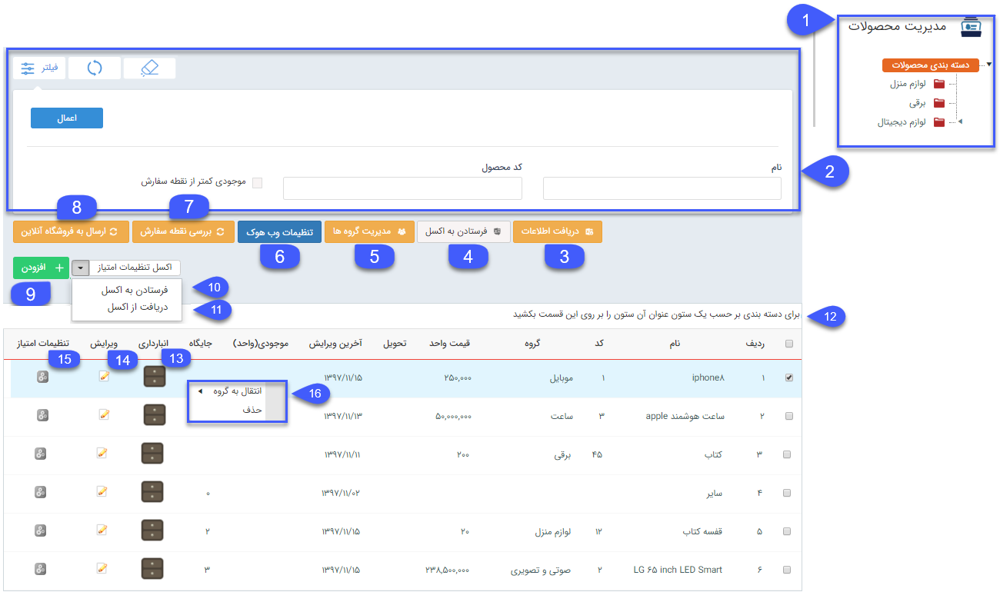
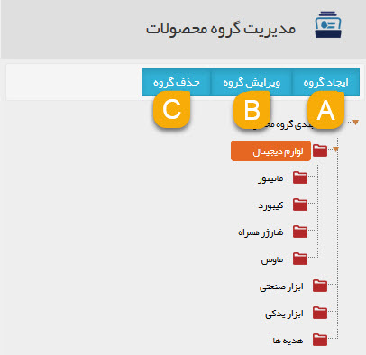

## مدیریت محصولات

در این قسمت باید دسته بندی محصولات را مشخص کرده و محصولات خود را در نرم افزار تعریف نمایید، امکان ورود اطلاعات  بصورت دستی و از طریق فایل اکسل و یا خروجی گرفتن اطلاعات محصولات از طریق اکسل وجود دارد. تنظیمات امتیاز هر محصول نیز در این قسمت قابل تعریف است . 

از این محصولات در هنگام صدور پیش فاکتور و فاکتور، ذخیره کردن یک فرصت فروش و یا صدور رسید و حواله انبار استفاده می شود.

1. لیست دسته بندی ها: لیست دسته بندی محصولات را نمایش می دهد.

2. یلتر: در این قسمت می توانید فیلترهای مختلفی از قبیل نام و کد محصول و اینکه آیا محصولات به نقطه سفارش خود رسیده اند یا خیر، برای یافتن محصولات مورد نظر خود اعمال کنید.

3. افت اطلاعات: با کلیک بر روی این دکمه می توانید، محصولات جدیدی را از طریق فایل اکسل به نرم افزار اضافه کرده و یا اطلاعات محصولات موجود را بروزرسانی کنید. برای اطلاع از چگونگی انجام این کار،[ دریافت اطلاعات](receiving-information%2Freceiving-information.md) را مطالعه کنید.  

 4. رستادن به اکسل: نرم افزار جزئیات اطلاعات محصولاتی که مشاهده می کنید را در قالب یک فایل اکسل در اختیار شما قرار می دهد. 

5. مدیریت گروه ها: در این قسمت می توانید دسته بندی محصولات خود را ایجاد، ویرایش و یا حذف کنید.

A. ایجاد گروه: می توانید در هر قسمت گروه جدیدی برای محصولات اضافه کنید.

B. ویرایش گروه: می توانید نام گروهی از محصولات را تغییر دهید.

C. حذف گروه: می توانید گروه محصولاتی که ایجاد نموده اید را حذف کنید.

6. تنظیمات وب هوک: در صورت تمایل برای همگام سازی محصولات با یک نرم افزار یا وب سایت دیگر (به طور مثال نرم افزار مالی) تنظیمات وب هوک برای برقراری ارتباط با وب سرویس از این قسمت باید اعمال گردد.

7. بررسی نقطه سفارش: با کلیک بر روی این دکمه نرم افزار وضعیت موجودی محصولات را بروز رسانی می کند و با بررسی نقطه سفارش تعیین شده برای آن ها، عملیات خودکار نقطه سفارش تنظیم شده را انجام می دهد.

> نکته: برای تنظیم عملیات نقطه سفارش به قسمت[ تنظیمات کل](https://github.com/1stco/PayamGostarDocs/blob/master/help%202.5.4/Settings/General-settings/inventory/inventory.md)ی مراجعه کنید.

8. ارسال به فروشگاه آنلاین: همگام سازی محصولات با فروشگاه آنلاین از این قسمت باید اعمال گردد. (برای اطلاع از نحوه همگام سازی به [ارسال به فروشگاه آنلاین ](Online-shop%2FOnline-shop.md)مراجعه کنید .

9. اضافه کردن: با کلیک بر روی این دکمه می توانید یک محصول جدید تعریف کنید. قسمت [اضافه کردن محصول ](Add-product%2FAdd-product.md)را مطالعه کنید.

     

اکسل تنظمیات امتیاز

10.  فرستادن به اکسل: با کلیک بر روی این منو، نرم افزار اطلاعات امتیازی محصولاتی که در لیست مشاهده می کنید را به صورت یک فایل اکسل در اختیار شما قرار می دهد.

11. دریافت اطلاعات امتیازات از اکسل: با کلیک بر روی این منو، می توانید اطلاعات امتیازاتی محصولات که در اکسل آماده کرده اید را به نرم افزار وارد نمایید.

> لازم به ذکر است دریافت امتیازات از طریق اکسل صرفا باید در قالب فایل اکسل نمونه انجام شود و همچنین دریافت امتیازات از طریق کد محصول انجام می‌شود و در صورت خالی بودن کد محصول امتیازی از طریق اکسل دریافت نمی‌شود.

12. مرتب سازی بر اساس ستون های جدول: برای مرتب سازی ستون های جدول با ترتیب دلخواه، ستون را با ماوس به محل دلخواه منتقل نمایید.

13. انبارداری: در صورتی که در قسمت تنظیمات کلی، تنظیمات موجودی انبار را "بر اساس تعداد" تنظیم کرده باشید، از این قسمت می توانید موجودی محصول را اضافه یا کم کنید. برای اطلاعات بیشتر قسمت[ انبارداری تعدادی ](number-%20warehouses%2Fnumber-warehouses.md)را مطالعه کنید.

 توجه داشته باشید در صورتی که تنظیمات موجودی انبار بر اساس سریال یا بر اساس وب سرویس باشد، این ستون در این قسمت نمایش داده نخواهد شد. (در انبارداری سریالی موجودی بر اساس تراکنش های ثبت شده در انبار محاسبه خواهد شد و در انبارداری وب سرویسی، موجودی از یک نرم افزار یا وب سایت دیگر فراخوانی خواهد شد)

14. ویرایش: با کلیک بر روی این دکمه می توانید اطلاعات هر کدام از محصولات تعریف شده را ویرایش نمایید.

15. تنظیمات امتیاز : با کلیک بر روی این دکمه تنظیمات امتیازدهی هر محصول را تعیین کنید. برای اطلاع از جزئیات انجام این کار،[ تنظیمات امتیاز](Score-settings%2FScore-settings.md) را مطالعه کنید.

16. راست کلیک: با راست کلیک بر روی محصولات می توانید دسته بندی آنها را تغییر دهید و یا در صورت نیاز آنها را حذف کنید. (توجه داشته باشید اگر از آن محصول در هر گونه تراکنش یا سابقه ای در نرم افزار استفاده شده باشد (برای مثال در یک پیش فاکتور،فرصت، انبارو ...  از آن استفاده شده باشد) دیگر نرم افزار اجازه حذف آن محصول را نخواهد داد ( مگر آنکه آن سابقه مربوط به آن را حذف کنید.)

 
    
    