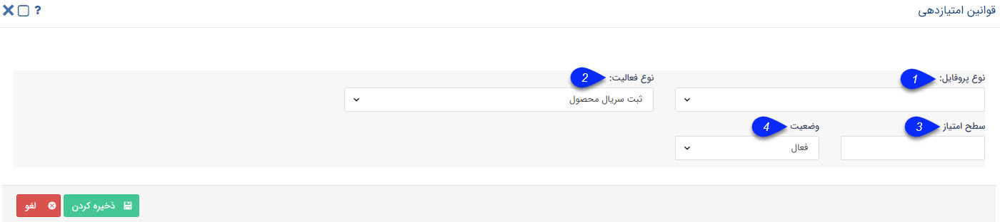

## تنظیمات امتیاز

در این صفحه می توانید امتیاز محصول در پایه امتیاز های مختلف را تعیین نمایید.

1. نوع پروفایل: نوع پروفایلی که میخواهید این امتیاز به آن  تعلق گیرد را تعیین کنید.

2. نوع فعالیت: فعالیتی که میخواهید با آن این امتیاز محاسبه شود را تعیین نمایید. (برای مثال فعال سازی سریال محصول به این معنی است که هر بار که سریال این محصول از طریق پیامک برای یک مشتری فعال شود(اصالت کالا)، نرم افزار امتیاز تعیین شده در این قسمت را به حساب او اضافه خواهد کرد.)

3.  سطح امتیاز: میزان امتیاز محصول را تعیین کنید. ( به بیان دیگر تعیین نمایید که خرید این محصول چند امتیاز دارد.)

4. وضعیت: فعال یا غیر فعال بودن این امتیاز را تعیین نمایید.

> نکته : توجه داشته باشید که برای هر محصول می توان بی نهایت امتیاز تعریف کرد اما فقط یکی از انها می تواند فعال باشد.

