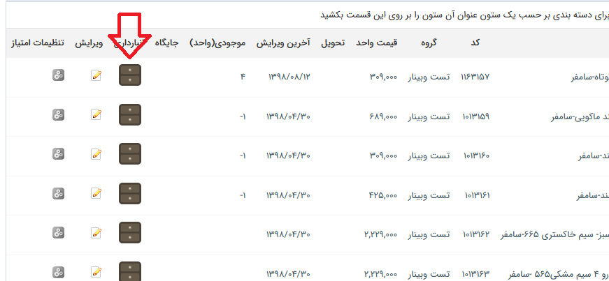
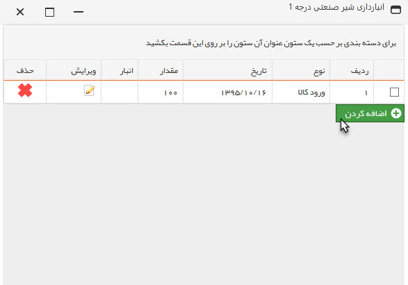
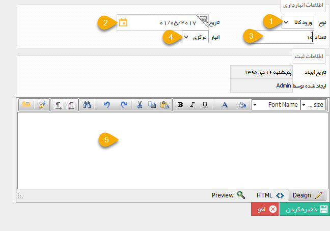

## انبارداری تعدادی

در صورتی که ماژول انبارداری پیشرفته فعال نشده باشد و نوع انبارداری کالاها بر حسب تعداد قرار گرفته باشد، می توانید از این قسمت برای ثبت ورود و خروج کالاها استفاده کنید.

> نکته: برای تغییر نوع انبارداری به قسمت [انبارداری ](https://github.com/1stco/PayamGostarDocs/blob/master/help%202.5.4/Settings/General-settings/inventory/inventory.md) در تنظیمات کلی مراجعه کنید.

موجودی کالاها در این حالت توسط فاکتورهای فروش و خرید تایید شده و نیز ورود و خروج کالاها که در این قسمت ثبت می شود، تعیین می گردد.

در صورت فعال بودن ماژول انبارداری پیشرفته و یا وب سرویس، این قسمت دیگر ظاهر نخواهد شد و انبارداری محصولات مختلف بر اساس رسید و حواله های صادر شده از انبارها تعیین خواهد گردید.

بعد از اضافه کردن یک محصول در صورتی که محصول دارای انبارداری است می توانید از انبارداری محصول برای ثبت تعداد محصول و تاریخ ورود محصول به انبار استفاده نمایید.

با کلیک بر روی اضافه نمودن، می توانید محصول را از انبار خارج و یا به انبار وارد نمایید

> نکته:  در هر بار فروش محصول به تعداد فروش از انبار کسر می شود .

1. نوع:نوع انبارداری می تواند ورود یا خروج محصول باشد.

2. تاریخ:تاریخ ورود و یا خروج  محصول باید مشخص باشد.

3. تعداد: تعداد ورود و یا خروج کالا بر حسب واحد آن باید مشخص گردد.

4. انبار: می توانید نام انبارهای مختلف را با ویرایش لیست انبار در [مدیریت آیتم های سیستم ](https://github.com/1stco/PayamGostarDocs/blob/master/help%202.5.4/Settings/General-settings/inventory/inventory.md) وارد نمایید.

5. توضیحات: توضیحات مرتبط با این ورود یا خروج را می توانید در این قسمت وارد کنید.

