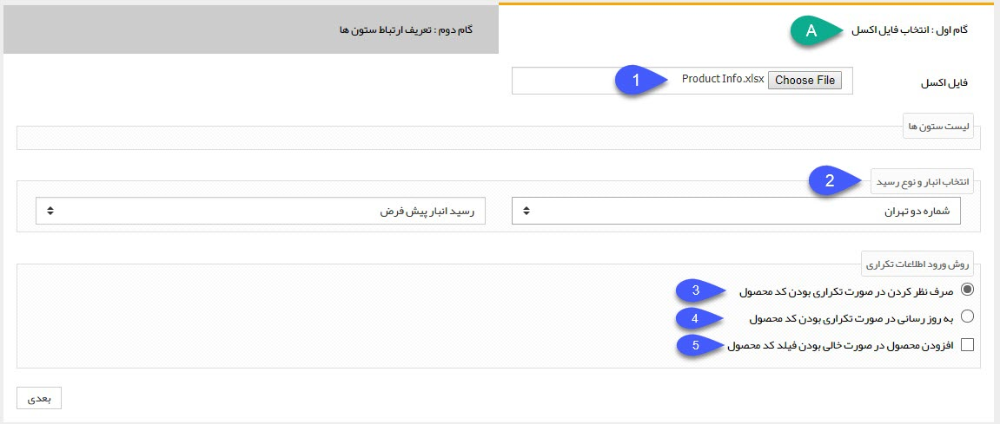
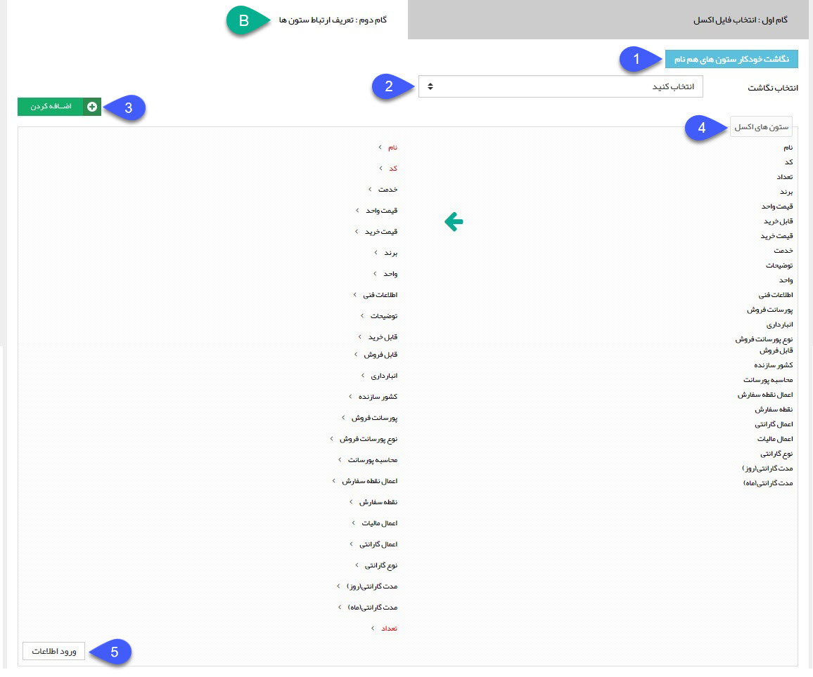

## دریافت اطلاعات

با استفاده از این ابزار می توانید محصولات خود را از طریق یک فایل اکسل (Excel) در نرم افزار وارد کنید یا اطلاعات محصولاتی که قبلا وارد شده اند را بروز کنید.

ابتدا گروه محصول مورد نظر را انتخاب کنید. سپس بر روی دریافت اطلاعات کلیک کنید. دریافت اطلاعات از اکسل در دو گام انجام می شود:

1. فایل اکسل: فایلی که حاضر کرده اید را با استفاده از این دکمه انتخاب و بارگزاری کنید.

2. رسید انبار: در صورتی که از انبارداری پیشرفته استفاده می کنید، باید نام انیار و نوع رسید انبار برای ورود محصولات به انبار  را انتخاب کنید. با انجام این کار پس از ورود محصولات، سیستم به صورت خودکار در انبار مشخص شده یک رسید ثبت خواهد کرد. تعداد هر محصول (موجودی انبار)  را می توانید با یک ستون به نام تعداد در فایل اکسل تعریف کنید.

> نکته: توجه داشته باشید در صورتی که تنظیمات موجودی انبار را "بر اساس تعداد" یا "بر اساس وب سرویس" تنظیم کرده باشید، این قسمت نمایش داده نخواهد شد. اما در انبارداری تعدادی همچنان می توانید برای محصولات با استفاده از ستون تعداد در فایل اکسل، موجودی تعریف نمایید. ( موجودی محصولات هنگام صدور فاکتور و پیش فاکتور نمایش داده می شود )

3. صرف نظر کردن در صورت تکراری بودن کد محصول: در صورت فعال بودن این گزینه در صورت تکراری بودن کد محصولاتی که قصد ورود آنها در نرم افزار را دارید، نرم افزار آن محصول را نادیده خواهد گرفت. (برای مثال اگر یک کالا با کد 10234 را قبلا وارد کرده باشید و دوباره در این اکسل هم باشد، نرم افزار دیگر آن را وارد نخواهد کرد.)

4. به روز رسانی در صورت تکراری بودن کد محصول: در صورت فعال بودن این گزینه، در صورت تکراری بودن یک کد محصول در اکسل، نرم افزار اطلاعات نرم افزار را بر طبق آن بروز می کند. این گزینه برای بروز رسانی لیست قیمت های کالاها بسیار مناسب است. (برای مثال اگر یک محصول با کد 1983 قبلا در نرم افزار وجود داشته باشد و در این فایل اکسل هم چنین کدی وجود داشته باشد، نرم افزار اطلاعات آن محصول را بر اساس فایل اکسل بروز خواهد کرد.)

5. افزودن در صورت خالی بودن کد محصول: در صورتی که این گزینه را فعال نکنید، محصولاتی از فایل اکسل که برای آن ها کد محصول تعریف نکرده باشید، در نظر گرفته نخواهند شد و فقط محصولات دارای کد در نرم افزار وارد خواهند شد

نکته: توجه داشته باشید در صورتی که برای محصولات خود، کد تعریف نکنید، امکان بروز رسانی اطلاعات آن ها از طریق فایل اکسل وجود نخواهد داشت. زیرا بروز رسانی فقط از روی کد محصول انجام می شود

B. گام دوم:

در این گام باید ستون هایی که در اکسل خود دارید را با عناوینی که در نرم افزار پیام گستر موجود است، نگاشت کنید.

1. نگاشت خودکار ستون های هم نام: نرم افزار به صورت خودکار ستون هایی که با عناوین نرم افزار یکسان باشد را کنار هم قرار می دهد.

2. انتخاب نگاشت: اگر قبلا نگاشتی را ذخیره کرده باشید از این لیست میتوانید آن را انتخاب کنید.

3. اضافه کردن: می توانید این نگاشت (ترتیبی که عناوین اکسل شما با عناوین نرم افزار در کنار یکدیگر قرار گرفته اند.) را در نرم افزار ذخیره کنید تا در دفعات بعد نیاز به نگاشت کردن دوباره آنها نباشد.

توجه داشته باشید که داشتن ستون های نام و تعداد (که با رنگ قرمز عنوان آنها متمایز شده) اجباری است. یعنی تمامی محصولات اکسل شما باید این دو مقدار را داشته باشند. اگر قصد بروز رسانی محصولات را داشته باشید ستون کد هم بصورت اجباری نمایش داده می شود .

4. ستون های اکسل: باید ستونهایی که نیاز دارید را از ستون راستی (که عنوان ستونهای اکسل شما است.) به ستون سمت چپ نگاشت کنید.

5. ورود اطلاعات: محصولات را وارد نرم افزار می کند .

