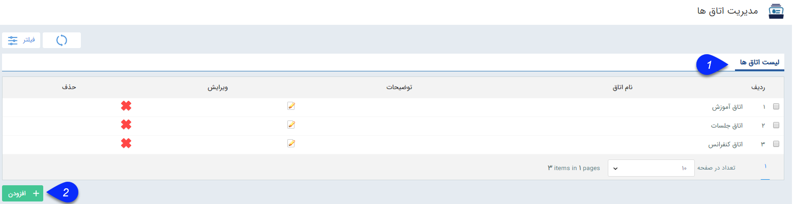

## مدیریت اتاق ها

در این قسمت اتاق هایی که به عنوان محل ملاقات برایقرار های ملاقات در نظر گرفته می شوند را میتوانید ایجاد و مدیریت کنید.

1. لیست اتاق ها: لیست اتاق هایی که قبلا اضافه شده اند را میتوانید در این قسمت مشاهده کنید.

 2 . اضافه کردن: با استفاده از این گزینه می توانید یک اتاق جدید برای نرم افزار ایجاد کنید
 
 
 
 

