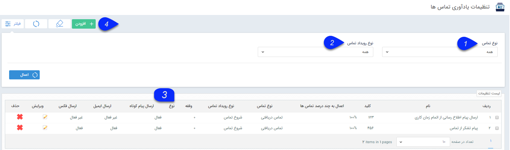

## تنظیمات یادآوری تماس ها

تنظیمات یادآوری های تماس ها در این صفحه انجام می شود. با استفاده از یادآوری تماس ها می توانید تعیین نمایید که برای چند درصد از کدام نوع تماس (ورودی، خروجی یا از دست رفته) رویدادهایی مشخصی صورت بگیرد. این رویدادها شامل ثبت فرم دلخواه، ارسال پیامک، ایمیل یا فکس می توانند باشند.

برای مثال می توانید تعیین کنید که برای 50 درصد تماس های دریافتی واحد فروش یک پیام تشکر ارسال شود. یا برای 100 درصد تماس های یک داخلی خاص، فرمی ایجاد شود و تحت فرآیند رسیدگی از طریق آن فرم قرار بگیرد

1. نوع تماس: برای فیلتر یادآوری های تماس ها بر اساس نوع تماس (ورودی، خروجی و از دست رفته) از این فیلد استفاده نمایید.

2. نوع رویداد تماس: برای فیلتر بر اساس نوع رویداد تماس (هنگام شروع یا خاتمه تماس) از این فیلد برای فیلتر لیست استفاده نمایید.

3. نوع فرم: در صورتی که برای رویداد تماس، ثبت فرم را تنظیم کرده باشید، زیرنوع فرم انتخاب شده در این قسمت نمایش داده می شود.

4. اضافه کردن رویداد تماس: با استفاده از این کلید می توانید یک رویداد تماس جدید اضافه نمایید
