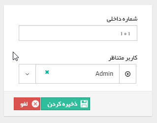

## تعریف داخلی‌ها

مسیر دسترسی: **اطلاعات پایه** > **مدیریت سیستم‌های تلفنی** >  **افزودن داخلی**

در مدیریت سیستم‌های تلفنی با کلیک بر روی هر سیستم تلفنی و کلیک بر روی افزودن در بخش داخلی‌ها  می‌توان داخلی جدید را تعریف و آن را به کاربر موردنظر اختصاص داد.

برای اضافه کردن هر داخلی باید شماره داخلی و نام کاربری که از آن داخلی استفاده می کند را درج کنید. از این داخلی ها درلیست تماس های نرم افزار استفاده می شود. همچنین در گزارشات و محدودیت های مشاهده تماس های ورودی، تعیین این داخلی ها نقش حیاتی دارند.

