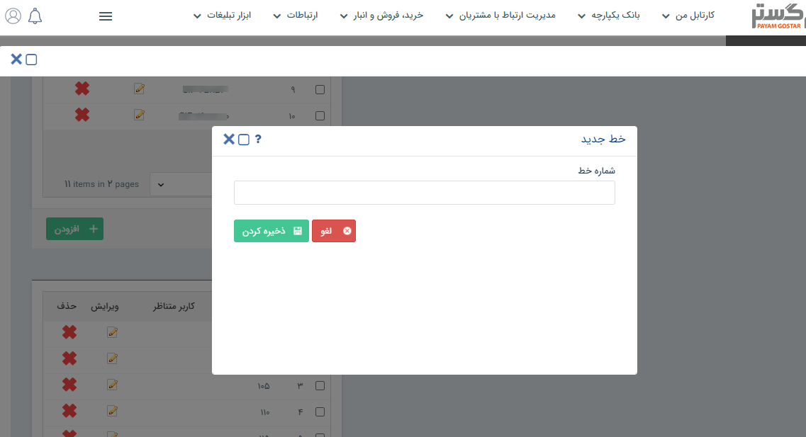

## تعریف خطوط

مسیر دسترسی: **اطلاعات پایه** > **مدیریت سیستم‌های تلفنی** >  **افزودن خطوط**

در این بخش امکان تعرف خطوط با استفاده از کلید افزودن وجود دارد.

در این قسمت باید شماره خط مورد نظر تعریف و ذخیره گردد.