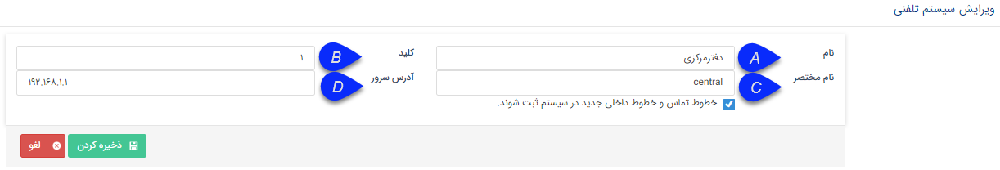

## تعریف سیستم تلفنی

مسیر دسترسی: **اطلاعات پایه** > **مدیریت سیستم‌های تلفنی** >  **افزودن سیستم تلفنی**

با استفاده از کلید افزودن موجود در این بخش می‌توان سیستم تلفنی جدیدی تعریف کرد.

A. نام: نام سیستم تلفنی را درج نمایید.

B . کلید: کلیدی که در سرویس سپتا تلفنی  برای مشخص کردن سیستم تلفنی وارد شده است را در این فیلد درج نمایید. 

C . نام مختصر: می توان یک نام کوتاه برای سیستم تلفنی برای سهولت در یافتن آن در لیست سیستم های تلفنی درج نمایید.

D . آدرس سرور: آدرس سروری که سانترال به آن متصل شده یا سرور VOIP بر روی آن نصب شده است را درج نمایید.

**ثبت خطوط جدید:** با فعال کردن این گزینه، نرم افزار به صورت خودکار داخلی هایی که به سیستم تلفنی اضافه می شوند را به لیست داخلی های نرم افزار اضافه می کند. (تنها در سیستم هایی که در لاگ خروجی خود داخلی ها را ارسال می کنند -مانند سانترال های TDE یا Voip- قابل استفاده است.)

