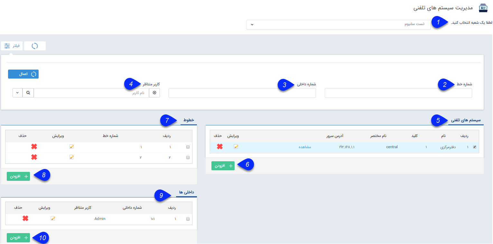

## مدیریت سیستم های تلفنی

مسیر دسترسی: **اطلاعات پایه** > **مدیریت سیستم‌های تلفنی** 

در این قسمت تنظیمات مرتبط با سیستم های تلفنی انجام می شود. توجه داشته باشید که پس از تعیین شعبه می توانید ،  سیستم های تلفنی را اضافه نمایید و سپس خطوط تلفنی و داخلی های متناظر با کاربران را برای آن ها تعریف نمایید.

1. انتخاب شعبه: ابتدا شعبه ای را که می خواهید سیستم های تلفنی را برای آن تنظیم نمایید، باید انتخاب شود. این شعب از قسمت مدیریت[ شعب، دپارتمان ها و سمت ](https://github.com/1stco/PayamGostarDocs/blob/master/help%202.5.4/Basic-Information/branches-department/branches-department.md)ایجاد می شوند.

2. شماره خط: با استفاده از این فیلد می توانید شماره خط مورد نظر را فیلتر نمایید.

3. شماره داخلی: می توانید داخلی بخصوصی را فیلتر نمایید.

4. کاربر متناظر: با استفاده از این فیلد می توانید کاربر مورد نظری که داخلی برای او تعریف شده است فیلتر کنید . 

5. سیستم های تلفنی: سیستم های تلفنی تعریف شده در این لیست نمایش داده می شوند. با کلیک بر روی کلید"مشاهده" صفحه مرتبط با[ وضعیت کنونی مرکز تماس ](https://github.com/1stco/PayamGostarDocs/blob/master/help%202.5.4/Windows/Contact-center-status/Contact-center-status.md)نمایش داده خواهد شد.

6. اضافه کردن سیستم تلفنی: با استفاده از این کلید می توانید یک سیستم تلفنی جدید ایجاد نمایید.

7. خطوط: لیست خطوط هر سیستم تلفنی در این لیست نمایش داده می شود.

8. اضافه کردن خطوط: با فشردن این کلید می توانید خطوط مورد نظر  را به سیستم تلفنی خود اضافه نمایید.

9. داخلی ها: لیست داخلی های مرتبط با هر سیستم تلفنی در این قسمت نمایش داده می شود.

10. اضافه کردن داخلی جدید: با کلیک بر روی این دکمه می توانید داخلی های مختلف را به نرم افزار اضافه نمایید.

