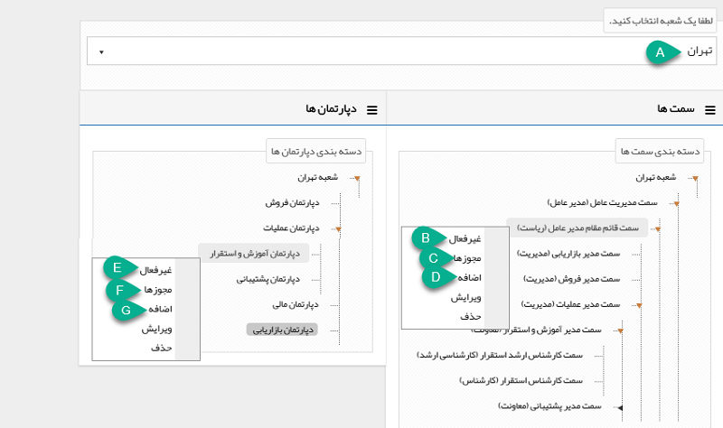

## مدیریت شعب،دپارتمان و سمت

در صورتی که سازمان دارای شعبه های مختلف در سطح کشور باشد. امکان تعریف شعب و دپارتمانهای مختلف تا بی نهایت سطح در این قسمت وجود دارد.

بر اساس این چارت می توان مجوزهای کاربران و سطح دسترسی آن ها به بخش های مختلف نرم افزار را تعیین کرد. همچنین در قسمت ارجاع وظیفه، فرآیند ها، گزارشات عملکردی و ... از این چارت استفاده می شود.

توجه داشته باشید که سمت های تعریف شده در این قسمت از طریق[ مدیریت حکم های پرسنل](https://github.com/1stco/PayamGostarDocs/blob/master/help%202.5.4/Settings/Personnel-command-management/Personnel-command-management.md)ی به کاربران متصل می گردد.

1. اضافه: با راست کلیک بر روی عبارت "لیست شعب" می توانید یک شعبه اضافه کنید.

 . Aشعب: در صورتی که این شعبه زیر مجموعه شعبه دیگری است نام آن را انتخاب کنید ( در غیر یان صورت می تواند این فیلد خالی باشد )

 . bنام : نام مورد نظر برای شعبه را وارد کنید.

C .  کلید: برای ارتباط نرم افزار با بقیه نرم افزار ها از طریق وب سرویس این گزینه استفاده می شود

D .  آدرس: آدرس این شعبه را می توانید در این قسمت درج کنید.

با راست کلیک روی هر شعبه می توان :

شعبه  ای،  دپارتمان ها وسمت های زیر مجموعه آن شعبه  را تعریف کنیم ، می توان آن شعبه را ویرایش و حذف نمود و همچنین امکان تعریف مجوز های مربوط به این شعبه وجود دارد

2. دپارتمان ها و سمت ها: با راست کلیک روی هر شعبه به شما دسترسی به دپارتمان ها و سمت های آن شعبه را می دهد. در واقع در این قسمت می توانید چارت سازمانی خود را طراحی کنید و دپارتمان ها و سطوح سمت سازمان خود را تعریف کنید. پس از تعریف سطوح سمت، با تخصیص آن ها به کاربران نرم افزار، هر کاربر می تواند بر اساس سمت های تخصیص داده شده  به خود، از طریق [گزارشات عملکردی ،](https://github.com/1stco/PayamGostarDocs/blob/master/help%202.5.4/Management-and-reports/Functional-reports/Functional-reports.md) عملکرد سمت های زیر مجموعه خود را بررسی کند.

> نکته: توجه داشته باشید برای تعریف سطوح سمت، باید ماژول "حکم سازمانی" را تهیه کرده باشید، در غیر اینصورت تنها می توانید سمت های کارمند و مدیر را داشته باشید.

.A نام شعبه: نام شعبه ای که قصد تغییر دپارتمان ها و سمت های آن را دارید می توانید انتخاب کنید.

B . غیر فعال: سمت مورد نظر را غیر فعال می کند. توجه داشته باشید در صورتی که این سمت، حکم فعال داشته باشد، یعنی در قسمت مدیریت حکم های پرسنلی این سمت را به یک کاربر تخصیص داده باشید، امکان غیرفعال کردن آن وجود ندارد.

C . مجوزها: مجوزهای این سمت را می توان تعیین کرد. در این صورت پس از تخصیص این سمت به یکی از کاربران نرم افزار، کاربر مربوطه مجوزهای تعیین شده در این سمت را به ارث خواهد برد.

D . اضافه: می توانید یک سمت به زیر مجموعه این سمت اضافه کنید.

E . غیرفعال : از این بخش امکان غری فعال کردن دپارتمان وجود دارد .

F   .مجوزهای دپارتمان: در صورت تعیین مجوز برای یک دپارتمان، تمامی کاربرهایی که یک سمت فعال در آن دپارتمان داشته باشند، مجوز های تعیین شده را به ارث خواهند برد .

G . اضافه: می توانید یک دپارتمان جدید زیر مجموعه دپارتمان مورد نظر اضافه کنید .

3.  مجوزها: مجوزهای مرتبط با این شعبه را با استفاده از این گزینه می توانید مشخص کنید . در صورت تعیین مجوز برای یک شعبه، تمامی کاربرهایی که یک سمت فعال در یکی از دپارتمان های این شعبه داشته باشند، مجوز های تعیین شده را به ارث خواهند برد.

> نکته مهم: توجه داشته باشید نحوه تاثیر مجوزهای تعیین شده برای شعبه، دپارتمان و سمت، مانند نحوه تاثیر مجوزهای تعیین شده برای گروه کاربران می باشد ، مجوزهای شخصی هر کاربر که در قسمت ویرایش مجوزها در مدیریت گروه ها و کاربران تعیین می شود به آن مجوز ها  اولویت دارد.

4.اضافه: می توانید به این شعبه یک زیر مجموعه دیگر اضافه کنید.

